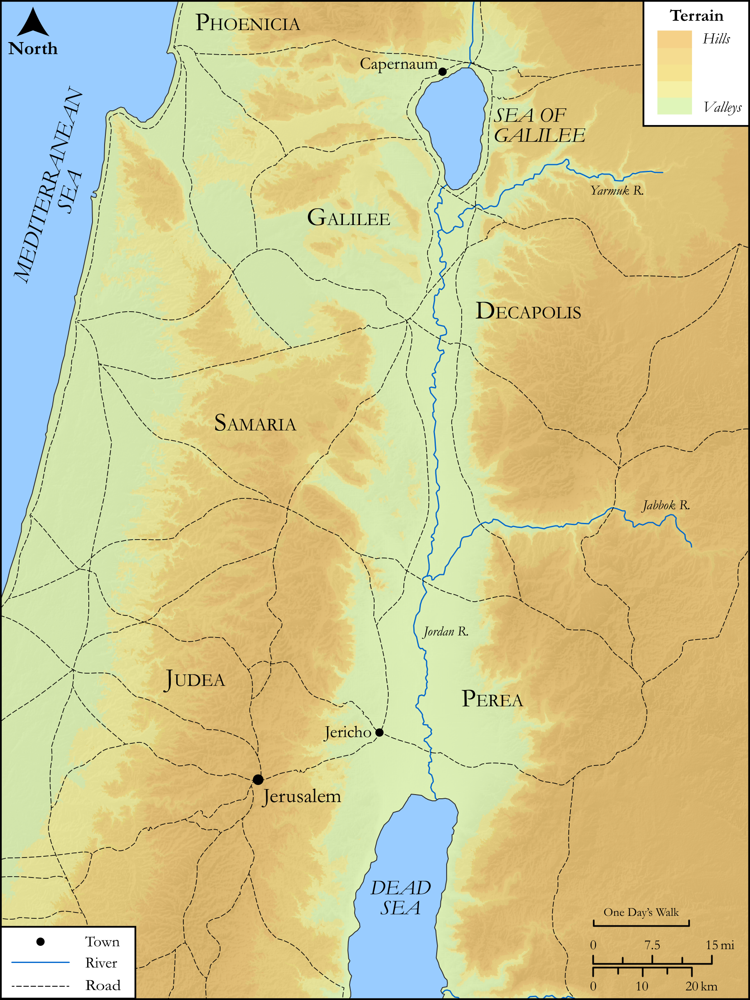

# Biblica Open Bible Maps

## License Information

Biblica Open Bible Maps, © 2023–2025 Biblica, Inc. This work is licensed under Creative Commons Attribution-ShareAlike 4.0 International (https://creativecommons.org/licenses/by-sa/4.0/). More Information: https://docs.google.com/document/d/1Pp44yZ0Zdnd59vJHTrt2rPYq0SppfX5rZbPBt6mz37U/edit?tab=t.0#heading=h.oev9aj1ksvk2

--------------------------------

## SRV Luke: Luke 18:31–34 (id: NT225)

### Image Content

[link](images/NT225.png)

Original: [SRV Luke: Luke 18:31\-34](https://drive.google.com/open?id=1xk0mTChSD_EielkfDWw3C5pHBNssfofE&usp=drive_copy)

* **Associated Passages:** Luke 18:1-43

* **Associated ACAI Concepts:** LORD (ID: `deity:Lord`); Jesus (ID: `person:Jesus.2`); Kingdom (ID: `keyterm:Kingdom`); Avenge (ID: `keyterm:GrantJustice`); Tax Collector (ID: `keyterm:TaxCollector`); Pray (ID: `keyterm:Pray`); Pharisees (ID: `group:Pharisee`); Believe (ID: `keyterm:Believe`); Surely! (ID: `keyterm:Surely`); Salvation (ID: `keyterm:Salvation`); Parable (ID: `keyterm:Parable`); David (ID: `person:David`); Good (ID: `keyterm:Good`); Life (ID: `keyterm:Life`); Be (Or Show Oneself) Just (ID: `keyterm:Just`); To Command (ID: `keyterm:Command`); Fear (ID: `keyterm:Fear`); Sky (ID: `keyterm:Heaven`); Always (ID: `keyterm:Always`); Mercy (ID: `keyterm:Mercy`); Abstain from Food (ID: `keyterm:Fast`); House (ID: `realia:House`); Temple (ID: `realia:Temple`); Fornication (ID: `keyterm:Fornication`); Nazareth (ID: `place:Nazareth`); Unjust Deed (ID: `keyterm:UnjustDeed`); Jericho (ID: `place:Jericho`); Persuade (ID: `keyterm:Persuade`); Jerusalem (ID: `place:Jerusalem`); Commandment (ID: `keyterm:Commandment`); Chosen (ID: `keyterm:Chosen`); Glory (ID: `keyterm:Glory`); Word (ID: `keyterm:Word`); Week (ID: `keyterm:Week`); Peter (ID: `person:Peter`); Forgive (ID: `keyterm:Forgive`); Ability (ID: `keyterm:Ability`); Heart (ID: `keyterm:Heart`); Be a Disciple (ID: `keyterm:Disciple`); Rich Young Ruler (ID: `person:RichYoungRuler`); Gentiles (ID: `group:Gentile`); Needle (ID: `realia:Needle`); Camel (ID: `fauna:Camel`)
