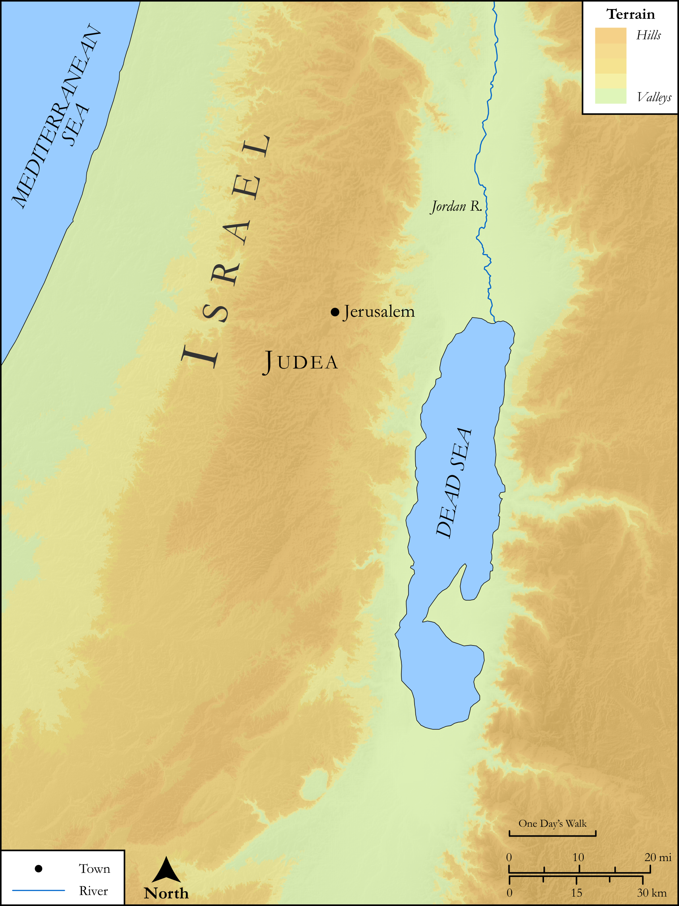

# Biblica Open Bible Maps

## License Information

Biblica Open Bible Maps, © 2023–2025 Biblica, Inc. This work is licensed under Creative Commons Attribution-ShareAlike 4.0 International (https://creativecommons.org/licenses/by-sa/4.0/). More Information: https://docs.google.com/document/d/1Pp44yZ0Zdnd59vJHTrt2rPYq0SppfX5rZbPBt6mz37U/edit?tab=t.0#heading=h.oev9aj1ksvk2

--------------------------------

## SRV Luke: Luke 21:20–27 (id: NT228)

### Image Content

[link](images/NT228.png)

Original: [SRV Luke: Luke 21:20\-27](https://drive.google.com/open?id=1cbj5r6WU8FKjYZtdVkJb_ltPJYrRgDih&usp=drive_copy)

* **Associated Passages:** Luke 21:1-38

* **Associated ACAI Concepts:** Sky (ID: `keyterm:Heaven`); Name (ID: `keyterm:Name`); Jerusalem (ID: `place:Jerusalem`); Temple (ID: `realia:Temple`); Ability (ID: `keyterm:Ability`); Symbol (ID: `keyterm:Example`); Kingdom (ID: `keyterm:Kingdom`); Offering (ID: `keyterm:Offering`); Heart (ID: `keyterm:Heart`); Daily Life (ID: `keyterm:DailyLife`); Ask for (ID: `keyterm:AskFor`); LORD (ID: `deity:Lord`); Avenge (ID: `keyterm:GrantJustice`); Parable (ID: `keyterm:Parable`); Glory (ID: `keyterm:Glory`); Gentiles (ID: `group:Gentile`); True (ID: `keyterm:True`); Liberation (ID: `keyterm:Liberation`); Bear Witness (ID: `keyterm:BearWitness`); Surely! (ID: `keyterm:Surely`); Disaster (ID: `keyterm:Disaster`); Dreadful Event (ID: `keyterm:DreadfulEventOrSight`); Everyday Matters (ID: `keyterm:OfThisLife`); Fear (ID: `keyterm:Fear`); Mount of Olives (ID: `place:OlivesMount`); Judea (ID: `place:Judea`); Lepton (ID: `realia:Lepton`); Treasury (ID: `realia:Treasury`); Olive Tree (ID: `flora:OliveTree`); Prison (ID: `realia:Prison`); Net (ID: `realia:Net`); Fig (ID: `flora:Fig`); Synagogue (ID: `realia:Synagogue`)
