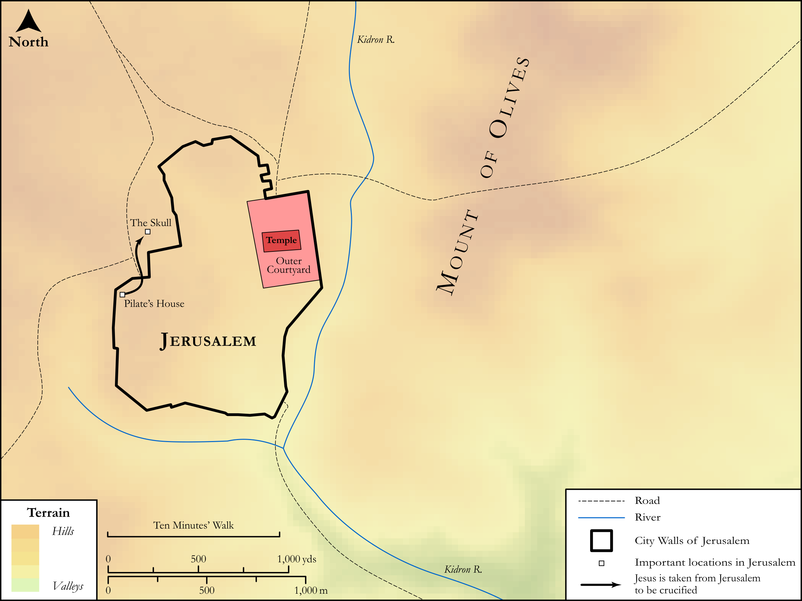

# Biblica Open Bible Maps

## License Information

Biblica Open Bible Maps, © 2023–2025 Biblica, Inc. This work is licensed under Creative Commons Attribution-ShareAlike 4.0 International (https://creativecommons.org/licenses/by-sa/4.0/). More Information: https://docs.google.com/document/d/1Pp44yZ0Zdnd59vJHTrt2rPYq0SppfX5rZbPBt6mz37U/edit?tab=t.0#heading=h.oev9aj1ksvk2

--------------------------------

## SRV Luke: Luke 23:26–42 (id: NT231)

### Image Content

[link](images/NT231.png)

Original: [SRV Luke: Luke 23:26\-42](https://drive.google.com/open?id=1iQ5df_1AjXe8nAB3835n9Rb11EbZn2kP&usp=drive_copy)

* **Associated Passages:** Luke 23:1-56

* **Associated ACAI Concepts:** Jesus (ID: `person:Jesus.2`); Pilate (ID: `person:Pilate`); LORD (ID: `deity:Lord`); Herod Antipas (ID: `person:Herod.2`); Galilee (ID: `place:Galilee`); Jews (ID: `group:Jews`); Cross (ID: `realia:Cross`); Salvation (ID: `keyterm:Salvation`); Jerusalem (ID: `place:Jerusalem`); Be (Or Show Oneself) Just (ID: `keyterm:Just`); Sabbath (ID: `keyterm:Sabbath`); Body (ID: `keyterm:Body.3`); Barabbas (ID: `person:Barabbas`); Criminal on the Cross (ID: `person:Dysmas`); Cyrene (ID: `place:Cyrene`); Simon (ID: `person:Simon.5`); Joseph (ID: `person:Joseph.6`); Arimathea (ID: `place:Arimathea`); Grave (ID: `realia:Grave`); Golgotha (ID: `place:Golgotha`); Paradise (ID: `keyterm:Paradise`); Tiberius (ID: `person:Tiberius`); Surely! (ID: `keyterm:Surely`); Ask for (ID: `keyterm:AskFor`); Happy (ID: `keyterm:Happy`); Commandment (ID: `keyterm:Commandment`); Chosen (ID: `keyterm:Chosen`); Judgment (ID: `keyterm:Judgment`); Glory (ID: `keyterm:Glory`); Kingdom (ID: `keyterm:Kingdom`)
