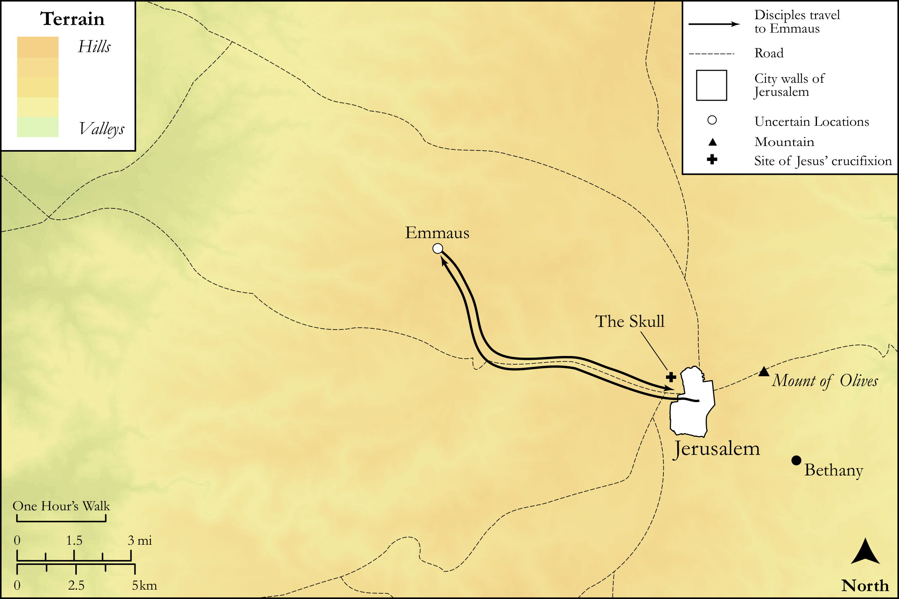

# Biblica Open Bible Maps

## License Information

Biblica Open Bible Maps, © 2023–2025 Biblica, Inc. This work is licensed under Creative Commons Attribution-ShareAlike 4.0 International (https://creativecommons.org/licenses/by-sa/4.0/). More Information: https://docs.google.com/document/d/1Pp44yZ0Zdnd59vJHTrt2rPYq0SppfX5rZbPBt6mz37U/edit?tab=t.0#heading=h.oev9aj1ksvk2

--------------------------------

## SRV Luke: Luke 24:13–34 (id: NT232)

### Image Content

[link](images/NT232.png)

Original: [SRV Luke: Luke 24:13\-34](https://drive.google.com/open?id=1HzeEFBGddiCQXjqgcUWbhBTeeggUVVte&usp=drive_copy)

* **Associated Passages:** Luke 24:1-53

* **Associated ACAI Concepts:** Jerusalem (ID: `place:Jerusalem`); Jesus (ID: `person:Jesus.2`); Grave (ID: `realia:Grave`); Bless (ID: `keyterm:Bless`); Written (ID: `keyterm:Scripture`); LORD (ID: `deity:Lord`); Name (ID: `keyterm:Name`); Heart (ID: `keyterm:Heart`); Body (ID: `keyterm:Body.3`); Disbelieve (ID: `keyterm:Disbelieve`); Moses (ID: `person:Moses`); Resurrection (ID: `keyterm:Resurrection`); Cause of Joy (ID: `keyterm:CauseOfJoy`); Word (ID: `keyterm:Word`); Life (ID: `keyterm:Life`); Peter (ID: `person:Peter`); Spirit (ID: `keyterm:Spirit.2`); Emmaus (ID: `place:Emmaus`); Cleopas (ID: `person:Cleopas`); To Cause to Happen (ID: `keyterm:Happen`); Week (ID: `keyterm:Week`); Bethany (ID: `place:Bethany`); Bow Down (ID: `keyterm:BowDown`); Joanna (ID: `person:Joanna`); Believe (ID: `keyterm:Believe`); Galilee (ID: `place:Galilee`); Law (ID: `keyterm:Law`); Height (ID: `keyterm:Height`); An Angel (ID: `deity:Angel`); To Sin (ID: `keyterm:Sin`)
