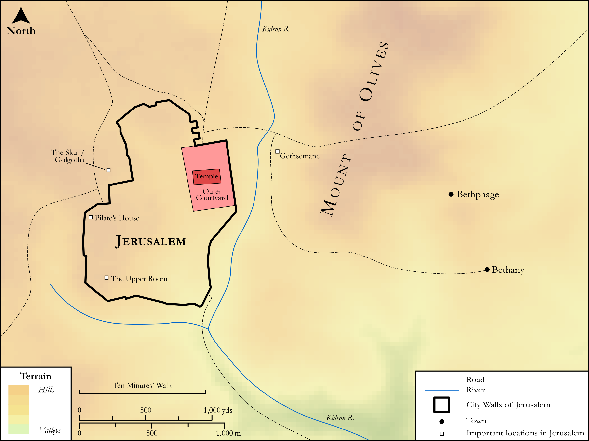

# Biblica Open Bible Maps

## License Information

Biblica Open Bible Maps, © 2023–2025 Biblica, Inc. This work is licensed under Creative Commons Attribution-ShareAlike 4.0 International (https://creativecommons.org/licenses/by-sa/4.0/). More Information: https://docs.google.com/document/d/1Pp44yZ0Zdnd59vJHTrt2rPYq0SppfX5rZbPBt6mz37U/edit?tab=t.0#heading=h.oev9aj1ksvk2

--------------------------------

## SRV Luke: All Luke Sites (Jerusalem) (id: NT235)

### Image Content

[link](images/NT235.png)

Original: [SRV Luke: All Luke Sites (Jerusalem)](https://drive.google.com/open?id=18ExmDvnFl84r6Lt5zLHglV4We2LjpRY1&usp=drive_copy)

* **Associated Passages:** Luke 1:1-24:53

* **Associated ACAI Concepts:** LORD (ID: `deity:Lord`); Jesus (ID: `person:Jesus.2`); Kingdom (ID: `keyterm:Kingdom`); Ability (ID: `keyterm:Ability`); Be a Disciple (ID: `keyterm:Disciple`); Sky (ID: `keyterm:Heaven`); Name (ID: `keyterm:Name`); Jerusalem (ID: `place:Jerusalem`); Ask for (ID: `keyterm:AskFor`); Fear (ID: `keyterm:Fear`); Pharisees (ID: `group:Pharisee`); Peter (ID: `person:Peter`); An Angel (ID: `deity:Angel`); Heart (ID: `keyterm:Heart`); Pray (ID: `keyterm:Pray`); Serve (ID: `keyterm:Serve`); John (ID: `person:John`); Glory (ID: `keyterm:Glory`); Salvation (ID: `keyterm:Salvation`); Demons (ID: `deity:Demons`); Believe (ID: `keyterm:Believe`); Forgive (ID: `keyterm:Forgive`); Life (ID: `keyterm:Life`); Parable (ID: `keyterm:Parable`); Holy Spirit (ID: `deity:HolySpirit`); Galilee (ID: `place:Galilee`); Word (ID: `keyterm:Word`); To Command (ID: `keyterm:Command`); Authority (ID: `keyterm:Authority.2`); Sabbath (ID: `keyterm:Sabbath`)
