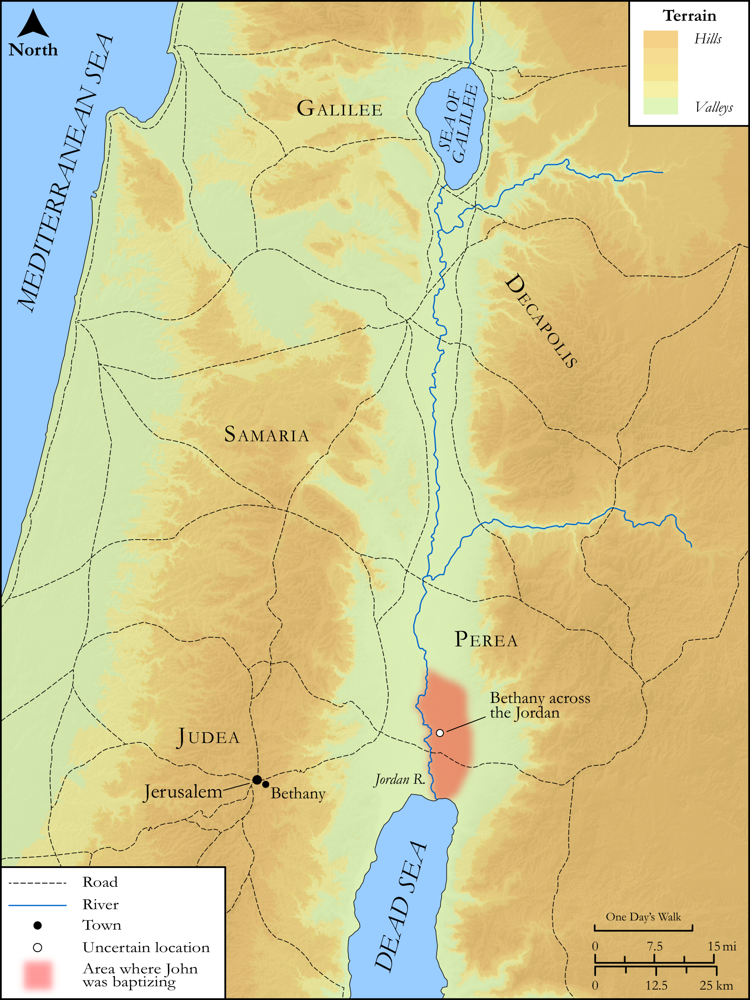

# Biblica Open Bible Maps

## License Information

Biblica Open Bible Maps, © 2023–2025 Biblica, Inc. This work is licensed under Creative Commons Attribution-ShareAlike 4.0 International (https://creativecommons.org/licenses/by-sa/4.0/). More Information: https://docs.google.com/document/d/1Pp44yZ0Zdnd59vJHTrt2rPYq0SppfX5rZbPBt6mz37U/edit?tab=t.0#heading=h.oev9aj1ksvk2

--------------------------------

## SRV John: John 1:19–27 (id: NT250)

### Image Content

[link](images/NT250.png)

Original: [SRV John: John 1:19\-27](https://drive.google.com/open?id=1Vq3d58BKWEhva_BXbfENPNRFwBFhU8sW&usp=drive_copy)

* **Associated Passages:** John 1:1-51

* **Associated ACAI Concepts:** Jesus (ID: `person:Jesus.2`); LORD (ID: `deity:Lord`); John (ID: `person:John`); Bear Witness (ID: `keyterm:BearWitness`); Nathanael (ID: `person:Nathanael`); Philip (ID: `person:Philip`); Baptism (ID: `keyterm:Baptism`); Peter (ID: `person:Peter`); Ability (ID: `keyterm:Ability`); Believe (ID: `keyterm:Believe`); Ask for (ID: `keyterm:AskFor`); Favor (ID: `keyterm:Favor`); Israel (ID: `person:Israel`); Nazareth (ID: `place:Nazareth`); Law (ID: `keyterm:Law`); True (ID: `keyterm:True`); Andrew (ID: `person:Andrew`); Moses (ID: `person:Moses`); Truth (ID: `keyterm:Truth`); Elijah (ID: `person:Elijah`); Holy Spirit (ID: `deity:HolySpirit`); Name (ID: `keyterm:Name`); Sky (ID: `keyterm:Heaven`); Be a Disciple (ID: `keyterm:Disciple`); Body (ID: `keyterm:Body.3`); Bethany (ID: `place:Bethany.2`); Life (ID: `keyterm:Life`); John (ID: `person:John.4`); Bethsaida (ID: `place:Bethsaida`); A Disciple (ID: `person:GenericDisciple`)
