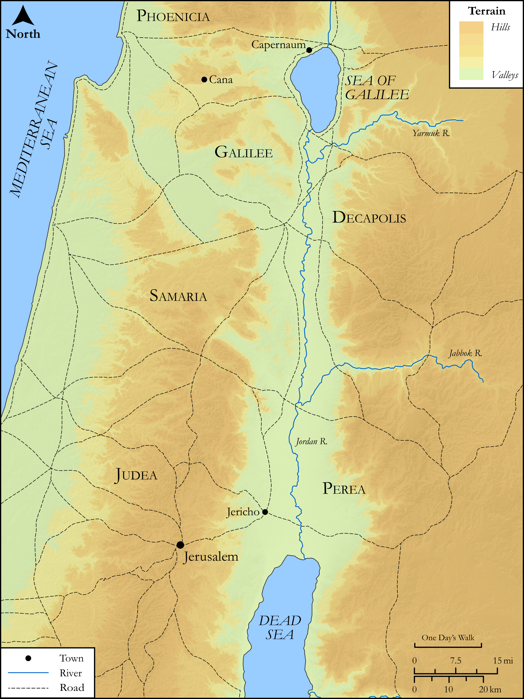

# Biblica Open Bible Maps

## License Information

Biblica Open Bible Maps, © 2023–2025 Biblica, Inc. This work is licensed under Creative Commons Attribution-ShareAlike 4.0 International (<a href="https://creativecommons.org/licenses/by-sa/4.0/">https://creativecommons.org/licenses/by-sa/4.0/</a>). More Information: <a href="https://docs.google.com/document/d/1Pp44yZ0Zdnd59vJHTrt2rPYq0SppfX5rZbPBt6mz37U/edit?tab=t.0#heading=h.oev9aj1ksvk2">https://docs.google.com/document/d/1Pp44yZ0Zdnd59vJHTrt2rPYq0SppfX5rZbPBt6mz37U/edit?tab=t.0#heading=h.oev9aj1ksvk2</a>

--------------------------------

## SRV John: John 2:1–11 (id: NT252)

### Image Content

[link](images/NT252.png)

Original: [SRV John: John 2:1\-11](https://drive.google.com/open?id=1lus4UTOiA-W-feR7EXpLj1toc0V-dWYj&usp=drive_copy)

* **Associated Passages:** Luke 18:1-43

* **Associated ACAI Concepts:** LORD (ID: `deity:Lord`); Jesus (ID: `person:Jesus.2`); Kingdom (ID: `keyterm:Kingdom`); Avenge (ID: `keyterm:GrantJustice`); Tax Collector (ID: `keyterm:TaxCollector`); Pray (ID: `keyterm:Pray`); Pharisees (ID: `group:Pharisee`); Surely! (ID: `keyterm:Surely`); To Command (ID: `keyterm:Command`); Be (Or Show Oneself) Just (ID: `keyterm:Just`); David (ID: `person:David`); Always (ID: `keyterm:Always`); Sky (ID: `keyterm:Heaven`); Fear (ID: `keyterm:Fear`); Mercy (ID: `keyterm:Mercy`); Parable (ID: `keyterm:Parable`); Salvation (ID: `keyterm:Salvation`); Believe (ID: `keyterm:Believe`); Life (ID: `keyterm:Life`); Good (ID: `keyterm:Good`); Abstain from Food (ID: `keyterm:Fast`); Temple (ID: `realia:Temple`); House (ID: `realia:House`); Unjust Deed (ID: `keyterm:UnjustDeed`); Commandment (ID: `keyterm:Commandment`); Ability (ID: `keyterm:Ability`); Week (ID: `keyterm:Week`); Gentiles (ID: `group:Gentile`); Be a Disciple (ID: `keyterm:Disciple`); Jerusalem (ID: `place:Jerusalem`); Peter (ID: `person:Peter`); Glory (ID: `keyterm:Glory`); Fornication (ID: `keyterm:Fornication`); Jericho (ID: `place:Jericho`); Persuade (ID: `keyterm:Persuade`); Word (ID: `keyterm:Word`); Nazareth (ID: `place:Nazareth`); Rich Young Ruler (ID: `person:RichYoungRuler`); Forgive (ID: `keyterm:Forgive`); Chosen (ID: `keyterm:Chosen`); Heart (ID: `keyterm:Heart`); Needle (ID: `realia:Needle`); Camel (ID: `fauna:Camel`)
