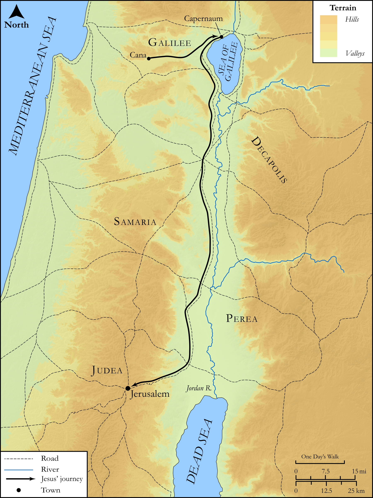

# Biblica Open Bible Maps

## License Information

Biblica Open Bible Maps, © 2023–2025 Biblica, Inc. This work is licensed under Creative Commons Attribution-ShareAlike 4.0 International (https://creativecommons.org/licenses/by-sa/4.0/). More Information: https://docs.google.com/document/d/1Pp44yZ0Zdnd59vJHTrt2rPYq0SppfX5rZbPBt6mz37U/edit?tab=t.0#heading=h.oev9aj1ksvk2

--------------------------------

## SRV John: John 2:13–24 (id: NT254)

### Image Content

[link](images/NT254.png)

Original: [SRV John: John 2:13\-24](https://drive.google.com/open?id=1eaF17UifhRH9X3lP3gHhofXaeiHj25M6&usp=drive_copy)

* **Associated Passages:** John 2:1-25

* **Associated ACAI Concepts:** Jesus (ID: `person:Jesus.2`); Be a Disciple (ID: `keyterm:Disciple`); Temple (ID: `realia:Temple`); Jews (ID: `group:Jews`); Believe (ID: `keyterm:Believe`); Symbol (ID: `keyterm:Example`); Wine (ID: `realia:Wine`); Cana (ID: `place:Cana`); Galilee (ID: `place:Galilee`); Passover (ID: `keyterm:Passover`); Jerusalem (ID: `place:Jerusalem`); Stone Jar (ID: `realia:StoneJar`); Clay Jar (ID: `realia:ClayJar`); Dove (ID: `fauna:Dove`); Sheep (ID: `fauna:Lamb`); Cattle (ID: `fauna:Bull`); Extremely (ID: `keyterm:Extremely`); House (ID: `realia:House`); LORD (ID: `deity:Lord`); Glory (ID: `keyterm:Glory`); Bear Witness (ID: `keyterm:BearWitness`); Written (ID: `keyterm:Scripture`); Body (ID: `keyterm:Body.3`); Resurrection (ID: `keyterm:Resurrection`); To Cleanse (ID: `keyterm:Cleanse.2`); Name (ID: `keyterm:Name`); Capernaum (ID: `place:Capernaum`); Measure (ID: `realia:Measure`); Whip (ID: `realia:Whip`); Rope (ID: `realia:Rope`)
