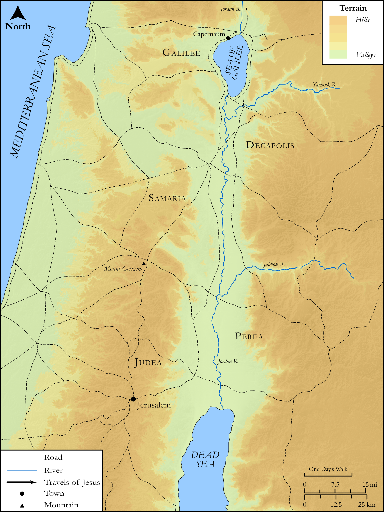

# Biblica Open Bible Maps

## License Information

Biblica Open Bible Maps, © 2023–2025 Biblica, Inc. This work is licensed under Creative Commons Attribution-ShareAlike 4.0 International (<a href="https://creativecommons.org/licenses/by-sa/4.0/">https://creativecommons.org/licenses/by-sa/4.0/</a>). More Information: <a href="https://docs.google.com/document/d/1Pp44yZ0Zdnd59vJHTrt2rPYq0SppfX5rZbPBt6mz37U/edit?tab=t.0#heading=h.oev9aj1ksvk2">https://docs.google.com/document/d/1Pp44yZ0Zdnd59vJHTrt2rPYq0SppfX5rZbPBt6mz37U/edit?tab=t.0#heading=h.oev9aj1ksvk2</a>

--------------------------------

## SRV John: John 7:1–09 (id: NT263)

### Image Content

[link](images/NT263.png)

Original: [SRV John: John 7:1\-09](https://drive.google.com/open?id=1boywg6wSx4WVH19B6CIBXsjVzLCx50Bl&usp=drive_copy)

* **Associated Passages:** John 7:1-53

* **Associated ACAI Concepts:** Jesus (ID: `person:Jesus.2`); Jews (ID: `group:Jews`); A Group of People (ID: `group:GenericGroup`); Believe (ID: `keyterm:Believe`); Galilee (ID: `place:Galilee`); True (ID: `keyterm:True`); Pharisees (ID: `group:Pharisee`); Law (ID: `keyterm:Law`); Moses (ID: `person:Moses`); Judea (ID: `place:Judea`); Circumcision (ID: `keyterm:Circumcision`); Decided (ID: `keyterm:Decided`); Ability (ID: `keyterm:Ability`); Glory (ID: `keyterm:Glory`); Sabbath (ID: `keyterm:Sabbath`); Written (ID: `keyterm:Scripture`); Temple (ID: `realia:Temple`); Unjust Deed (ID: `keyterm:UnjustDeed`); Bethlehem (ID: `place:Bethlehem`); Be (Or Show Oneself) Just (ID: `keyterm:Just`); Relatives (ID: `group:Relatives`); Nicodemus (ID: `person:Nicodemus`); Greeks (ID: `group:Greek`); Religious Officials (ID: `group:ReligiousOfficials`); Be a Disciple (ID: `keyterm:Disciple`); To Cause to Happen (ID: `keyterm:Happen`); David (ID: `person:David`); Jerusalem (ID: `place:Jerusalem`); LORD (ID: `deity:Lord`); Fear (ID: `keyterm:Fear`)
