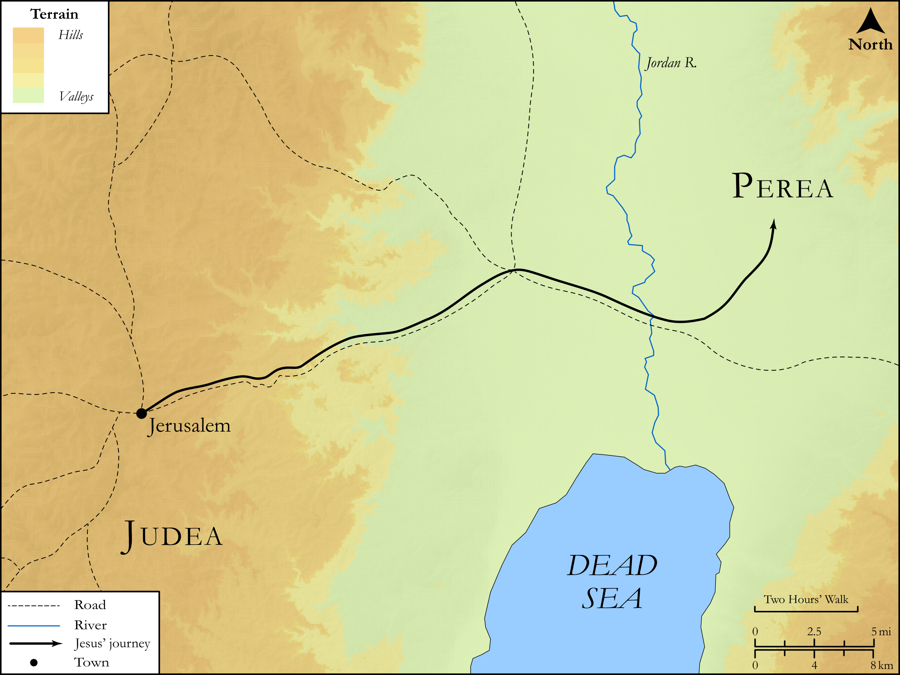

# Biblica Open Bible Maps

## License Information

Biblica Open Bible Maps, © 2023–2025 Biblica, Inc. This work is licensed under Creative Commons Attribution-ShareAlike 4.0 International (<a href="https://creativecommons.org/licenses/by-sa/4.0/">https://creativecommons.org/licenses/by-sa/4.0/</a>). More Information: <a href="https://docs.google.com/document/d/1Pp44yZ0Zdnd59vJHTrt2rPYq0SppfX5rZbPBt6mz37U/edit?tab=t.0#heading=h.oev9aj1ksvk2">https://docs.google.com/document/d/1Pp44yZ0Zdnd59vJHTrt2rPYq0SppfX5rZbPBt6mz37U/edit?tab=t.0#heading=h.oev9aj1ksvk2</a>

--------------------------------

## SRV John: John 10:22–41 (id: NT267)

### Image Content

[link](images/NT267.png)

Original: [SRV John: John 10:22\-41](https://drive.google.com/open?id=1dC6ksuo-oMCagA6MGs4pT-MyDDDMBQx7&usp=drive_copy)

* **Associated Passages:** John 10:1-42

* **Associated ACAI Concepts:** LORD (ID: `deity:Lord`); Sheep (ID: `fauna:Lamb`); Jesus (ID: `person:Jesus.2`); Believe (ID: `keyterm:Believe`); Life (ID: `keyterm:Life`); Flock (ID: `fauna:Flock`); Goat (ID: `fauna:Goat`); Jews (ID: `group:Jews`); Hired Worker (ID: `keyterm:HiredWorker`); Blaspheme (ID: `keyterm:Blaspheme`); Ability (ID: `keyterm:Ability`); Surely! (ID: `keyterm:Surely`); Name (ID: `keyterm:Name`); John (ID: `person:John`); Demons (ID: `deity:Demons`); Sheepfold (ID: `realia:Sheepfold`); Always (ID: `keyterm:Always`); Jordan River (ID: `place:Jordan`); Commandment (ID: `keyterm:Commandment`); Solomon (ID: `person:Solomon`); Jerusalem (ID: `place:Jerusalem`); Symbol (ID: `keyterm:Example`); True (ID: `keyterm:True`); Written (ID: `keyterm:Scripture`); Word (ID: `keyterm:Word`); Salvation (ID: `keyterm:Salvation`); Consecration (ID: `keyterm:Consecration.2`); Authority (ID: `keyterm:Authority.2`); Love (ID: `keyterm:Love`); Law (ID: `keyterm:Law`); Bear Witness (ID: `keyterm:BearWitness`); Be Demon Possessed (ID: `keyterm:DemonPossessed`); Baptism (ID: `keyterm:Baptism`); Porch (ID: `realia:Porch`); Wolf (ID: `fauna:Wolf`); Temple (ID: `realia:Temple`)
