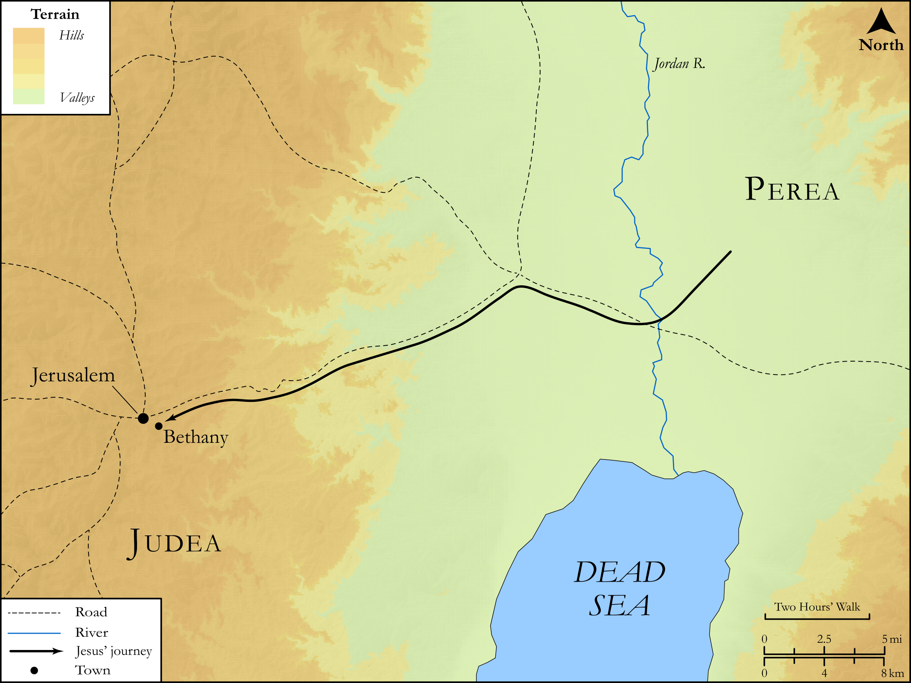

# Biblica Open Bible Maps

## License Information

Biblica Open Bible Maps, © 2023–2025 Biblica, Inc. This work is licensed under Creative Commons Attribution-ShareAlike 4.0 International (https://creativecommons.org/licenses/by-sa/4.0/). More Information: https://docs.google.com/document/d/1Pp44yZ0Zdnd59vJHTrt2rPYq0SppfX5rZbPBt6mz37U/edit?tab=t.0#heading=h.oev9aj1ksvk2

--------------------------------

## SRV John: John 11:1–15 (id: NT268)

### Image Content

[link](images/NT268.png)

Original: [SRV John: John 11:1\-15](https://drive.google.com/open?id=18FWtsBe6cOIy6YVlfp8JePZ2WLLCzY6t&usp=drive_copy)

* **Associated Passages:** John 11:1-57

* **Associated ACAI Concepts:** Jesus (ID: `person:Jesus.2`); Martha (ID: `person:Martha`); Mary (ID: `person:Mary.3`); Believe (ID: `keyterm:Believe`); Jews (ID: `group:Jews`); Lazarus (ID: `person:Lazarus.2`); LORD (ID: `deity:Lord`); Be a Disciple (ID: `keyterm:Disciple`); Pharisees (ID: `group:Pharisee`); Bethany (ID: `place:Bethany`); Stumble (ID: `keyterm:Stumble`); Resurrection (ID: `keyterm:Resurrection`); Jerusalem (ID: `place:Jerusalem`); Glory (ID: `keyterm:Glory`); Friendship (ID: `keyterm:Friendship`); Life (ID: `keyterm:Life`); Ability (ID: `keyterm:Ability`); A Group of Disciples (ID: `group:GenericDisciples`); Grave (ID: `realia:Grave`); Passover (ID: `keyterm:Passover`); Caiaphas (ID: `person:Caiaphas`); Thomas (ID: `person:Thomas`); Pure (ID: `keyterm:Pure`); Love (ID: `keyterm:Love`); Commandment (ID: `keyterm:Commandment`); Salvation (ID: `keyterm:Salvation`); Ephraim (ID: `place:Ephraim`); Anointed (ID: `keyterm:Anointed`); Speak as a Prophet (ID: `keyterm:Speak`); Rome (ID: `place:Rome`)
