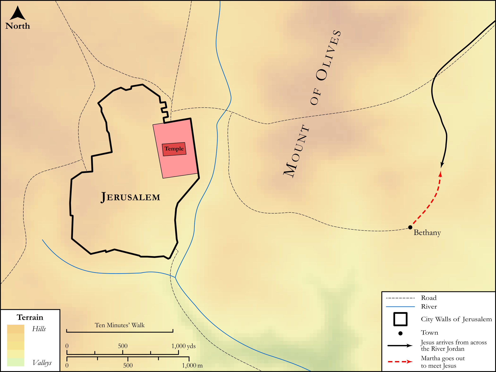

# Biblica Open Bible Maps

## License Information

Biblica Open Bible Maps, © 2023–2025 Biblica, Inc. This work is licensed under Creative Commons Attribution-ShareAlike 4.0 International (https://creativecommons.org/licenses/by-sa/4.0/). More Information: https://docs.google.com/document/d/1Pp44yZ0Zdnd59vJHTrt2rPYq0SppfX5rZbPBt6mz37U/edit?tab=t.0#heading=h.oev9aj1ksvk2

--------------------------------

## SRV John: John 11:17–27 (id: NT269)

### Image Content

[link](images/NT269.png)

Original: [SRV John: John 11:17\-27](https://drive.google.com/open?id=1NNGSjUSJBQhUqCfM3fZ7HHh6JmcGpoef&usp=drive_copy)

* **Associated Passages:** John 11:1-57

* **Associated ACAI Concepts:** Jesus (ID: `person:Jesus.2`); Martha (ID: `person:Martha`); Mary (ID: `person:Mary.3`); Jews (ID: `group:Jews`); Believe (ID: `keyterm:Believe`); Lazarus (ID: `person:Lazarus.2`); LORD (ID: `deity:Lord`); Be a Disciple (ID: `keyterm:Disciple`); Pharisees (ID: `group:Pharisee`); Bethany (ID: `place:Bethany`); Stumble (ID: `keyterm:Stumble`); Resurrection (ID: `keyterm:Resurrection`); Glory (ID: `keyterm:Glory`); A Group of Disciples (ID: `group:GenericDisciples`); Ability (ID: `keyterm:Ability`); Life (ID: `keyterm:Life`); Jerusalem (ID: `place:Jerusalem`); Friendship (ID: `keyterm:Friendship`); Grave (ID: `realia:Grave`); Thomas (ID: `person:Thomas`); Caiaphas (ID: `person:Caiaphas`); Passover (ID: `keyterm:Passover`); Commandment (ID: `keyterm:Commandment`); Ephraim (ID: `place:Ephraim`); Always (ID: `keyterm:Always`); Spirit (ID: `keyterm:Spirit.2`); Speak as a Prophet (ID: `keyterm:Speak`); Symbol (ID: `keyterm:Example`); Salvation (ID: `keyterm:Salvation`); Pure (ID: `keyterm:Pure`)
