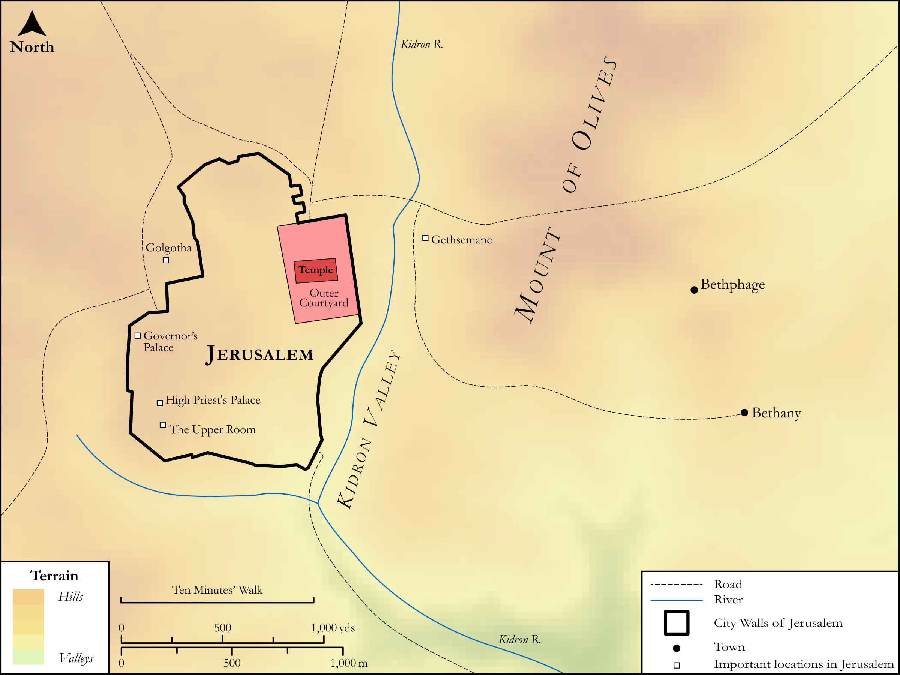

# Biblica Open Bible Maps

## License Information

Biblica Open Bible Maps, © 2023–2025 Biblica, Inc. This work is licensed under Creative Commons Attribution-ShareAlike 4.0 International (https://creativecommons.org/licenses/by-sa/4.0/). More Information: https://docs.google.com/document/d/1Pp44yZ0Zdnd59vJHTrt2rPYq0SppfX5rZbPBt6mz37U/edit?tab=t.0#heading=h.oev9aj1ksvk2

--------------------------------

## SRV John: All John Sites (Jerusalem) (id: NT275)

### Image Content

[link](images/NT275.png)

Original: [SRV John: All John Sites (Jerusalem)](https://drive.google.com/open?id=1Neghu9Rv49t_gKdg_yZG2ToarhqeeK4b&usp=drive_copy)

* **Associated Passages:** John 1:1-21:25

* **Associated ACAI Concepts:** Jesus (ID: `person:Jesus.2`); LORD (ID: `deity:Lord`); Believe (ID: `keyterm:Believe`); Be a Disciple (ID: `keyterm:Disciple`); Jews (ID: `group:Jews`); Ability (ID: `keyterm:Ability`); Life (ID: `keyterm:Life`); Bear Witness (ID: `keyterm:BearWitness`); Peter (ID: `person:Peter`); Love (ID: `keyterm:Love`); Always (ID: `keyterm:Always`); Glory (ID: `keyterm:Glory`); True (ID: `keyterm:True`); Ask for (ID: `keyterm:AskFor`); Surely! (ID: `keyterm:Surely`); Name (ID: `keyterm:Name`); Truth (ID: `keyterm:Truth`); Pilate (ID: `person:Pilate`); Pharisees (ID: `group:Pharisee`); John (ID: `person:John`); Body (ID: `keyterm:Body.3`); Symbol (ID: `keyterm:Example`); To Sin (ID: `keyterm:Sin`); Sky (ID: `keyterm:Heaven`); Galilee (ID: `place:Galilee`); Holy Spirit (ID: `deity:HolySpirit`); Jerusalem (ID: `place:Jerusalem`); Decided (ID: `keyterm:Decided`); Law (ID: `keyterm:Law`); Written (ID: `keyterm:Scripture`)
