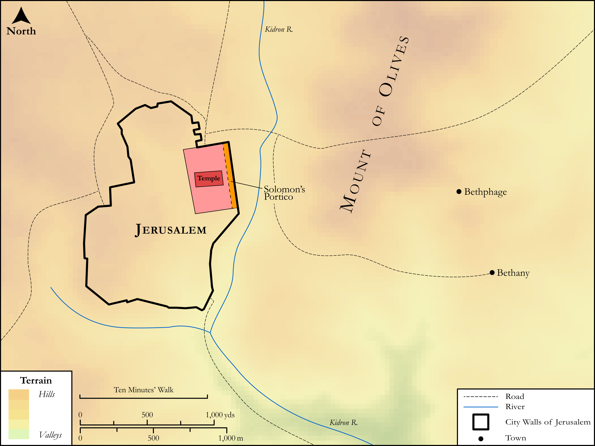

# Biblica Open Bible Maps

## License Information

Biblica Open Bible Maps, © 2023–2025 Biblica, Inc. This work is licensed under Creative Commons Attribution-ShareAlike 4.0 International (<a href="https://creativecommons.org/licenses/by-sa/4.0/">https://creativecommons.org/licenses/by-sa/4.0/</a>). More Information: <a href="https://docs.google.com/document/d/1Pp44yZ0Zdnd59vJHTrt2rPYq0SppfX5rZbPBt6mz37U/edit?tab=t.0#heading=h.oev9aj1ksvk2">https://docs.google.com/document/d/1Pp44yZ0Zdnd59vJHTrt2rPYq0SppfX5rZbPBt6mz37U/edit?tab=t.0#heading=h.oev9aj1ksvk2</a>

--------------------------------

## SRV Acts: Acts 5:12–15 (id: NT304)

### Image Content

[link](images/NT304.png)

Original: [SRV Acts: Acts 5:12\-15](https://drive.google.com/open?id=1PJOSDvzEJlkMxKQM77F4yvTYh3knQMd0&usp=drive_copy)

* **Associated Passages:** Acts 5:1-42

* **Associated ACAI Concepts:** LORD (ID: `deity:Lord`); Peter (ID: `person:Peter`); Name (ID: `keyterm:Name`); Heart (ID: `keyterm:Heart`); Prison (ID: `realia:Prison`); Temple (ID: `realia:Temple`); Ananias (ID: `person:Ananias`); Persuade (ID: `keyterm:Persuade`); Jesus (ID: `person:Jesus.2`); Fear (ID: `keyterm:Fear`); Israel (ID: `person:Israel`); Holy Spirit (ID: `deity:HolySpirit`); Door (ID: `realia:Door`); Jerusalem (ID: `place:Jerusalem`); Word (ID: `keyterm:Word`); Portent (ID: `keyterm:Portent`); Witness (ID: `keyterm:Witness`); Resentment (ID: `keyterm:Resentment`); Sapphira (ID: `person:Sapphira`); Judas (ID: `person:Judas.3`); Savior (ID: `keyterm:Savior`); Gamaliel (ID: `person:Gamaliel`); Theudas (ID: `person:Theudas`); Ability (ID: `keyterm:Ability`); Serve (ID: `keyterm:Serve`); Opposing God (ID: `keyterm:OpposingGod`); An Angel (ID: `deity:Angel`); Church (ID: `keyterm:Church`); Resurrection (ID: `keyterm:Resurrection`); Symbol (ID: `keyterm:Example`); Blood (ID: `keyterm:Blood`); Sadducees (ID: `group:Sadducee`); Satan (ID: `deity:Satan`); Pharisees (ID: `group:Pharisee`); A Group of Disciples (ID: `group:GenericDisciples`); A Person (ID: `person:GenericPerson`); Israelites (ID: `group:Israel`); Census (ID: `keyterm:Census`); To Sin (ID: `keyterm:Sin`); Authority (ID: `keyterm:Authority.2`); Believe (ID: `keyterm:Believe`); Life (ID: `keyterm:Life`); Repent (ID: `keyterm:Repent`); Forgive (ID: `keyterm:Forgive`); Galileans (ID: `group:Galilee`); Good News (ID: `keyterm:GoodNews`); Galilee (ID: `place:Galilee`); Porch (ID: `realia:Porch`); Bed (ID: `realia:Bed`); Cross (ID: `realia:Cross`); House (ID: `realia:House`)
