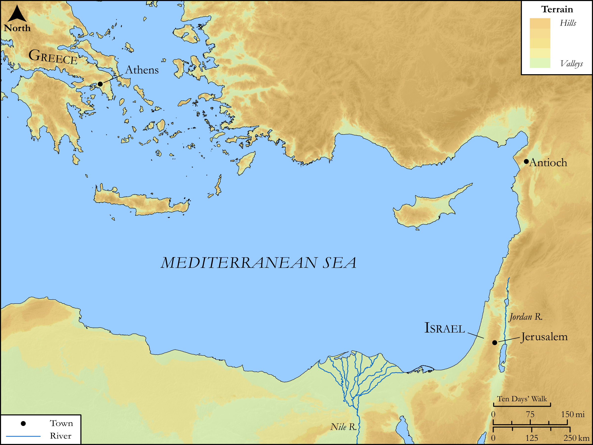

# Biblica Open Bible Maps

## License Information

Biblica Open Bible Maps, © 2023–2025 Biblica, Inc. This work is licensed under Creative Commons Attribution-ShareAlike 4.0 International (<a href="https://creativecommons.org/licenses/by-sa/4.0/">https://creativecommons.org/licenses/by-sa/4.0/</a>). More Information: <a href="https://docs.google.com/document/d/1Pp44yZ0Zdnd59vJHTrt2rPYq0SppfX5rZbPBt6mz37U/edit?tab=t.0#heading=h.oev9aj1ksvk2">https://docs.google.com/document/d/1Pp44yZ0Zdnd59vJHTrt2rPYq0SppfX5rZbPBt6mz37U/edit?tab=t.0#heading=h.oev9aj1ksvk2</a>

--------------------------------

## SRV Acts: Acts 6:1–6 (id: NT305)

### Image Content

[link](images/NT305.png)

Original: [SRV Acts: Acts 6:1\-6](https://drive.google.com/open?id=18eY_570Ku9xbxUuCM6GAybZKNxyv3gEV&usp=drive_copy)

* **Associated Passages:** Acts 6:1-15

* **Associated ACAI Concepts:** Stephen (ID: `person:Stephen`); Serve (ID: `keyterm:Serve`); Be a Disciple (ID: `keyterm:Disciple`); LORD (ID: `deity:Lord`); Holy Spirit (ID: `deity:HolySpirit`); Moses (ID: `person:Moses`); Pray (ID: `keyterm:Pray`); Word (ID: `keyterm:Word`); Spirit (ID: `keyterm:Spirit.2`); Believe (ID: `keyterm:Believe`); Philip (ID: `person:Philip.4`); Alexandrians (ID: `group:Alexandria`); Freedmen (ID: `group:Freedmen`); Parmenas (ID: `person:Parmenas`); Antiochians (ID: `group:Antioch`); Nicanor (ID: `person:Nicanor`); Nicolaus (ID: `person:Nicolaus`); Timon (ID: `person:Timon`); Alexandria (ID: `place:Alexandria`); Prochorus (ID: `person:Prochorus`); Hellenists (ID: `group:Hellenist`); Portent (ID: `keyterm:Portent`); Favor (ID: `keyterm:Favor`); Hebrews (ID: `group:Hebrews`); Ability (ID: `keyterm:Ability`); Witness (ID: `keyterm:Witness`); Asia (ID: `place:Asia`); Jerusalem (ID: `place:Jerusalem`); Jesus (ID: `person:Jesus.2`); An Angel (ID: `deity:Angel`); Antioch (ID: `place:Antioch`); Holy (ID: `keyterm:Holy`); Symbol (ID: `keyterm:Example`); Cilicia (ID: `place:Cilicia`); Cyrene (ID: `place:Cyrene`); A Group of Disciples (ID: `group:GenericDisciples`); Nazareth (ID: `place:Nazareth`); Chosen (ID: `keyterm:Chosen`); Law (ID: `keyterm:Law`); Blasphemous (ID: `keyterm:Blasphemous`); Bear Witness (ID: `keyterm:BearWitness`); Greece (ID: `place:Greece`); Tabernacle (ID: `realia:Tabernacle`)
