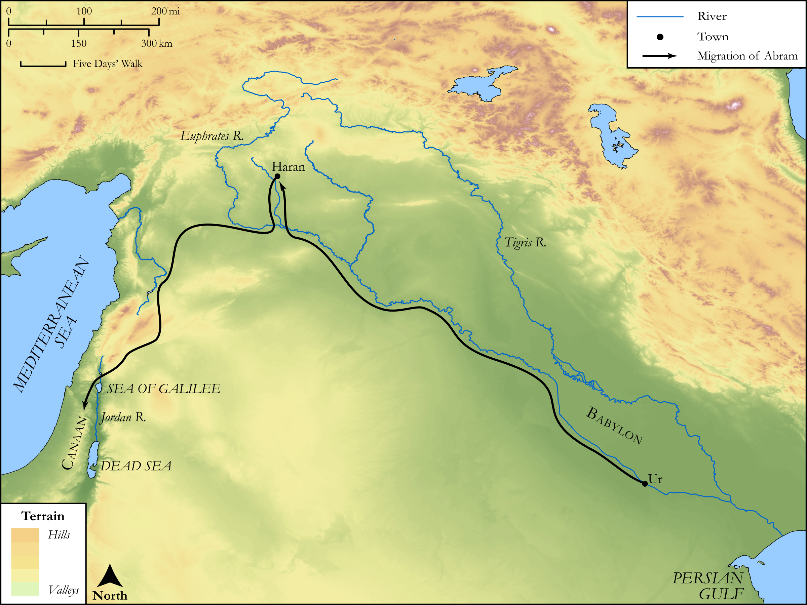

# Biblica Open Bible Maps

## License Information

Biblica Open Bible Maps, © 2023–2025 Biblica, Inc. This work is licensed under Creative Commons Attribution-ShareAlike 4.0 International (https://creativecommons.org/licenses/by-sa/4.0/). More Information: https://docs.google.com/document/d/1Pp44yZ0Zdnd59vJHTrt2rPYq0SppfX5rZbPBt6mz37U/edit?tab=t.0#heading=h.oev9aj1ksvk2

--------------------------------

## SRV Acts: Acts 7:1–7 (id: NT307)

### Image Content

[link](images/NT307.png)

Original: [SRV Acts: Acts 7:1\-7](https://drive.google.com/open?id=1V_d_5-1LKWNG7acnklGtIf9RaaSp6WMd&usp=drive_copy)

* **Associated Passages:** Acts 7:1-60

* **Associated ACAI Concepts:** LORD (ID: `deity:Lord`); Egypt (ID: `place:Egypt`); Moses (ID: `person:Moses`); Israel (ID: `person:Israel`); Joseph (ID: `person:Joseph.10`); Sky (ID: `keyterm:Heaven`); Abraham (ID: `person:Abraham`); An Angel (ID: `deity:Angel`); To Act Wickedly (ID: `keyterm:ActWickedly`); Egyptians (ID: `group:Egypt`); Heart (ID: `keyterm:Heart`); Jesus (ID: `person:Jesus.2`); Rescue (ID: `keyterm:Rescue`); Pharaoh (ID: `person:Pharaoh.4`); Haran (ID: `place:Haran`); Priesthood (ID: `keyterm:Priesthood`); Holy Spirit (ID: `deity:HolySpirit`); Judge (ID: `keyterm:Judge`); Serve (ID: `keyterm:Serve`); Glory (ID: `keyterm:Glory`); Offering (ID: `keyterm:Offering`); Mount Sinai (ID: `place:SinaiMount`); Favor (ID: `keyterm:Favor`); Promise (ID: `keyterm:Promise`); Isaac (ID: `person:Isaac`); Mesopotamia (ID: `place:Mesopotamia`); Hamor (ID: `person:Hamor`); Call Upon (ID: `keyterm:CallUpon`); Shechem (ID: `place:Shechem`); Stephen (ID: `person:Stephen`)
