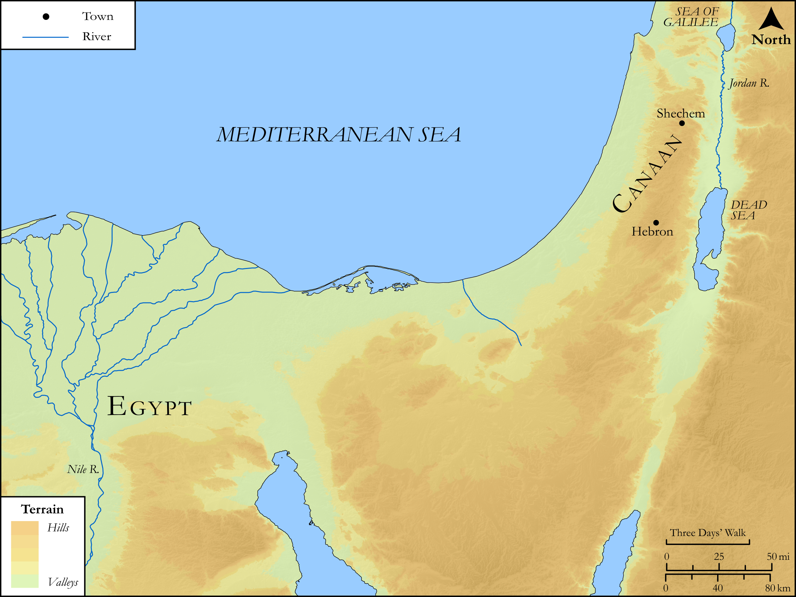

# Biblica Open Bible Maps

## License Information

Biblica Open Bible Maps, © 2023–2025 Biblica, Inc. This work is licensed under Creative Commons Attribution-ShareAlike 4.0 International (<a href="https://creativecommons.org/licenses/by-sa/4.0/">https://creativecommons.org/licenses/by-sa/4.0/</a>). More Information: <a href="https://docs.google.com/document/d/1Pp44yZ0Zdnd59vJHTrt2rPYq0SppfX5rZbPBt6mz37U/edit?tab=t.0#heading=h.oev9aj1ksvk2">https://docs.google.com/document/d/1Pp44yZ0Zdnd59vJHTrt2rPYq0SppfX5rZbPBt6mz37U/edit?tab=t.0#heading=h.oev9aj1ksvk2</a>

--------------------------------

## SRV Acts: Acts 7:9–18 (id: NT308)

### Image Content

[link](images/NT308.png)

Original: [SRV Acts: Acts 7:9\-18](https://drive.google.com/open?id=1TXJEBrUKsE8gvxPzqItZMWpNkzpFD457&usp=drive_copy)

* **Associated Passages:** Acts 7:1-60

* **Associated ACAI Concepts:** LORD (ID: `deity:Lord`); Egypt (ID: `place:Egypt`); Moses (ID: `person:Moses`); Israel (ID: `person:Israel`); Joseph (ID: `person:Joseph.10`); Sky (ID: `keyterm:Heaven`); An Angel (ID: `deity:Angel`); Abraham (ID: `person:Abraham`); To Act Wickedly (ID: `keyterm:ActWickedly`); Jesus (ID: `person:Jesus.2`); Egyptians (ID: `group:Egypt`); Heart (ID: `keyterm:Heart`); Rescue (ID: `keyterm:Rescue`); Pharaoh (ID: `person:Pharaoh.4`); Favor (ID: `keyterm:Favor`); Haran (ID: `place:Haran`); Promise (ID: `keyterm:Promise`); Mount Sinai (ID: `place:SinaiMount`); Serve (ID: `keyterm:Serve`); Offering (ID: `keyterm:Offering`); Isaac (ID: `person:Isaac`); Glory (ID: `keyterm:Glory`); Judge (ID: `keyterm:Judge`); Priesthood (ID: `keyterm:Priesthood`); Holy Spirit (ID: `deity:HolySpirit`); Call Upon (ID: `keyterm:CallUpon`); Mesopotamia (ID: `place:Mesopotamia`); Rephan (ID: `deity:Rephan`); Stephen (ID: `person:Stephen`); Hamor (ID: `person:Hamor`)
