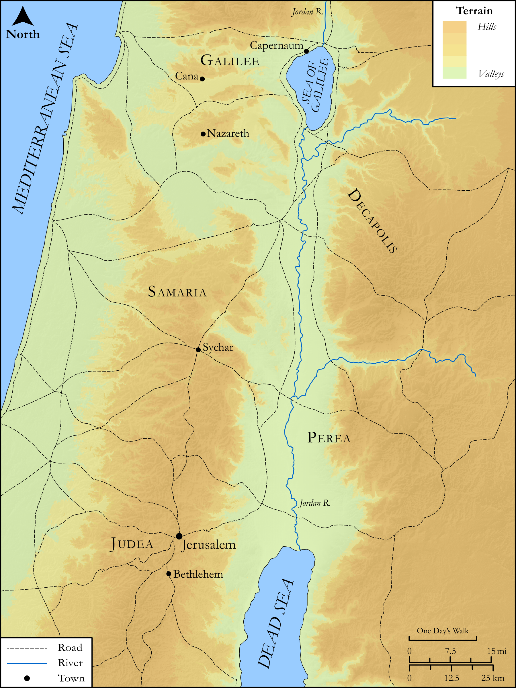

# Biblica Open Bible Maps

## License Information

Biblica Open Bible Maps, © 2023–2025 Biblica, Inc. This work is licensed under Creative Commons Attribution-ShareAlike 4.0 International (https://creativecommons.org/licenses/by-sa/4.0/). More Information: https://docs.google.com/document/d/1Pp44yZ0Zdnd59vJHTrt2rPYq0SppfX5rZbPBt6mz37U/edit?tab=t.0#heading=h.oev9aj1ksvk2

--------------------------------

## SRV Acts: Acts 7:54–8:2 (id: NT310)

### Image Content

[link](images/NT310.png)

Original: [SRV Acts: Acts 7:54\-8:2](https://drive.google.com/open?id=18MadB11-vl5QFOZw-silfeygTEUroRZ6&usp=drive_copy)

* **Associated Passages:** John 4:1-54

* **Associated ACAI Concepts:** Jesus (ID: `person:Jesus.2`); Believe (ID: `keyterm:Believe`); Life (ID: `keyterm:Life`); Galilee (ID: `place:Galilee`); Samaria (ID: `place:Samaria`); Be a Disciple (ID: `keyterm:Disciple`); Bow Down (ID: `keyterm:BowDown`); LORD (ID: `deity:Lord`); True (ID: `keyterm:True`); A Woman (ID: `person:GenericFemale`); Samaritans (ID: `group:Samaritan`); Jerusalem (ID: `place:Jerusalem`); Israel (ID: `person:Israel`); Ask for (ID: `keyterm:AskFor`); Judea (ID: `place:Judea`); Baptism (ID: `keyterm:Baptism`); Jews (ID: `group:Jews`); Always (ID: `keyterm:Always`); Spirit (ID: `keyterm:Spirit.2`); Symbol (ID: `keyterm:Example`); Bear Witness (ID: `keyterm:BearWitness`); Truth (ID: `keyterm:Truth`); Galileans (ID: `group:Galilee`); Sychar (ID: `place:Sychar`); Cana (ID: `place:Cana`); Portent (ID: `keyterm:Portent`); Public Official (ID: `person:GenericOfficial`); Ability (ID: `keyterm:Ability`); A Group of Disciples (ID: `group:GenericDisciples`); Salvation (ID: `keyterm:Salvation`)
