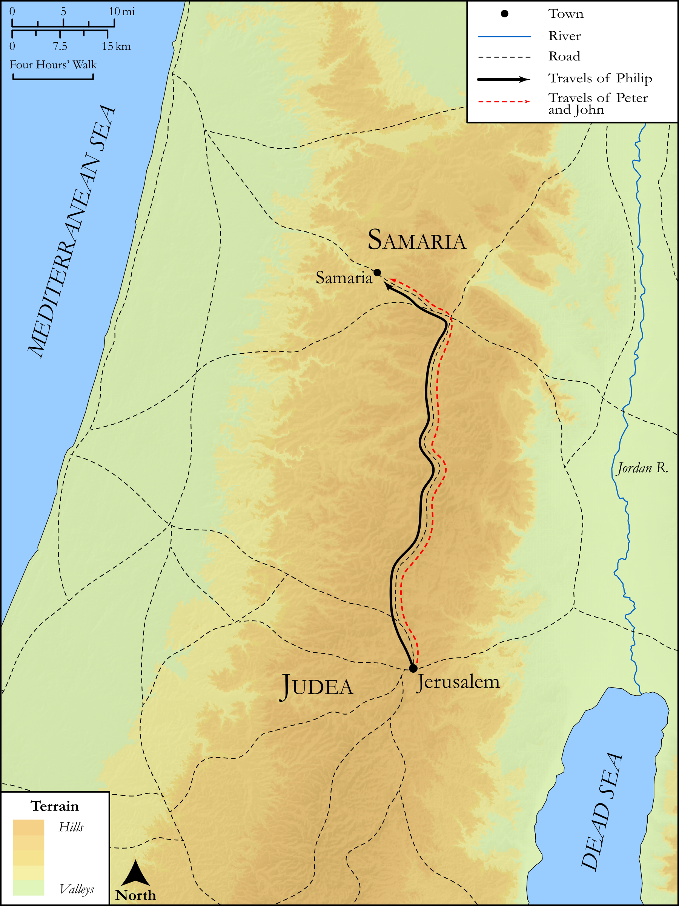

# Biblica Open Bible Maps

## License Information

Biblica Open Bible Maps, © 2023–2025 Biblica, Inc. This work is licensed under Creative Commons Attribution-ShareAlike 4.0 International (https://creativecommons.org/licenses/by-sa/4.0/). More Information: https://docs.google.com/document/d/1Pp44yZ0Zdnd59vJHTrt2rPYq0SppfX5rZbPBt6mz37U/edit?tab=t.0#heading=h.oev9aj1ksvk2

--------------------------------

## SRV Acts: Acts 8:4–24 (id: NT311)

### Image Content

[link](images/NT311.png)

Original: [SRV Acts: Acts 8:4\-24](https://drive.google.com/open?id=1zkpPN23O7cnijSXzucGMSA-F3eooxcig&usp=drive_copy)

* **Associated Passages:** Acts 8:1-40

* **Associated ACAI Concepts:** Philip (ID: `person:Philip.4`); LORD (ID: `deity:Lord`); Holy Spirit (ID: `deity:HolySpirit`); Good News (ID: `keyterm:GoodNews`); Jerusalem (ID: `place:Jerusalem`); Baptism (ID: `keyterm:Baptism`); Samaria (ID: `place:Samaria`); Ask for (ID: `keyterm:AskFor`); Jesus (ID: `person:Jesus.2`); Simon (ID: `person:Simon.8`); Public Official (ID: `person:GenericOfficial`); Ability (ID: `keyterm:Ability`); Name (ID: `keyterm:Name`); Chariot (ID: `realia:Chariot`); Peter (ID: `person:Peter`); Symbol (ID: `keyterm:Example`); Believe (ID: `keyterm:Believe`); Church (ID: `keyterm:Church`); Written (ID: `keyterm:Scripture`); Paul (ID: `person:Paul`); Heart (ID: `keyterm:Heart`); Isaiah (ID: `person:Isaiah`); Money (ID: `realia:Money`); Ashdod (ID: `place:Ashdod`); Proclaim (ID: `keyterm:Proclaim`); Ethiopia (ID: `place:Ethiopia`); Stephen (ID: `person:Stephen`); Gaza (ID: `place:Gaza`); Ethiopians (ID: `group:Ethiopia`); Judea (ID: `place:Judea`); Declare (ID: `keyterm:Declare`); An Angel (ID: `deity:Angel`); Bow Down (ID: `keyterm:BowDown`); Forgive (ID: `keyterm:Forgive`); Cause of Joy (ID: `keyterm:CauseOfJoy`); Kingdom (ID: `keyterm:Kingdom`); Serve (ID: `keyterm:Serve`); Authority (ID: `keyterm:Authority.2`); Pray (ID: `keyterm:Pray`); Simon (ID: `person:Simon.9`); Samaritans (ID: `group:Samaritan`); Unjust Deed (ID: `keyterm:UnjustDeed`); Repent (ID: `keyterm:Repent`); Straightness (ID: `keyterm:Straightness`); John (ID: `person:John.2`); Life (ID: `keyterm:Life`); Caesarea (ID: `place:Caesarea`); Prison (ID: `realia:Prison`); Sheep (ID: `fauna:Lamb`); House (ID: `realia:House`); Temple (ID: `realia:Temple`)
