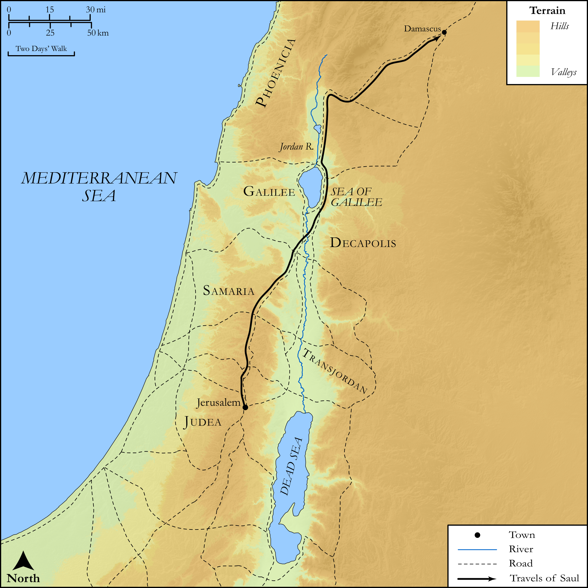

# Biblica Open Bible Maps

## License Information

Biblica Open Bible Maps, © 2023–2025 Biblica, Inc. This work is licensed under Creative Commons Attribution-ShareAlike 4.0 International (https://creativecommons.org/licenses/by-sa/4.0/). More Information: https://docs.google.com/document/d/1Pp44yZ0Zdnd59vJHTrt2rPYq0SppfX5rZbPBt6mz37U/edit?tab=t.0#heading=h.oev9aj1ksvk2

--------------------------------

## SRV Acts: Acts 9:1–19a (id: NT314)

### Image Content

[link](images/NT314.png)

Original: [SRV Acts: Acts 9:1\-19a](https://drive.google.com/open?id=11qzQeqhW4dNsfi2IA_iPR916yyKkUBDK&usp=drive_copy)

* **Associated Passages:** Acts 9:1-43

* **Associated ACAI Concepts:** Jesus (ID: `person:Jesus.2`); Name (ID: `keyterm:Name`); Paul (ID: `person:Paul`); Damascus (ID: `place:Damascus`); Be a Disciple (ID: `keyterm:Disciple`); Jerusalem (ID: `place:Jerusalem`); Peter (ID: `person:Peter`); Ananias (ID: `person:Ananias.2`); Joppa (ID: `place:Joppa`); Tabitha (ID: `person:Tabitha`); Holy (ID: `keyterm:Holy`); Lod (ID: `place:Lod`); Aeneas (ID: `person:Aeneas`); Tarsus (ID: `place:Tarsus`); Believe (ID: `keyterm:Believe`); Ask for (ID: `keyterm:AskFor`); Call Upon (ID: `keyterm:CallUpon`); Holy Spirit (ID: `deity:HolySpirit`); Pray (ID: `keyterm:Pray`); Fear (ID: `keyterm:Fear`); Jews (ID: `group:Jews`); Judas (ID: `person:Judas.4`); Hellenists (ID: `group:Hellenist`); The Way (ID: `keyterm:TheWay`); Simon (ID: `person:Simon.9`); Tarsians (ID: `group:Tarsus`); Straight Street (ID: `place:Straight`); Sharon Plain (ID: `place:Sharon.2`); Upstairs Room (ID: `realia:UpstairsRoom`); House (ID: `realia:House`); Greece (ID: `place:Greece`); Barnabas (ID: `person:Barnabas`); Galilee (ID: `place:Galilee`); Chosen (ID: `keyterm:Chosen`); Baptism (ID: `keyterm:Baptism`); Church (ID: `keyterm:Church`); Proclaim (ID: `keyterm:Proclaim`); Good (ID: `keyterm:Good`); Make Peace (ID: `keyterm:Peace`); Life (ID: `keyterm:Life`); Straightness (ID: `keyterm:Straightness`); Sky (ID: `keyterm:Heaven`); Caesarea (ID: `place:Caesarea`); Samaria (ID: `place:Samaria`); Judea (ID: `place:Judea`); Ability (ID: `keyterm:Ability`); Israel (ID: `person:Israel`); Gentiles (ID: `group:Gentile`); Body (ID: `keyterm:Body.3`); Authority (ID: `keyterm:Authority.2`); Basket (ID: `realia:Basket`); Cloak (ID: `realia:Cloak`); Synagogue (ID: `realia:Synagogue`); City Wall (ID: `realia:CityWall`); Temple (ID: `realia:Temple`); Tunic (ID: `realia:Tunic.2`); Leather (ID: `realia:Leather`); Bed (ID: `realia:Bed`)
