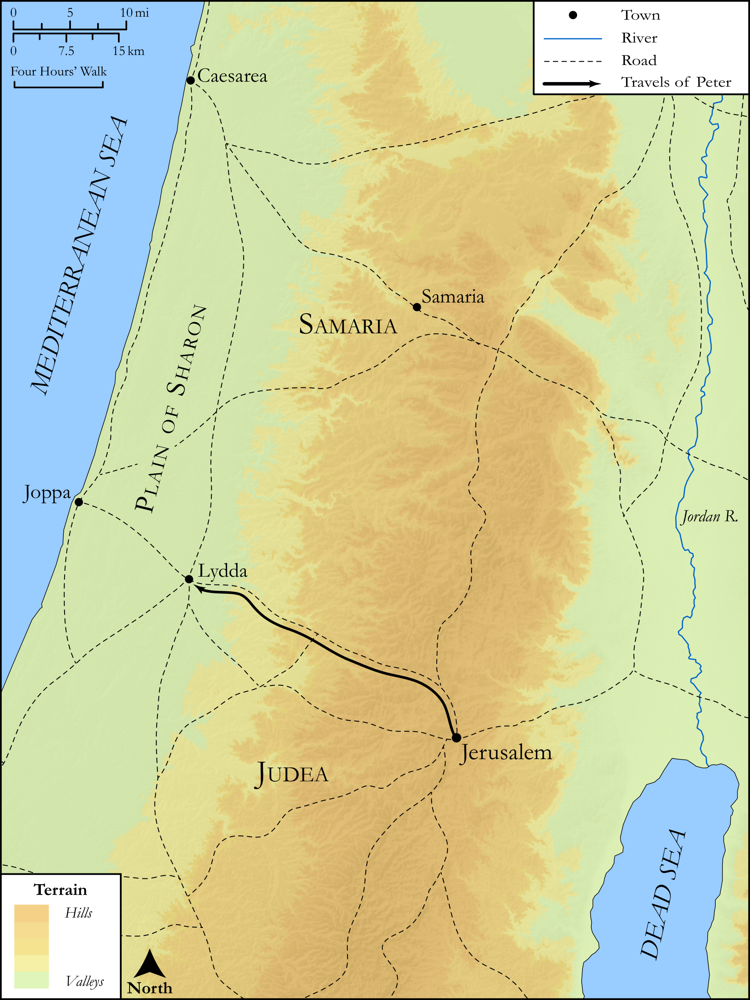

# Biblica Open Bible Maps

## License Information

Biblica Open Bible Maps, © 2023–2025 Biblica, Inc. This work is licensed under Creative Commons Attribution-ShareAlike 4.0 International (<a href="https://creativecommons.org/licenses/by-sa/4.0/">https://creativecommons.org/licenses/by-sa/4.0/</a>). More Information: <a href="https://docs.google.com/document/d/1Pp44yZ0Zdnd59vJHTrt2rPYq0SppfX5rZbPBt6mz37U/edit?tab=t.0#heading=h.oev9aj1ksvk2">https://docs.google.com/document/d/1Pp44yZ0Zdnd59vJHTrt2rPYq0SppfX5rZbPBt6mz37U/edit?tab=t.0#heading=h.oev9aj1ksvk2</a>

--------------------------------

## SRV Acts: Acts 9:32–34 (id: NT317)

### Image Content

[link](images/NT317.png)

Original: [SRV Acts: Acts 9:32\-34](https://drive.google.com/open?id=1suk-nmWLwUgXjC7JTkFfOLdMG8uB3jl1&usp=drive_copy)

* **Associated Passages:** Acts 9:1-43

* **Associated ACAI Concepts:** Jesus (ID: `person:Jesus.2`); Name (ID: `keyterm:Name`); Paul (ID: `person:Paul`); Damascus (ID: `place:Damascus`); Be a Disciple (ID: `keyterm:Disciple`); Jerusalem (ID: `place:Jerusalem`); Peter (ID: `person:Peter`); Ananias (ID: `person:Ananias.2`); Joppa (ID: `place:Joppa`); Tabitha (ID: `person:Tabitha`); Holy (ID: `keyterm:Holy`); Lod (ID: `place:Lod`); Aeneas (ID: `person:Aeneas`); Tarsus (ID: `place:Tarsus`); Jews (ID: `group:Jews`); Call Upon (ID: `keyterm:CallUpon`); Fear (ID: `keyterm:Fear`); Ask for (ID: `keyterm:AskFor`); Pray (ID: `keyterm:Pray`); Believe (ID: `keyterm:Believe`); Holy Spirit (ID: `deity:HolySpirit`); Straight Street (ID: `place:Straight`); Sharon Plain (ID: `place:Sharon.2`); The Way (ID: `keyterm:TheWay`); Tarsians (ID: `group:Tarsus`); Simon (ID: `person:Simon.9`); Judas (ID: `person:Judas.4`); Hellenists (ID: `group:Hellenist`); Upstairs Room (ID: `realia:UpstairsRoom`); House (ID: `realia:House`); Samaria (ID: `place:Samaria`); Ability (ID: `keyterm:Ability`); Gentiles (ID: `group:Gentile`); Make Peace (ID: `keyterm:Peace`); Greece (ID: `place:Greece`); Church (ID: `keyterm:Church`); Sky (ID: `keyterm:Heaven`); Proclaim (ID: `keyterm:Proclaim`); Caesarea (ID: `place:Caesarea`); Authority (ID: `keyterm:Authority.2`); Israel (ID: `person:Israel`); Body (ID: `keyterm:Body.3`); Life (ID: `keyterm:Life`); Good (ID: `keyterm:Good`); Barnabas (ID: `person:Barnabas`); Straightness (ID: `keyterm:Straightness`); Chosen (ID: `keyterm:Chosen`); Judea (ID: `place:Judea`); Galilee (ID: `place:Galilee`); Baptism (ID: `keyterm:Baptism`); Basket (ID: `realia:Basket`); Bed (ID: `realia:Bed`); Temple (ID: `realia:Temple`); Tunic (ID: `realia:Tunic.2`); Leather (ID: `realia:Leather`); Cloak (ID: `realia:Cloak`); City Wall (ID: `realia:CityWall`); Synagogue (ID: `realia:Synagogue`)
