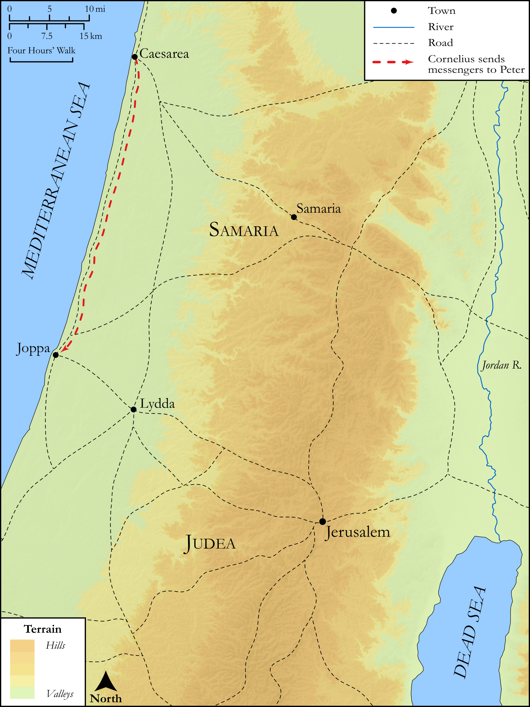

# Biblica Open Bible Maps

## License Information

Biblica Open Bible Maps, © 2023–2025 Biblica, Inc. This work is licensed under Creative Commons Attribution-ShareAlike 4.0 International (https://creativecommons.org/licenses/by-sa/4.0/). More Information: https://docs.google.com/document/d/1Pp44yZ0Zdnd59vJHTrt2rPYq0SppfX5rZbPBt6mz37U/edit?tab=t.0#heading=h.oev9aj1ksvk2

--------------------------------

## SRV Acts: Acts 10:1–8, Acts 10:9–23a (id: NT319)

### Image Content

[link](images/NT319.png)

Original: [SRV Acts: Acts 10:1\-8, Acts 10:9\-23a](https://drive.google.com/open?id=1Wy3Y6BkiNAHfk1e1n4e5yhzLqnQaIFKB&usp=drive_copy)

* **Associated Passages:** Acts 10:1-48

* **Associated ACAI Concepts:** LORD (ID: `deity:Lord`); Peter (ID: `person:Peter`); Cornelius (ID: `person:Cornelius`); Holy Spirit (ID: `deity:HolySpirit`); An Angel (ID: `deity:Angel`); Joppa (ID: `place:Joppa`); Pray (ID: `keyterm:Pray`); House (ID: `realia:House`); Simon (ID: `person:Simon.9`); Word (ID: `keyterm:Word`); Baptism (ID: `keyterm:Baptism`); Jews (ID: `group:Jews`); Sky (ID: `keyterm:Heaven`); Name (ID: `keyterm:Name`); Fear (ID: `keyterm:Fear`); Defilement (ID: `keyterm:Defilement`); Bear Witness (ID: `keyterm:BearWitness`); Witness (ID: `keyterm:Witness`); Ask for (ID: `keyterm:AskFor`); Jesus (ID: `person:Jesus.2`); Proclaim (ID: `keyterm:Proclaim`); Be (Or Show Oneself) Just (ID: `keyterm:Just`); Caesarea (ID: `place:Caesarea`); Temple (ID: `realia:Temple`); Declare (ID: `keyterm:Declare`); Italians (ID: `group:Italy`); Anointed (ID: `keyterm:Anointed`); Make Peace (ID: `keyterm:Peace`); Israel (ID: `person:Israel`); Holy (ID: `keyterm:Holy`); Bow Down (ID: `keyterm:BowDown`); Forgive (ID: `keyterm:Forgive`); Gentiles (ID: `group:Gentile`); Ability (ID: `keyterm:Ability`); Discern (ID: `keyterm:Discern`); Galilee (ID: `place:Galilee`); Truth (ID: `keyterm:Truth`); Believe (ID: `keyterm:Believe`); Italy (ID: `place:Italy`); Good News (ID: `keyterm:GoodNews`); Resurrection (ID: `keyterm:Resurrection`); John (ID: `person:John`); To Cleanse (ID: `keyterm:Cleanse.2`); To Sin (ID: `keyterm:Sin`); Circumcision (ID: `keyterm:Circumcision`); Men (ID: `group:GenericMales`); Disgusting (ID: `keyterm:Disgusting`); Life (ID: `keyterm:Life`); Faithfulness (ID: `keyterm:Faithfulness`); Jerusalem (ID: `place:Jerusalem`); Judea (ID: `place:Judea`); Nazareth (ID: `place:Nazareth`); Leather (ID: `realia:Leather`); Linen Cloth (ID: `realia:LinenCloth`); Housetop (ID: `realia:Housetop`); Chameleon (ID: `fauna:Chameleon`); Clothing (ID: `realia:Clothing`); Monitor (ID: `fauna:Iguana`); Cross (ID: `realia:Cross`); Lizard (ID: `fauna:Lizard`); Creeping Animal (ID: `fauna:CreepingAnimal`); Snake (ID: `fauna:Snake`)
