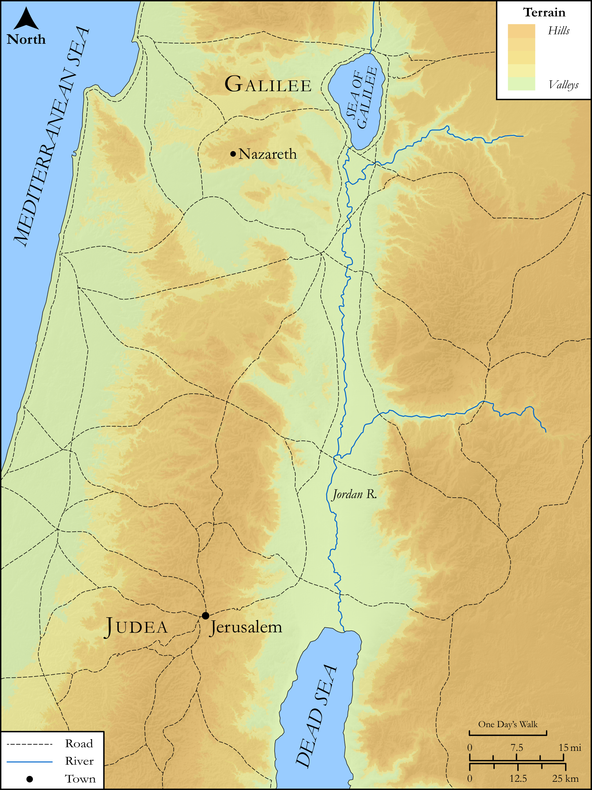

# Biblica Open Bible Maps

## License Information

Biblica Open Bible Maps, © 2023–2025 Biblica, Inc. This work is licensed under Creative Commons Attribution-ShareAlike 4.0 International (https://creativecommons.org/licenses/by-sa/4.0/). More Information: https://docs.google.com/document/d/1Pp44yZ0Zdnd59vJHTrt2rPYq0SppfX5rZbPBt6mz37U/edit?tab=t.0#heading=h.oev9aj1ksvk2

--------------------------------

## SRV Acts: Acts 10:34–47 (id: NT321)

### Image Content

[link](images/NT321.png)

Original: [SRV Acts: Acts 10:34\-47](https://drive.google.com/open?id=1FSmqNS64ESQbTEcdS_f-FmsdgBeT6_6B&usp=drive_copy)

* **Associated Passages:** John 7:1-53

* **Associated ACAI Concepts:** Jesus (ID: `person:Jesus.2`); Jews (ID: `group:Jews`); Believe (ID: `keyterm:Believe`); A Group of People (ID: `group:GenericGroup`); Galilee (ID: `place:Galilee`); Law (ID: `keyterm:Law`); Pharisees (ID: `group:Pharisee`); True (ID: `keyterm:True`); Moses (ID: `person:Moses`); Judea (ID: `place:Judea`); Glory (ID: `keyterm:Glory`); Written (ID: `keyterm:Scripture`); Decided (ID: `keyterm:Decided`); Circumcision (ID: `keyterm:Circumcision`); Ability (ID: `keyterm:Ability`); Sabbath (ID: `keyterm:Sabbath`); Temple (ID: `realia:Temple`); Unjust Deed (ID: `keyterm:UnjustDeed`); Be (Or Show Oneself) Just (ID: `keyterm:Just`); Relatives (ID: `group:Relatives`); Bethlehem (ID: `place:Bethlehem`); Nicodemus (ID: `person:Nicodemus`); Affection (ID: `keyterm:Affection`); Javan (ID: `person:Javan`); LORD (ID: `deity:Lord`); Jerusalem (ID: `place:Jerusalem`); Internal Organs (ID: `keyterm:Belly`); Judgment (ID: `keyterm:Judgment`); Holy Spirit (ID: `deity:HolySpirit`); David (ID: `person:David`)
