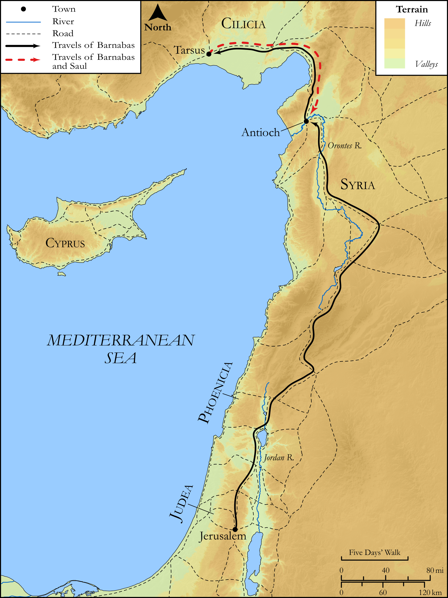

# Biblica Open Bible Maps

## License Information

Biblica Open Bible Maps, © 2023–2025 Biblica, Inc. This work is licensed under Creative Commons Attribution-ShareAlike 4.0 International (https://creativecommons.org/licenses/by-sa/4.0/). More Information: https://docs.google.com/document/d/1Pp44yZ0Zdnd59vJHTrt2rPYq0SppfX5rZbPBt6mz37U/edit?tab=t.0#heading=h.oev9aj1ksvk2

--------------------------------

## SRV Acts: Acts 11:19–25 (id: NT324)

### Image Content

[link](images/NT324.png)

Original: [SRV Acts: Acts 11:19\-25](https://drive.google.com/open?id=1Wl9BgWCr9oJGJf51HhUXwBns8Bj_gclr&usp=drive_copy)

* **Associated Passages:** Acts 11:1-30

* **Associated ACAI Concepts:** LORD (ID: `deity:Lord`); Antioch (ID: `place:Antioch`); Holy Spirit (ID: `deity:HolySpirit`); Peter (ID: `person:Peter`); Sky (ID: `keyterm:Heaven`); Jesus (ID: `person:Jesus.2`); Believe (ID: `keyterm:Believe`); Jerusalem (ID: `place:Jerusalem`); Cyprus (ID: `place:Cyprus`); Be a Disciple (ID: `keyterm:Disciple`); House (ID: `realia:House`); Barnabas (ID: `person:Barnabas`); Joppa (ID: `place:Joppa`); Church (ID: `keyterm:Church`); Defilement (ID: `keyterm:Defilement`); Word (ID: `keyterm:Word`); Paul (ID: `person:Paul`); Judea (ID: `place:Judea`); Gentiles (ID: `group:Gentile`); Discern (ID: `keyterm:Discern`); Claudius (ID: `person:Claudius`); Hellenists (ID: `group:Hellenist`); Christians (ID: `group:Christ`); Agabus (ID: `person:Agabus`); Phoenicia (ID: `place:Phoenicia`); Cypriots (ID: `group:Cyprus`); Temple (ID: `realia:Temple`); Greece (ID: `place:Greece`); Good News (ID: `keyterm:GoodNews`); Ask for (ID: `keyterm:AskFor`); Salvation (ID: `keyterm:Salvation`); Baptism (ID: `keyterm:Baptism`); An Angel (ID: `deity:Angel`); Glory (ID: `keyterm:Glory`); Tarsus (ID: `place:Tarsus`); Favor (ID: `keyterm:Favor`); Stephen (ID: `person:Stephen`); John (ID: `person:John`); Cyrene (ID: `place:Cyrene`); Repent (ID: `keyterm:Repent`); Good (ID: `keyterm:Good`); Life (ID: `keyterm:Life`); Name (ID: `keyterm:Name`); Pray (ID: `keyterm:Pray`); Caesarea (ID: `place:Caesarea`); Ability (ID: `keyterm:Ability`); To Cleanse (ID: `keyterm:Cleanse.2`); Circumcision (ID: `keyterm:Circumcision`); Heart (ID: `keyterm:Heart`); Jews (ID: `group:Jews`); Serve (ID: `keyterm:Serve`); Linen Cloth (ID: `realia:LinenCloth`); Lizard (ID: `fauna:Lizard`); Snake (ID: `fauna:Snake`); Monitor (ID: `fauna:Iguana`); Chameleon (ID: `fauna:Chameleon`); Creeping Animal (ID: `fauna:CreepingAnimal`)
