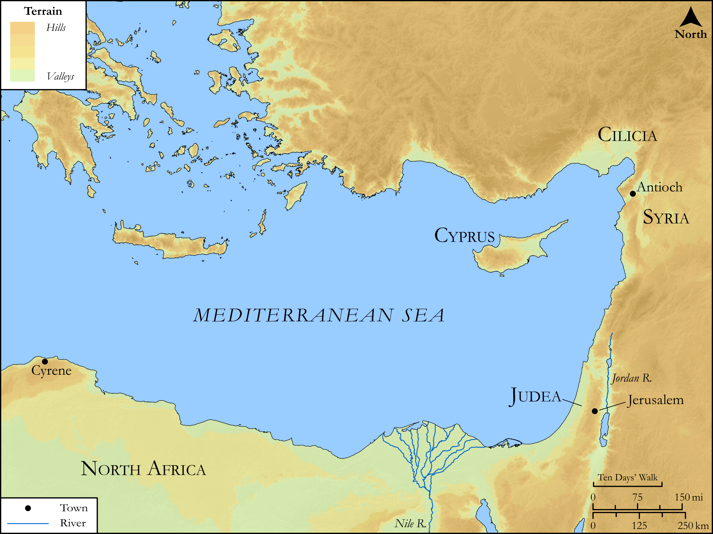

# Biblica Open Bible Maps

## License Information

Biblica Open Bible Maps, © 2023–2025 Biblica, Inc. This work is licensed under Creative Commons Attribution-ShareAlike 4.0 International (https://creativecommons.org/licenses/by-sa/4.0/). More Information: https://docs.google.com/document/d/1Pp44yZ0Zdnd59vJHTrt2rPYq0SppfX5rZbPBt6mz37U/edit?tab=t.0#heading=h.oev9aj1ksvk2

--------------------------------

## SRV Acts: Acts 12:25–13:3, Acts 15:36–40 (id: NT329)

### Image Content

[link](images/NT329.png)

Original: [SRV Acts: Acts 12:25\-13:3, Acts 15:36\-40](https://drive.google.com/open?id=106e5SErgPwCjj5TSXtbFtJ3bqRlVLDeI&usp=drive_copy)

* **Associated Passages:** Acts 12:1-13:52

* **Associated ACAI Concepts:** LORD (ID: `deity:Lord`); Paul (ID: `person:Paul`); Peter (ID: `person:Peter`); Barnabas (ID: `person:Barnabas`); An Angel (ID: `deity:Angel`); Jews (ID: `group:Jews`); Herod (ID: `person:Herod.3`); Believe (ID: `keyterm:Believe`); Mark (ID: `person:Mark`); Jerusalem (ID: `place:Jerusalem`); Holy Spirit (ID: `deity:HolySpirit`); Sabbath (ID: `keyterm:Sabbath`); Israel (ID: `person:Israel`); David (ID: `person:David`); Gentiles (ID: `group:Gentile`); Pray (ID: `keyterm:Pray`); Church (ID: `keyterm:Church`); Name (ID: `keyterm:Name`); Prison (ID: `realia:Prison`); Paphos (ID: `place:Paphos`); Bar-jesus (ID: `person:Bar-jesus`); Worship (ID: `keyterm:Worship`); Abstain from Food (ID: `keyterm:Fast`); Perga (ID: `place:Perga`); Ask for (ID: `keyterm:AskFor`); Cause of Joy (ID: `keyterm:CauseOfJoy`); Jesus (ID: `person:Jesus.2`); A Group of People (ID: `group:GenericGroup`); Resurrection (ID: `keyterm:Resurrection`); Promise (ID: `keyterm:Promise`)
