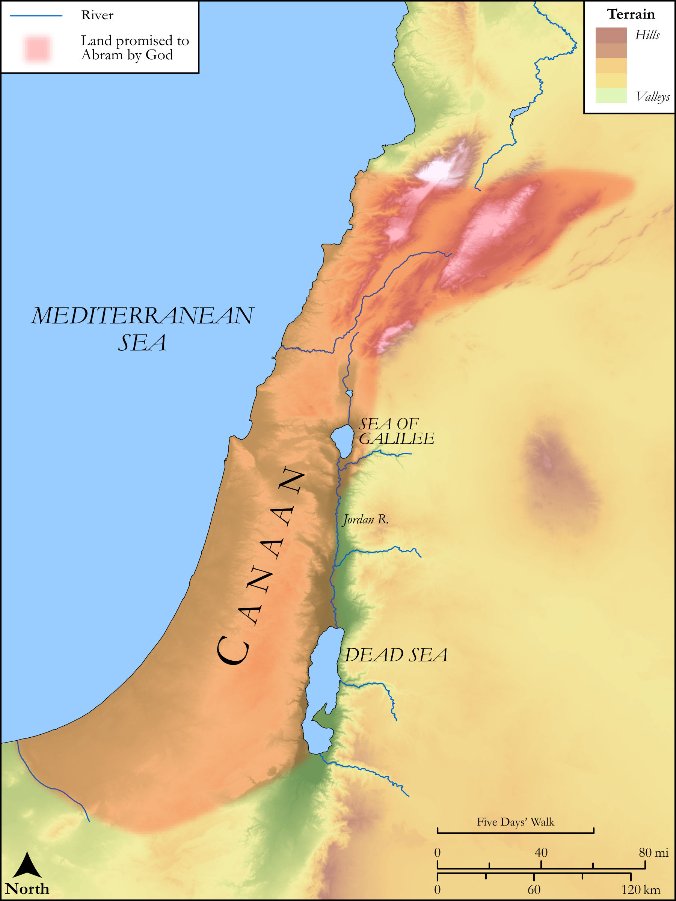

# Biblica Open Bible Maps

## License Information

Biblica Open Bible Maps, © 2023–2025 Biblica, Inc. This work is licensed under Creative Commons Attribution-ShareAlike 4.0 International (https://creativecommons.org/licenses/by-sa/4.0/). More Information: https://docs.google.com/document/d/1Pp44yZ0Zdnd59vJHTrt2rPYq0SppfX5rZbPBt6mz37U/edit?tab=t.0#heading=h.oev9aj1ksvk2

--------------------------------

## SRV Acts: Acts 13:13–21 (id: NT331)

### Image Content

[link](images/NT331.png)

Original: [SRV Acts: Acts 13:13\-21](https://drive.google.com/open?id=13-Tq25oZQrLJPYugMayZBWvwdlaOU_Y_&usp=drive_copy)

* **Associated Passages:** Genesis 17:1-27

* **Associated ACAI Concepts:** Abraham (ID: `person:Abraham`); Covenant (ID: `keyterm:Covenant`); LORD (ID: `deity:Lord`); Circumcision (ID: `keyterm:Circumcision`); Ishmael (ID: `person:Ishmael`); Foreskin (ID: `keyterm:Foreskin`); Sarah (ID: `person:Sarah`); Money (ID: `realia:Money`); Isaac (ID: `person:Isaac`); Bless (ID: `keyterm:Bless`); Canaan (ID: `place:Canaan`); Complete (ID: `keyterm:Complete`); Uncircumcised Person (ID: `keyterm:UncircumcisedPerson`)
