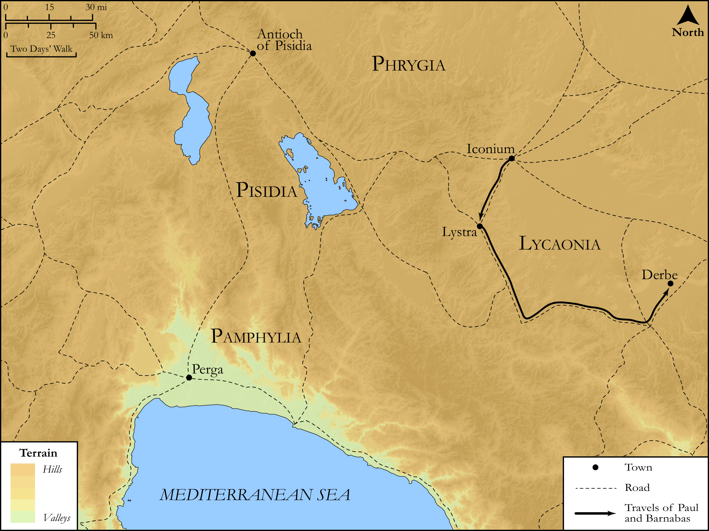

# Biblica Open Bible Maps

## License Information

Biblica Open Bible Maps, © 2023–2025 Biblica, Inc. This work is licensed under Creative Commons Attribution-ShareAlike 4.0 International (https://creativecommons.org/licenses/by-sa/4.0/). More Information: https://docs.google.com/document/d/1Pp44yZ0Zdnd59vJHTrt2rPYq0SppfX5rZbPBt6mz37U/edit?tab=t.0#heading=h.oev9aj1ksvk2

--------------------------------

## SRV Acts: Acts 14:1–6 (id: NT335)

### Image Content

[link](images/NT335.png)

Original: [SRV Acts: Acts 14:1\-6](https://drive.google.com/open?id=1IV9jtLtQpP2zebLGICx8sKQSGGSsnNJM&usp=drive_copy)

* **Associated Passages:** Acts 14:1-28

* **Associated ACAI Concepts:** LORD (ID: `deity:Lord`); Jews (ID: `group:Jews`); Believe (ID: `keyterm:Believe`); Paul (ID: `person:Paul`); Be a Disciple (ID: `keyterm:Disciple`); Iconium (ID: `place:Iconium`); Lystra (ID: `place:Lystra`); Gentiles (ID: `group:Gentile`); Barnabas (ID: `person:Barnabas`); Good News (ID: `keyterm:GoodNews`); Derbe (ID: `place:Derbe`); Zeus (ID: `deity:Zeus`); Lycaonia (ID: `place:Lycaonia`); Antioch (ID: `place:Antioch.2`); Favor (ID: `keyterm:Favor`); Offering (ID: `keyterm:Offering`); Church (ID: `keyterm:Church`); Lycaonians (ID: `group:Lycaonia`); Abstain from Food (ID: `keyterm:Fast`); Perga (ID: `place:Perga`); Attalia (ID: `place:Attalia`); Worthless (ID: `keyterm:Worthless`); Hermes (ID: `deity:Hermes`); Do Good (ID: `keyterm:DoGood`); Pisidia (ID: `place:Pisidia`); Pamphylia (ID: `place:Pamphylia`); Javan (ID: `person:Javan`); Ask for (ID: `keyterm:AskFor`); Portent (ID: `keyterm:Portent`); Symbol (ID: `keyterm:Example`); Kingdom (ID: `keyterm:Kingdom`); Bear Witness (ID: `keyterm:BearWitness`); Pray (ID: `keyterm:Pray`); From Heaven (ID: `keyterm:FromHeaven`); Greeks (ID: `group:Greek`); Salvation (ID: `keyterm:Salvation`); Sky (ID: `keyterm:Heaven`); Heart (ID: `keyterm:Heart`); Life (ID: `keyterm:Life`); Antioch (ID: `place:Antioch`); Persuade (ID: `keyterm:Persuade`); Garland (ID: `realia:Garland`); Clothing (ID: `realia:Clothing`); Door (ID: `realia:Door`); Cattle (ID: `fauna:Bull`); Temple (ID: `realia:Temple`); Synagogue (ID: `realia:Synagogue`)
