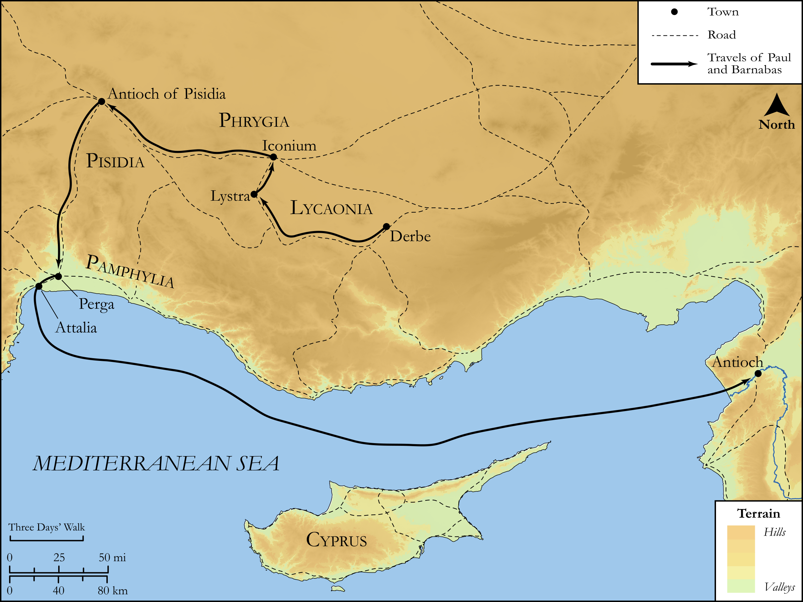

# Biblica Open Bible Maps

## License Information

Biblica Open Bible Maps, © 2023–2025 Biblica, Inc. This work is licensed under Creative Commons Attribution-ShareAlike 4.0 International (https://creativecommons.org/licenses/by-sa/4.0/). More Information: https://docs.google.com/document/d/1Pp44yZ0Zdnd59vJHTrt2rPYq0SppfX5rZbPBt6mz37U/edit?tab=t.0#heading=h.oev9aj1ksvk2

--------------------------------

## SRV Acts: Acts 14:21–27 (id: NT336)

### Image Content

[link](images/NT336.png)

Original: [SRV Acts: Acts 14:21\-27](https://drive.google.com/open?id=1mI0f8rexdvKnlgGj9wJIit7WGG4Ukkl4&usp=drive_copy)

* **Associated Passages:** Acts 14:1-28

* **Associated ACAI Concepts:** LORD (ID: `deity:Lord`); Believe (ID: `keyterm:Believe`); Paul (ID: `person:Paul`); Jews (ID: `group:Jews`); Be a Disciple (ID: `keyterm:Disciple`); Iconium (ID: `place:Iconium`); Lystra (ID: `place:Lystra`); Barnabas (ID: `person:Barnabas`); Good News (ID: `keyterm:GoodNews`); Gentiles (ID: `group:Gentile`); Derbe (ID: `place:Derbe`); Zeus (ID: `deity:Zeus`); Lycaonia (ID: `place:Lycaonia`); Antioch (ID: `place:Antioch.2`); Church (ID: `keyterm:Church`); Favor (ID: `keyterm:Favor`); Offering (ID: `keyterm:Offering`); Lycaonians (ID: `group:Lycaonia`); Do Good (ID: `keyterm:DoGood`); Hermes (ID: `deity:Hermes`); Perga (ID: `place:Perga`); Pisidia (ID: `place:Pisidia`); Abstain from Food (ID: `keyterm:Fast`); Pamphylia (ID: `place:Pamphylia`); Attalia (ID: `place:Attalia`); Worthless (ID: `keyterm:Worthless`); Javan (ID: `person:Javan`); Persuade (ID: `keyterm:Persuade`); Portent (ID: `keyterm:Portent`); Ask for (ID: `keyterm:AskFor`); From Heaven (ID: `keyterm:FromHeaven`); Salvation (ID: `keyterm:Salvation`); Kingdom (ID: `keyterm:Kingdom`); Antioch (ID: `place:Antioch`); Life (ID: `keyterm:Life`); Bear Witness (ID: `keyterm:BearWitness`); Pray (ID: `keyterm:Pray`); Sky (ID: `keyterm:Heaven`); Heart (ID: `keyterm:Heart`); Greeks (ID: `group:Greek`); Symbol (ID: `keyterm:Example`); Garland (ID: `realia:Garland`); Clothing (ID: `realia:Clothing`); Synagogue (ID: `realia:Synagogue`); Cattle (ID: `fauna:Bull`); Temple (ID: `realia:Temple`); Door (ID: `realia:Door`)
