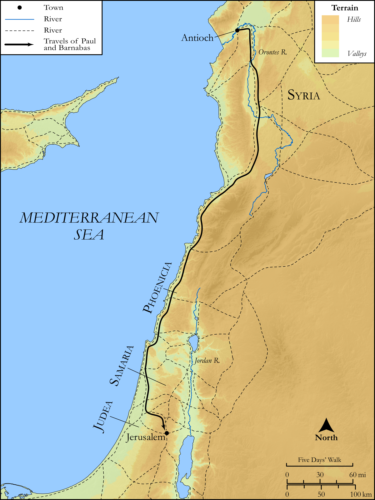

# Biblica Open Bible Maps

## License Information

Biblica Open Bible Maps, © 2023–2025 Biblica, Inc. This work is licensed under Creative Commons Attribution-ShareAlike 4.0 International (https://creativecommons.org/licenses/by-sa/4.0/). More Information: https://docs.google.com/document/d/1Pp44yZ0Zdnd59vJHTrt2rPYq0SppfX5rZbPBt6mz37U/edit?tab=t.0#heading=h.oev9aj1ksvk2

--------------------------------

## SRV Acts: Acts 15:1–20 (id: NT337)

### Image Content

[link](images/NT337.png)

Original: [SRV Acts: Acts 15:1\-20](https://drive.google.com/open?id=1wnDuoQ9OyGqhMGMTPbjUOCS7pMlKTIjO&usp=drive_copy)

* **Associated Passages:** Acts 15:1-41

* **Associated ACAI Concepts:** LORD (ID: `deity:Lord`); Barnabas (ID: `person:Barnabas`); Paul (ID: `person:Paul`); Gentiles (ID: `group:Gentile`); Silas (ID: `person:Silas`); Antioch (ID: `place:Antioch`); Believe (ID: `keyterm:Believe`); Church (ID: `keyterm:Church`); Judas (ID: `person:Judas.5`); Moses (ID: `person:Moses`); Chosen (ID: `keyterm:Chosen`); Name (ID: `keyterm:Name`); Mark (ID: `person:Mark`); Cilicia (ID: `place:Cilicia`); Ask for (ID: `keyterm:AskFor`); Holy Spirit (ID: `deity:HolySpirit`); Blood (ID: `keyterm:Blood`); Fornication (ID: `keyterm:Fornication`); Jesus (ID: `person:Jesus.2`); Favor (ID: `keyterm:Favor`); Peter (ID: `person:Peter`); Salvation (ID: `keyterm:Salvation`); Good News (ID: `keyterm:GoodNews`); Circumcision (ID: `keyterm:Circumcision`); Jerusalem (ID: `place:Jerusalem`); Phoenicia (ID: `place:Phoenicia`); James (ID: `person:James.3`); Judea (ID: `place:Judea`); Call Upon (ID: `keyterm:CallUpon`); Make Peace (ID: `keyterm:Peace`); Portent (ID: `keyterm:Portent`); Knower of Hearts (ID: `keyterm:KnowerOfHearts`); Beloved (ID: `keyterm:Beloved`); Cause of Joy (ID: `keyterm:CauseOfJoy`); Always (ID: `keyterm:Always`); Symbol (ID: `keyterm:Example`); Bear Witness (ID: `keyterm:BearWitness`); Discern (ID: `keyterm:Discern`); Authority (ID: `keyterm:Authority.2`); Proclaim (ID: `keyterm:Proclaim`); Sabbath (ID: `keyterm:Sabbath`); Pharisees (ID: `group:Pharisee`); David (ID: `person:David`); Samaria (ID: `place:Samaria`); Be a Disciple (ID: `keyterm:Disciple`); Cyprus (ID: `place:Cyprus`); To Cleanse (ID: `keyterm:Cleanse.2`); Heart (ID: `keyterm:Heart`); Encourage (ID: `keyterm:Encourage`); Men (ID: `group:GenericMales`); Pamphylia (ID: `place:Pamphylia`); Life (ID: `keyterm:Life`); Decided (ID: `keyterm:Decided`); Law (ID: `keyterm:Law`); Yoke (ID: `realia:Yoke`); Image (ID: `realia:Image`); Tabernacle (ID: `realia:Tabernacle`); Synagogue (ID: `realia:Synagogue`)
