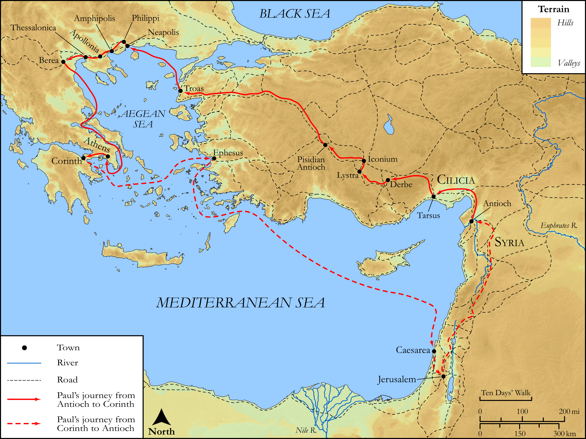

# Biblica Open Bible Maps

## License Information

Biblica Open Bible Maps, © 2023–2025 Biblica, Inc. This work is licensed under Creative Commons Attribution-ShareAlike 4.0 International (https://creativecommons.org/licenses/by-sa/4.0/). More Information: https://docs.google.com/document/d/1Pp44yZ0Zdnd59vJHTrt2rPYq0SppfX5rZbPBt6mz37U/edit?tab=t.0#heading=h.oev9aj1ksvk2

--------------------------------

## SRV Acts: Acts 16:1–4 (id: NT338)

### Image Content

[link](images/NT338.png)

Original: [SRV Acts: Acts 16:1\-4](https://drive.google.com/open?id=1ViWNoyyOgggTO4254b2dW7L1EcNpjJeq&usp=drive_copy)

* **Associated Passages:** Acts 16:1-40

* **Associated ACAI Concepts:** Paul (ID: `person:Paul`); LORD (ID: `deity:Lord`); Prison (ID: `realia:Prison`); Ask for (ID: `keyterm:AskFor`); Rome (ID: `place:Rome`); Macedonia (ID: `place:Macedonia`); Silas (ID: `person:Silas`); Believe (ID: `keyterm:Believe`); Jews (ID: `group:Jews`); Jesus (ID: `person:Jesus.2`); Pray (ID: `keyterm:Pray`); Salvation (ID: `keyterm:Salvation`); Name (ID: `keyterm:Name`); Lydia (ID: `person:Lydia`); Troas (ID: `place:Troas`); Lystra (ID: `place:Lystra`); Mysia (ID: `place:Mysia`); Temple (ID: `realia:Temple`); Javan (ID: `person:Javan`); Baptism (ID: `keyterm:Baptism`); Holy Spirit (ID: `deity:HolySpirit`); Greeks (ID: `group:Greek`); Faithfulness (ID: `keyterm:Faithfulness`); Decided (ID: `keyterm:Decided`); Asia (ID: `place:Asia`); Neapolis (ID: `place:Neapolis`); Derbe (ID: `place:Derbe`); Samothrace (ID: `place:Samothrace`); Philippi (ID: `place:Philippi`); Thyatira (ID: `place:Thyatira`); Galatia (ID: `place:Galatia`); Timothy (ID: `person:Timothy`); Bithynia (ID: `place:Bithynia`); Phrygia (ID: `place:Phrygia`); Philippian Jailer (ID: `person:PhilippianJailer`); Door (ID: `realia:Door`); House (ID: `realia:House`); Word (ID: `keyterm:Word`); Make Peace (ID: `keyterm:Peace`); Hope (ID: `keyterm:Hope`); Worship (ID: `keyterm:Worship`); Bear Witness (ID: `keyterm:BearWitness`); Be Lawful (ID: `keyterm:Lawful`); Sabbath (ID: `keyterm:Sabbath`); Church (ID: `keyterm:Church`); Be a Disciple (ID: `keyterm:Disciple`); Good News (ID: `keyterm:GoodNews`); Encourage (ID: `keyterm:Encourage`); Heart (ID: `keyterm:Heart`); Fear (ID: `keyterm:Fear`); Jerusalem (ID: `place:Jerusalem`); Iconium (ID: `place:Iconium`); Torch (ID: `realia:Torch`); Clothing (ID: `realia:Clothing`); Chain (ID: `realia:Chain`); Foundation (ID: `realia:Foundation`)
