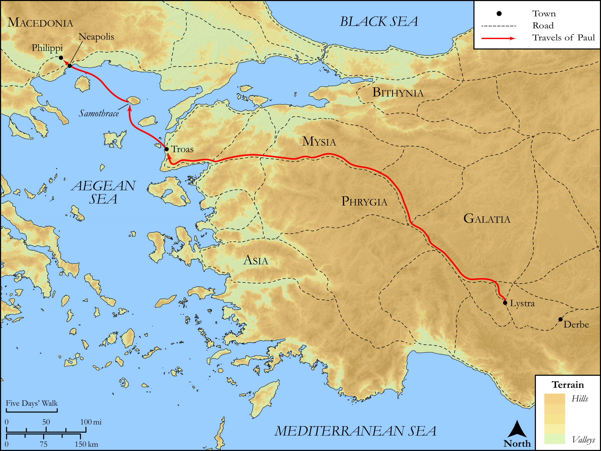

# Biblica Open Bible Maps

## License Information

Biblica Open Bible Maps, © 2023–2025 Biblica, Inc. This work is licensed under Creative Commons Attribution-ShareAlike 4.0 International (<a href="https://creativecommons.org/licenses/by-sa/4.0/">https://creativecommons.org/licenses/by-sa/4.0/</a>). More Information: <a href="https://docs.google.com/document/d/1Pp44yZ0Zdnd59vJHTrt2rPYq0SppfX5rZbPBt6mz37U/edit?tab=t.0#heading=h.oev9aj1ksvk2">https://docs.google.com/document/d/1Pp44yZ0Zdnd59vJHTrt2rPYq0SppfX5rZbPBt6mz37U/edit?tab=t.0#heading=h.oev9aj1ksvk2</a>

--------------------------------

## SRV Acts: Acts 16:6–14 (id: NT339)

### Image Content

[link](images/NT339.png)

Original: [SRV Acts: Acts 16:6\-14](https://drive.google.com/open?id=1vW_vMZsIiVoBXeGmkg_uZ8fGGxIpQCQB&usp=drive_copy)

* **Associated Passages:** Exodus 2:1-25

* **Associated ACAI Concepts:** Pharaoh (ID: `person:Pharaoh.5`); Moses (ID: `person:Moses`); Egypt (ID: `place:Egypt`); Hebrews (ID: `group:Hebrews`); Egyptians (ID: `group:Egypt`); LORD (ID: `deity:Lord`); Israel (ID: `person:Israel`); Flock (ID: `fauna:Flock`); Goat (ID: `fauna:Goat`); Nile River (ID: `place:Nile`); Midian (ID: `place:Midian`); Cattails (ID: `flora:Cattails`); Gershom (ID: `person:Gershom`); Sheep (ID: `fauna:Lamb`); Zipporah (ID: `person:Zipporah`); Ship (ID: `realia:Ship`); Jethro (ID: `person:Jethro`); Covenant (ID: `keyterm:Covenant`); Isaac (ID: `person:Isaac`); Fear (ID: `keyterm:Fear`); Work (ID: `keyterm:Work`); Abraham (ID: `person:Abraham`); Tribe of Levi (ID: `group:Levi`); Levi (ID: `person:Levi.3`); Papyrus (ID: `flora:Papyrus`)
