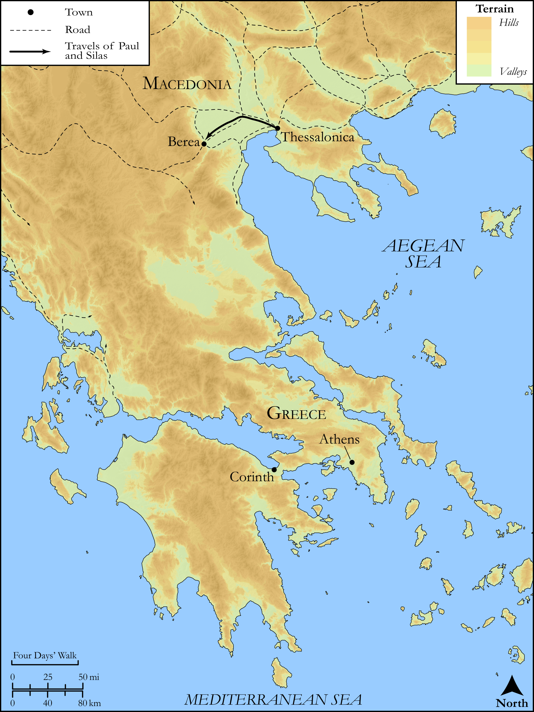

# Biblica Open Bible Maps

## License Information

Biblica Open Bible Maps, © 2023–2025 Biblica, Inc. This work is licensed under Creative Commons Attribution-ShareAlike 4.0 International (<a href="https://creativecommons.org/licenses/by-sa/4.0/">https://creativecommons.org/licenses/by-sa/4.0/</a>). More Information: <a href="https://docs.google.com/document/d/1Pp44yZ0Zdnd59vJHTrt2rPYq0SppfX5rZbPBt6mz37U/edit?tab=t.0#heading=h.oev9aj1ksvk2">https://docs.google.com/document/d/1Pp44yZ0Zdnd59vJHTrt2rPYq0SppfX5rZbPBt6mz37U/edit?tab=t.0#heading=h.oev9aj1ksvk2</a>

--------------------------------

## SRV Acts: Acts 17:10–14 (id: NT340)

### Image Content

[link](images/NT340.png)

Original: [SRV Acts: Acts 17:10\-14](https://drive.google.com/open?id=1eYq1kuifUDpct9v9L3tMbBQ7bzG-Q4fe&usp=drive_copy)

* **Associated Passages:** Acts 17:1-34

* **Associated ACAI Concepts:** Paul (ID: `person:Paul`); Jews (ID: `group:Jews`); LORD (ID: `deity:Lord`); Jason (ID: `person:Jason`); Athens (ID: `place:Athens`); Silas (ID: `person:Silas`); Thessalonica (ID: `place:Thessalonica`); Areopagus (ID: `place:Areopagus`); Worship (ID: `keyterm:Worship`); Ability (ID: `keyterm:Ability`); Jesus (ID: `person:Jesus.2`); Greeks (ID: `group:Greek`); Written (ID: `keyterm:Scripture`); Berea (ID: `place:Berea`); Synagogue (ID: `realia:Synagogue`); Resurrection (ID: `keyterm:Resurrection`); Timothy (ID: `person:Timothy`); Javan (ID: `person:Javan`); Believe (ID: `keyterm:Believe`); Life (ID: `keyterm:Life`); Discern (ID: `keyterm:Discern`); Decided (ID: `keyterm:Decided`); Stoics (ID: `group:Stoic`); Epicureans (ID: `group:Epicurean`); Apollonia (ID: `place:Apollonia`); Amphipolis (ID: `place:Amphipolis`); Areopagites (ID: `group:Areopagus`); Divine (ID: `keyterm:Divine`); Athenians (ID: `group:Athens`); Damaris (ID: `person:Damaris`); Dionysius (ID: `person:Dionysius`); Image (ID: `realia:Image`); Commandment (ID: `keyterm:Commandment`); Serve (ID: `keyterm:Serve`); Good News (ID: `keyterm:GoodNews`); Be (Or Show Oneself) Just (ID: `keyterm:Just`); Sky (ID: `keyterm:Heaven`); Obligated (ID: `keyterm:Ought`); Sabbath (ID: `keyterm:Sabbath`); Name (ID: `keyterm:Name`); Persuade (ID: `keyterm:Persuade`); Proof (ID: `keyterm:Proof`); Spirit (ID: `keyterm:Spirit.2`); Object of Worship (ID: `keyterm:ObjectOfWorship`); Bring to the Attention Of (ID: `keyterm:BringToTheAttentionOf`); Repent (ID: `keyterm:Repent`); Demons (ID: `deity:Demons`); Claudius (ID: `person:Claudius`); Temple (ID: `realia:Temple`); Stone Altar (ID: `realia:StoneAltar`); House (ID: `realia:House`)
