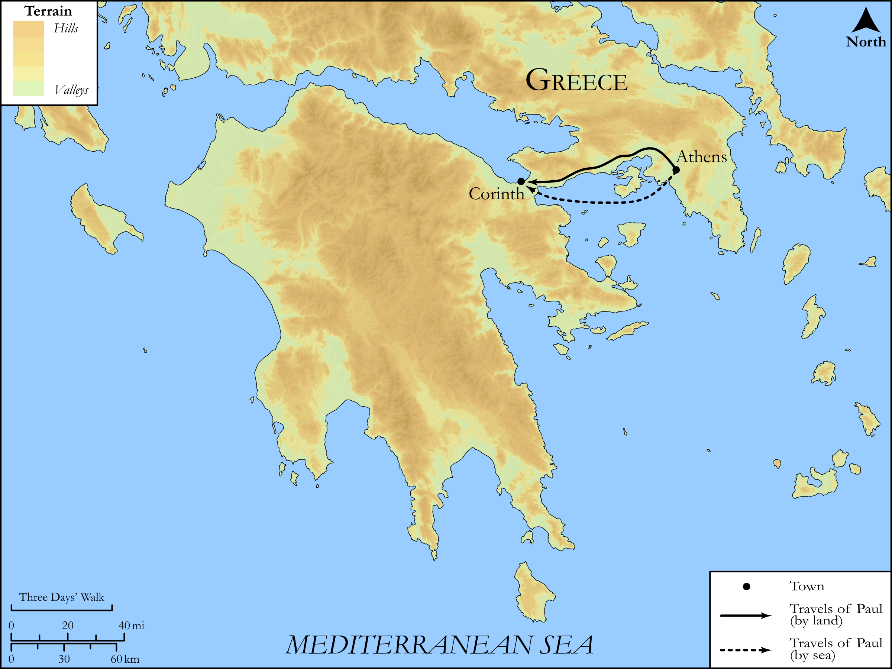

# Biblica Open Bible Maps

## License Information

Biblica Open Bible Maps, © 2023–2025 Biblica, Inc. This work is licensed under Creative Commons Attribution-ShareAlike 4.0 International (<a href="https://creativecommons.org/licenses/by-sa/4.0/">https://creativecommons.org/licenses/by-sa/4.0/</a>). More Information: <a href="https://docs.google.com/document/d/1Pp44yZ0Zdnd59vJHTrt2rPYq0SppfX5rZbPBt6mz37U/edit?tab=t.0#heading=h.oev9aj1ksvk2">https://docs.google.com/document/d/1Pp44yZ0Zdnd59vJHTrt2rPYq0SppfX5rZbPBt6mz37U/edit?tab=t.0#heading=h.oev9aj1ksvk2</a>

--------------------------------

## SRV Acts: Acts 18:1–16 (id: NT343)

### Image Content

[link](images/NT343.png)

Original: [SRV Acts: Acts 18:1\-16](https://drive.google.com/open?id=12OUlPI665bRobUYgVcX1Iq0371wdJfdy&usp=drive_copy)

* **Associated Passages:** Acts 18:1-28

* **Associated ACAI Concepts:** Jews (ID: `group:Jews`); LORD (ID: `deity:Lord`); Paul (ID: `person:Paul`); Synagogue (ID: `realia:Synagogue`); Name (ID: `keyterm:Name`); Gallio (ID: `person:Gallio`); Aquila (ID: `person:Aquila`); Priscilla (ID: `person:Priscilla`); Jesus (ID: `person:Jesus.2`); Ephesus (ID: `place:Ephesus`); Judgment Seat (ID: `realia:JudgmentSeat`); Worship (ID: `keyterm:Worship`); Achaia (ID: `place:Achaia`); Corinth (ID: `place:Corinth`); Be a Disciple (ID: `keyterm:Disciple`); Baptism (ID: `keyterm:Baptism`); The Way (ID: `keyterm:TheWay`); Written (ID: `keyterm:Scripture`); Believe (ID: `keyterm:Believe`); Law (ID: `keyterm:Law`); Alexandrians (ID: `group:Alexandria`); Sosthenes (ID: `person:Sosthenes`); Corinthians (ID: `group:Corinth`); Phrygia (ID: `place:Phrygia`); Crispus (ID: `person:Crispus`); Justus (ID: `person:Justus.2`); Galatia (ID: `place:Galatia`); Cenchreae (ID: `place:Cenchreae`); Rome (ID: `place:Rome`); Pontus (ID: `place:Pontus`); Apollos (ID: `person:Apollos`); Alexandria (ID: `place:Alexandria`); Pontus (ID: `group:Pontus`); Claudius (ID: `person:Claudius`); Blaspheme (ID: `keyterm:Blaspheme`); Favor (ID: `keyterm:Favor`); Gentiles (ID: `group:Gentile`); Vow (ID: `keyterm:Vow`); Clean (ID: `keyterm:Clean`); Greeks (ID: `group:Greek`); Macedonia (ID: `place:Macedonia`); Church (ID: `keyterm:Church`); Italy (ID: `place:Italy`); Fear (ID: `keyterm:Fear`); Antioch (ID: `place:Antioch`); Unrighteous Act (ID: `keyterm:UnrighteousAct`); Blood (ID: `keyterm:Blood`); Sabbath (ID: `keyterm:Sabbath`); Ask for (ID: `keyterm:AskFor`); Timothy (ID: `person:Timothy`); Javan (ID: `person:Javan`); Silas (ID: `person:Silas`); Athens (ID: `place:Athens`); Persuade (ID: `keyterm:Persuade`); Declare (ID: `keyterm:Declare`); Caesarea (ID: `place:Caesarea`); Spirit (ID: `keyterm:Spirit.2`); John (ID: `person:John`); Tent (ID: `realia:Tent`); House (ID: `realia:House`); Clothing (ID: `realia:Clothing`)
