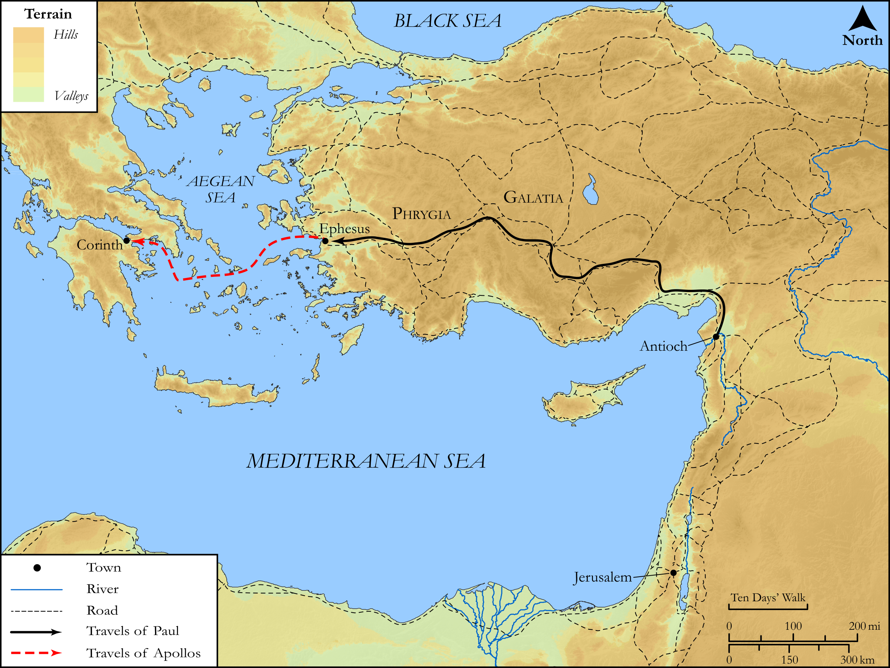

# Biblica Open Bible Maps

## License Information

Biblica Open Bible Maps, © 2023–2025 Biblica, Inc. This work is licensed under Creative Commons Attribution-ShareAlike 4.0 International (<a href="https://creativecommons.org/licenses/by-sa/4.0/">https://creativecommons.org/licenses/by-sa/4.0/</a>). More Information: <a href="https://docs.google.com/document/d/1Pp44yZ0Zdnd59vJHTrt2rPYq0SppfX5rZbPBt6mz37U/edit?tab=t.0#heading=h.oev9aj1ksvk2">https://docs.google.com/document/d/1Pp44yZ0Zdnd59vJHTrt2rPYq0SppfX5rZbPBt6mz37U/edit?tab=t.0#heading=h.oev9aj1ksvk2</a>

--------------------------------

## SRV Acts: Acts 19:1–7, Acts 19:8–09 (id: NT349)

### Image Content

[link](images/NT349.png)

Original: [SRV Acts: Acts 19:1\-7, Acts 19:8\-09](https://drive.google.com/open?id=1_BGGom3lozBtPkZ9l0s31TQYtxd2RImy&usp=drive_copy)

* **Associated Passages:** Acts 19:1-40

* **Associated ACAI Concepts:** Paul (ID: `person:Paul`); Ephesus (ID: `place:Ephesus`); Jews (ID: `group:Jews`); Artemis (ID: `deity:Artemis`); Jesus (ID: `person:Jesus.2`); Asia (ID: `place:Asia`); LORD (ID: `deity:Lord`); Name (ID: `keyterm:Name`); Macedonia (ID: `place:Macedonia`); Ephesians (ID: `group:Ephesus`); Be a Disciple (ID: `keyterm:Disciple`); Believe (ID: `keyterm:Believe`); Baptism (ID: `keyterm:Baptism`); Demetrius (ID: `person:Demetrius`); Ability (ID: `keyterm:Ability`); Greeks (ID: `group:Greek`); The Way (ID: `keyterm:TheWay`); Javan (ID: `person:Javan`); Persuade (ID: `keyterm:Persuade`); John (ID: `person:John`); Authority (ID: `keyterm:Authority.2`); Holy Spirit (ID: `deity:HolySpirit`); Theater (ID: `realia:Theater`); Sceva (ID: `person:Sceva`); Gaius (ID: `person:Gaius`); Aristarchus (ID: `person:Aristarchus`); Erastus (ID: `person:Erastus`); Achaia (ID: `place:Achaia`); Alexander (ID: `person:Alexander.3`); Demons (ID: `deity:Demons`); Tyrannus (ID: `person:Tyrannus`); Temple (ID: `realia:Temple`); Blaspheme (ID: `keyterm:Blaspheme`); Serve (ID: `keyterm:Serve`); Set Free (ID: `keyterm:SetFree`); Kingdom (ID: `keyterm:Kingdom`); Public Official (ID: `person:GenericOfficial`); Jerusalem (ID: `place:Jerusalem`); Worship (ID: `keyterm:Worship`); Magic (ID: `keyterm:Magic`); Fear (ID: `keyterm:Fear`); Timothy (ID: `person:Timothy`); Ask for (ID: `keyterm:AskFor`); Proclaim (ID: `keyterm:Proclaim`); Rome (ID: `place:Rome`); Spirit (ID: `keyterm:Spirit.2`); Be Lawful (ID: `keyterm:Lawful`); Apollos (ID: `person:Apollos`); Repent (ID: `keyterm:Repent`); Corinth (ID: `place:Corinth`); Speak as a Prophet (ID: `keyterm:Speak`); Lecture Hall (ID: `realia:LectureHall`); Band of Cloth (ID: `realia:BandOfCloth`); Replica Temple (ID: `realia:ReplicaTemple`); Apron (ID: `realia:Apron`); House (ID: `realia:House`); Synagogue (ID: `realia:Synagogue`); Scroll (ID: `realia:Scroll`)
