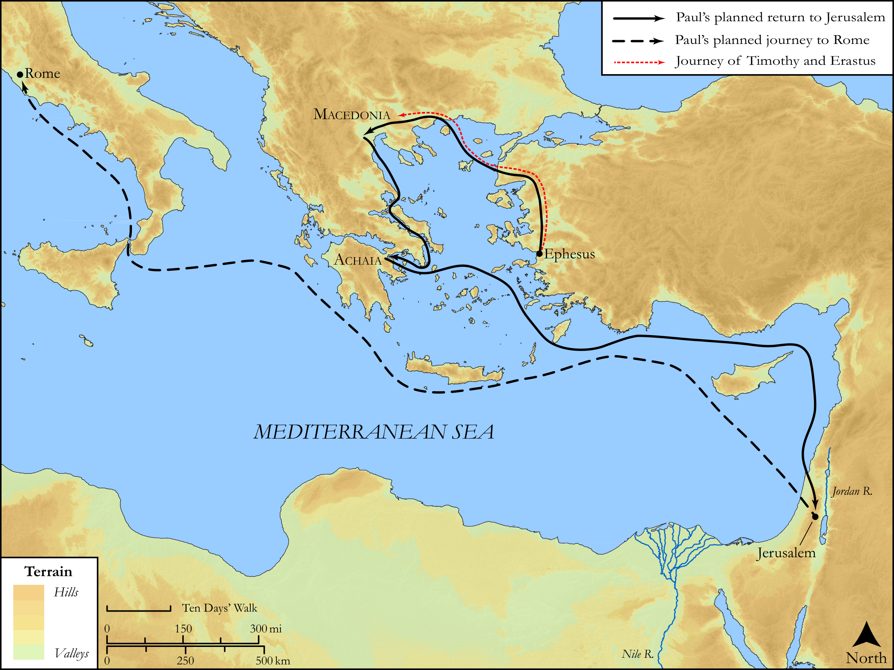

# Biblica Open Bible Maps

## License Information

Biblica Open Bible Maps, © 2023–2025 Biblica, Inc. This work is licensed under Creative Commons Attribution-ShareAlike 4.0 International (https://creativecommons.org/licenses/by-sa/4.0/). More Information: https://docs.google.com/document/d/1Pp44yZ0Zdnd59vJHTrt2rPYq0SppfX5rZbPBt6mz37U/edit?tab=t.0#heading=h.oev9aj1ksvk2

--------------------------------

## SRV Acts: Acts 19:21–40 (id: NT350)

### Image Content

[link](images/NT350.png)

Original: [SRV Acts: Acts 19:21\-40](https://drive.google.com/open?id=12ZaageDNC1nrgLEvdm4Rlffjo6oXXNTU&usp=drive_copy)

* **Associated Passages:** Acts 19:1-40

* **Associated ACAI Concepts:** Paul (ID: `person:Paul`); Ephesus (ID: `place:Ephesus`); Jews (ID: `group:Jews`); Artemis (ID: `deity:Artemis`); Jesus (ID: `person:Jesus.2`); Asia (ID: `place:Asia`); LORD (ID: `deity:Lord`); Name (ID: `keyterm:Name`); Macedonia (ID: `place:Macedonia`); Ephesians (ID: `group:Ephesus`); Baptism (ID: `keyterm:Baptism`); Believe (ID: `keyterm:Believe`); Be a Disciple (ID: `keyterm:Disciple`); Demetrius (ID: `person:Demetrius`); Javan (ID: `person:Javan`); Holy Spirit (ID: `deity:HolySpirit`); Ability (ID: `keyterm:Ability`); The Way (ID: `keyterm:TheWay`); Authority (ID: `keyterm:Authority.2`); Greeks (ID: `group:Greek`); John (ID: `person:John`); Persuade (ID: `keyterm:Persuade`); Theater (ID: `realia:Theater`); Aristarchus (ID: `person:Aristarchus`); Gaius (ID: `person:Gaius`); Achaia (ID: `place:Achaia`); Alexander (ID: `person:Alexander.3`); Erastus (ID: `person:Erastus`); Tyrannus (ID: `person:Tyrannus`); Demons (ID: `deity:Demons`); Sceva (ID: `person:Sceva`); Temple (ID: `realia:Temple`); Ask for (ID: `keyterm:AskFor`); Magic (ID: `keyterm:Magic`); Public Official (ID: `person:GenericOfficial`); Worship (ID: `keyterm:Worship`); Spirit (ID: `keyterm:Spirit.2`); Speak as a Prophet (ID: `keyterm:Speak`); Kingdom (ID: `keyterm:Kingdom`); Serve (ID: `keyterm:Serve`); Proclaim (ID: `keyterm:Proclaim`); Be Lawful (ID: `keyterm:Lawful`); Corinth (ID: `place:Corinth`); Repent (ID: `keyterm:Repent`); Timothy (ID: `person:Timothy`); Blaspheme (ID: `keyterm:Blaspheme`); Apollos (ID: `person:Apollos`); Fear (ID: `keyterm:Fear`); Set Free (ID: `keyterm:SetFree`); Rome (ID: `place:Rome`); Jerusalem (ID: `place:Jerusalem`); Replica Temple (ID: `realia:ReplicaTemple`); Lecture Hall (ID: `realia:LectureHall`); Apron (ID: `realia:Apron`); Band of Cloth (ID: `realia:BandOfCloth`); Scroll (ID: `realia:Scroll`); House (ID: `realia:House`); Synagogue (ID: `realia:Synagogue`)
