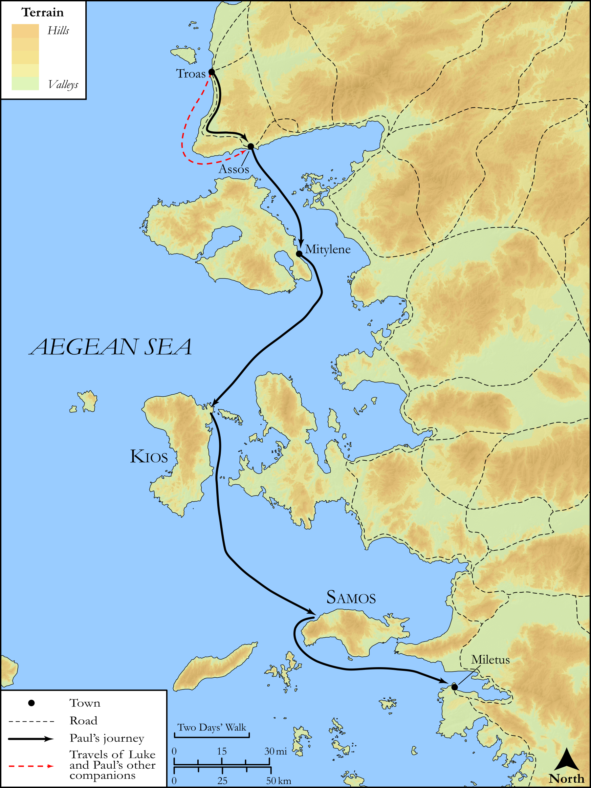

# Biblica Open Bible Maps

## License Information

Biblica Open Bible Maps, © 2023–2025 Biblica, Inc. This work is licensed under Creative Commons Attribution-ShareAlike 4.0 International (<a href="https://creativecommons.org/licenses/by-sa/4.0/">https://creativecommons.org/licenses/by-sa/4.0/</a>). More Information: <a href="https://docs.google.com/document/d/1Pp44yZ0Zdnd59vJHTrt2rPYq0SppfX5rZbPBt6mz37U/edit?tab=t.0#heading=h.oev9aj1ksvk2">https://docs.google.com/document/d/1Pp44yZ0Zdnd59vJHTrt2rPYq0SppfX5rZbPBt6mz37U/edit?tab=t.0#heading=h.oev9aj1ksvk2</a>

--------------------------------

## SRV Acts: Acts 20:13–16 (id: NT356)

### Image Content

[link](images/NT356.png)

Original: [SRV Acts: Acts 20:13\-16](https://drive.google.com/open?id=1ZFDAEQ_LrxBylwyF5bo26wUGaCKE70Oc&usp=drive_copy)

* **Associated Passages:** Acts 20:1-38

* **Associated ACAI Concepts:** Paul (ID: `person:Paul`); LORD (ID: `deity:Lord`); Declare (ID: `keyterm:Declare`); Asia (ID: `place:Asia`); Jews (ID: `group:Jews`); Jesus (ID: `person:Jesus.2`); Ask for (ID: `keyterm:AskFor`); Encourage (ID: `keyterm:Encourage`); Life (ID: `keyterm:Life`); Holy Spirit (ID: `deity:HolySpirit`); Miletus (ID: `place:Miletus`); Macedonia (ID: `place:Macedonia`); Troas (ID: `place:Troas`); Assos (ID: `place:Assos`); Ephesus (ID: `place:Ephesus`); Favor (ID: `keyterm:Favor`); Serve (ID: `keyterm:Serve`); Be a Disciple (ID: `keyterm:Disciple`); Jerusalem (ID: `place:Jerusalem`); Church (ID: `keyterm:Church`); Blood (ID: `keyterm:Blood`); Secundus (ID: `person:Secundus`); Tychicus (ID: `person:Tychicus`); Week (ID: `keyterm:Week`); Sopater (ID: `person:Sopater`); Eutychus (ID: `person:Eutychus`); Pyrrhus (ID: `person:Pyrrhus`); Chios (ID: `place:Chios`); Bereans (ID: `group:Berea`); Philippi (ID: `place:Philippi`); Asians (ID: `group:Asia`); Mitylene (ID: `place:Mitylene`); Trophimus (ID: `person:Trophimus`); Be Enslaved (ID: `keyterm:Serve.2`); Samos (ID: `place:Samos`); Gaius (ID: `person:Gaius.2`); Greece (ID: `place:Greece`); Flock (ID: `fauna:Flock`); Ship (ID: `realia:Ship`); Goat (ID: `fauna:Goat`); Decided (ID: `keyterm:Decided`); Derbe (ID: `place:Derbe`); Clean (ID: `keyterm:Clean`); Greeks (ID: `group:Greek`); Thessalonians (ID: `group:Thessalonica`); Kingdom (ID: `keyterm:Kingdom`); Aristarchus (ID: `person:Aristarchus`); Happy (ID: `keyterm:Happy`); Name (ID: `keyterm:Name`); Timothy (ID: `person:Timothy`); Proclaim (ID: `keyterm:Proclaim`); Javan (ID: `person:Javan`); Pray (ID: `keyterm:Pray`); Consecration (ID: `keyterm:Consecration.2`); Spirit (ID: `keyterm:Spirit.2`); Believe (ID: `keyterm:Believe`); Repent (ID: `keyterm:Repent`); Berea (ID: `place:Berea`); Good News (ID: `keyterm:GoodNews`); Thessalonica (ID: `place:Thessalonica`); Window (ID: `realia:Window`); Second Story (ID: `realia:SecondStory`); Wolf (ID: `fauna:Wolf`); Temple (ID: `realia:Temple`); Upstairs Room (ID: `realia:UpstairsRoom`); Lamp (ID: `realia:Lamp`); House (ID: `realia:House`); Clothing (ID: `realia:Clothing`)
