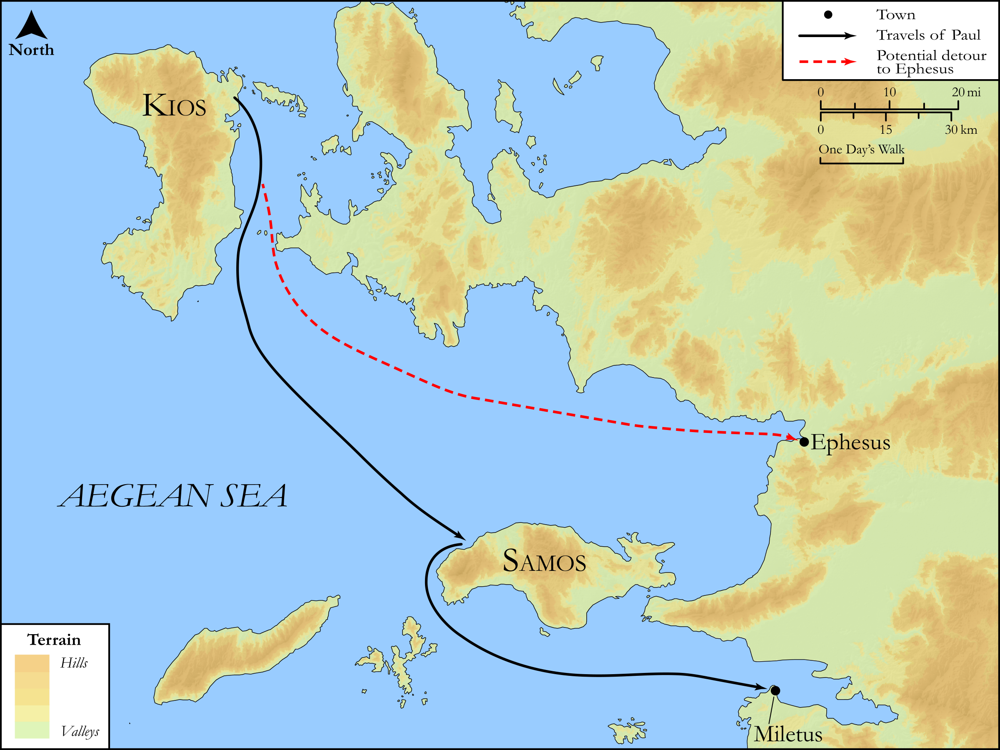

# Biblica Open Bible Maps

## License Information

Biblica Open Bible Maps, © 2023–2025 Biblica, Inc. This work is licensed under Creative Commons Attribution-ShareAlike 4.0 International (https://creativecommons.org/licenses/by-sa/4.0/). More Information: https://docs.google.com/document/d/1Pp44yZ0Zdnd59vJHTrt2rPYq0SppfX5rZbPBt6mz37U/edit?tab=t.0#heading=h.oev9aj1ksvk2

--------------------------------

## SRV Acts: Acts 20:13–16 (id: NT357)

### Image Content

[link](images/NT357.png)

Original: [SRV Acts: Acts 20:13\-16](https://drive.google.com/open?id=1ja5t9ZgqPPLluMK769Etj6zOvd7DoQtc&usp=drive_copy)

* **Associated Passages:** Acts 20:1-38

* **Associated ACAI Concepts:** Paul (ID: `person:Paul`); LORD (ID: `deity:Lord`); Declare (ID: `keyterm:Declare`); Ask for (ID: `keyterm:AskFor`); Holy Spirit (ID: `deity:HolySpirit`); Asia (ID: `place:Asia`); Life (ID: `keyterm:Life`); Encourage (ID: `keyterm:Encourage`); Jews (ID: `group:Jews`); Jesus (ID: `person:Jesus.2`); Miletus (ID: `place:Miletus`); Troas (ID: `place:Troas`); Macedonia (ID: `place:Macedonia`); Ephesus (ID: `place:Ephesus`); Assos (ID: `place:Assos`); Jerusalem (ID: `place:Jerusalem`); Church (ID: `keyterm:Church`); Favor (ID: `keyterm:Favor`); Be a Disciple (ID: `keyterm:Disciple`); Serve (ID: `keyterm:Serve`); Blood (ID: `keyterm:Blood`); Greece (ID: `place:Greece`); Sopater (ID: `person:Sopater`); Bereans (ID: `group:Berea`); Be Enslaved (ID: `keyterm:Serve.2`); Gaius (ID: `person:Gaius.2`); Philippi (ID: `place:Philippi`); Secundus (ID: `person:Secundus`); Trophimus (ID: `person:Trophimus`); Tychicus (ID: `person:Tychicus`); Asians (ID: `group:Asia`); Week (ID: `keyterm:Week`); Mitylene (ID: `place:Mitylene`); Pyrrhus (ID: `person:Pyrrhus`); Samos (ID: `place:Samos`); Chios (ID: `place:Chios`); Eutychus (ID: `person:Eutychus`); Flock (ID: `fauna:Flock`); Ship (ID: `realia:Ship`); Goat (ID: `fauna:Goat`); Javan (ID: `person:Javan`); Believe (ID: `keyterm:Believe`); Good News (ID: `keyterm:GoodNews`); Happy (ID: `keyterm:Happy`); Kingdom (ID: `keyterm:Kingdom`); Proclaim (ID: `keyterm:Proclaim`); Derbe (ID: `place:Derbe`); Repent (ID: `keyterm:Repent`); Name (ID: `keyterm:Name`); Thessalonians (ID: `group:Thessalonica`); Decided (ID: `keyterm:Decided`); Pray (ID: `keyterm:Pray`); Consecration (ID: `keyterm:Consecration.2`); Clean (ID: `keyterm:Clean`); Greeks (ID: `group:Greek`); Thessalonica (ID: `place:Thessalonica`); Berea (ID: `place:Berea`); Aristarchus (ID: `person:Aristarchus`); Timothy (ID: `person:Timothy`); Spirit (ID: `keyterm:Spirit.2`); Window (ID: `realia:Window`); Second Story (ID: `realia:SecondStory`); Lamp (ID: `realia:Lamp`); Clothing (ID: `realia:Clothing`); Wolf (ID: `fauna:Wolf`); Upstairs Room (ID: `realia:UpstairsRoom`); House (ID: `realia:House`); Temple (ID: `realia:Temple`)
