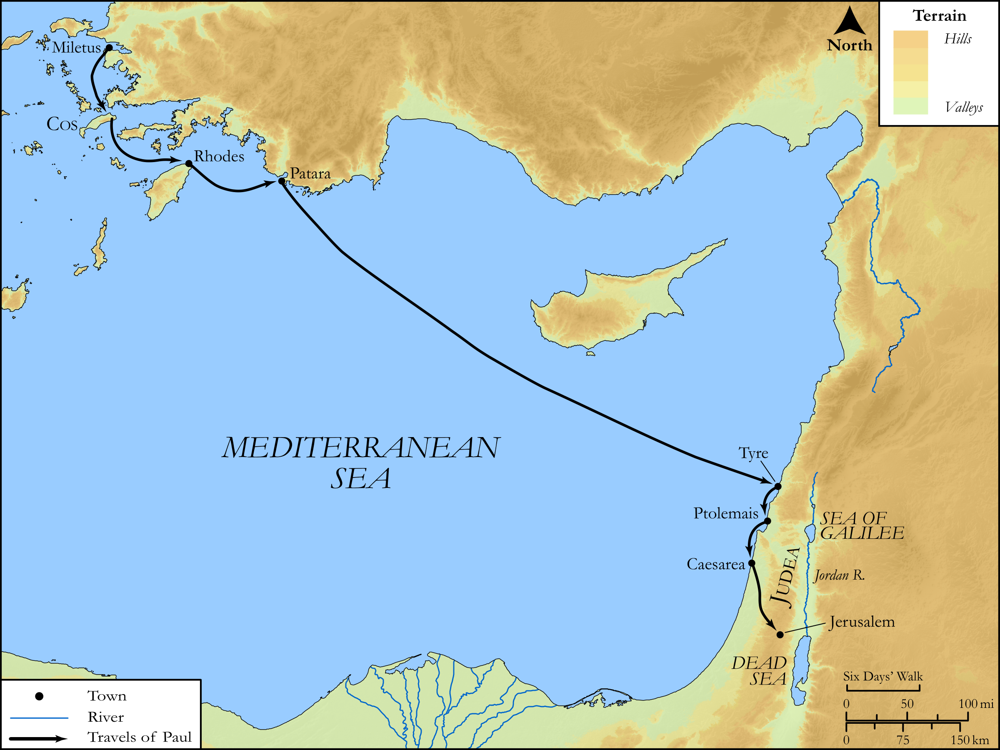

# Biblica Open Bible Maps

## License Information

Biblica Open Bible Maps, © 2023–2025 Biblica, Inc. This work is licensed under Creative Commons Attribution-ShareAlike 4.0 International (https://creativecommons.org/licenses/by-sa/4.0/). More Information: https://docs.google.com/document/d/1Pp44yZ0Zdnd59vJHTrt2rPYq0SppfX5rZbPBt6mz37U/edit?tab=t.0#heading=h.oev9aj1ksvk2

--------------------------------

## SRV Acts: Acts 21:1–9, Acts 21:15–25 (id: NT359)

### Image Content

[link](images/NT359.png)

Original: [SRV Acts: Acts 21:1\-9, Acts 21:15\-25](https://drive.google.com/open?id=1vHb-hTeSBkIzGmecs5ZZZVuRp06heMFc&usp=drive_copy)

* **Associated Passages:** Acts 21:1-40

* **Associated ACAI Concepts:** Paul (ID: `person:Paul`); Jerusalem (ID: `place:Jerusalem`); Jews (ID: `group:Jews`); Temple (ID: `realia:Temple`); Gentiles (ID: `group:Gentile`); LORD (ID: `deity:Lord`); Law (ID: `keyterm:Law`); Caesarea (ID: `place:Caesarea`); Ship (ID: `realia:Ship`); Believe (ID: `keyterm:Believe`); Pure (ID: `keyterm:Pure`); Cyprus (ID: `place:Cyprus`); Holy Spirit (ID: `deity:HolySpirit`); Name (ID: `keyterm:Name`); Be a Disciple (ID: `keyterm:Disciple`); Tyre (ID: `place:Tyre`); Step (ID: `realia:Step`); Mnason (ID: `person:Mnason`); Patara (ID: `place:Patara`); Tarsus (ID: `place:Tarsus`); Cilicia (ID: `place:Cilicia`); Trophimus (ID: `person:Trophimus`); Rhodes (ID: `place:Rhodes`); Philip (ID: `person:Philip.4`); Agabus (ID: `person:Agabus`); Phoenicia (ID: `place:Phoenicia`); Tarsians (ID: `group:Tarsus`); Cypriots (ID: `group:Cyprus`); Cos (ID: `place:Cos`); Fornication (ID: `keyterm:Fornication`); Javan (ID: `person:Javan`); Israelites (ID: `group:Israel`); Ephesians (ID: `group:Ephesus`); Egyptians (ID: `group:Egypt`); Persuade (ID: `keyterm:Persuade`); Ask for (ID: `keyterm:AskFor`); Moses (ID: `person:Moses`); Acco (ID: `place:Acco`); Glory (ID: `keyterm:Glory`); James (ID: `person:James.3`); Vow (ID: `keyterm:Vow`); Defilement (ID: `keyterm:Defilement`); Something Definite (ID: `keyterm:SomethingDefinite`); Asia (ID: `place:Asia`); Speak as a Prophet (ID: `keyterm:Speak`); Ephesus (ID: `place:Ephesus`); Offering (ID: `keyterm:Offering`); Be Lawful (ID: `keyterm:Lawful`); Decided (ID: `keyterm:Decided`); Pray (ID: `keyterm:Pray`); Egypt (ID: `place:Egypt`); Judea (ID: `place:Judea`); Heart (ID: `keyterm:Heart`); Live (ID: `keyterm:Live.3`); Greeks (ID: `group:Greek`); Military Member (ID: `person:MilitaryMember`); Serve (ID: `keyterm:Serve`); Israel (ID: `person:Israel`); Holy (ID: `keyterm:Holy`); Blood (ID: `keyterm:Blood`); Jesus (ID: `person:Jesus.2`); Belt (ID: `realia:Belt`); Bag (ID: `realia:Bag`); House (ID: `realia:House`); Tabernacle (ID: `realia:Tabernacle`); Door (ID: `realia:Door`); Chain (ID: `realia:Chain`)
