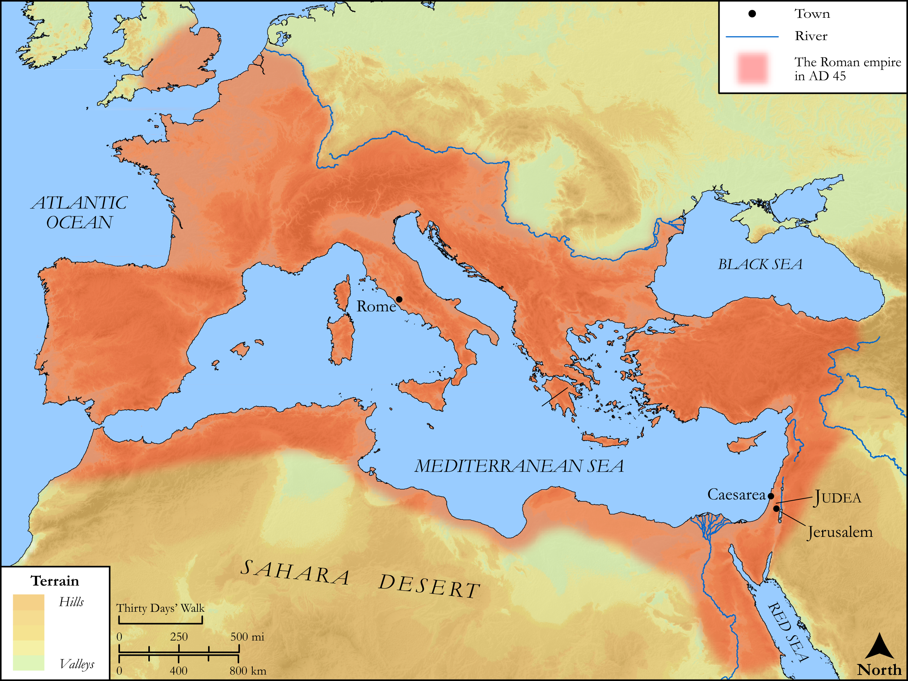

# Biblica Open Bible Maps

## License Information

Biblica Open Bible Maps, © 2023–2025 Biblica, Inc. This work is licensed under Creative Commons Attribution-ShareAlike 4.0 International (https://creativecommons.org/licenses/by-sa/4.0/). More Information: https://docs.google.com/document/d/1Pp44yZ0Zdnd59vJHTrt2rPYq0SppfX5rZbPBt6mz37U/edit?tab=t.0#heading=h.oev9aj1ksvk2

--------------------------------

## SRV Acts: Acts 25:13–21 (id: NT360)

### Image Content

[link](images/NT360.png)

Original: [SRV Acts: Acts 25:13\-21](https://drive.google.com/open?id=12sSRzC8rZXpDvHb8kfqmn1tjAhWdtn8z&usp=drive_copy)

* **Associated Passages:** Acts 25:1-27

* **Associated ACAI Concepts:** Paul (ID: `person:Paul`); Festus (ID: `person:Festus`); Jerusalem (ID: `place:Jerusalem`); Jews (ID: `group:Jews`); Agrippa (ID: `person:Agrippa`); Claudius (ID: `person:Claudius`); Caesarea (ID: `place:Caesarea`); Call Upon (ID: `keyterm:CallUpon`); Decided (ID: `keyterm:Decided`); Bernice (ID: `person:Bernice`); Augustus (ID: `person:Augustus`); Judgment Seat (ID: `realia:JudgmentSeat`); Favor (ID: `keyterm:Favor`); Life (ID: `keyterm:Life`); Forgive (ID: `keyterm:Forgive`); To Act Wickedly (ID: `keyterm:ActWickedly`); Law (ID: `keyterm:Law`); Ask for (ID: `keyterm:AskFor`); To Sin (ID: `keyterm:Sin`); Decision (ID: `keyterm:Decision`); Rome (ID: `place:Rome`); Felix (ID: `person:Felix`); Condemn (ID: `keyterm:Condemn`); Discern (ID: `keyterm:Discern`); Jesus (ID: `person:Jesus.2`); Audience Hall (ID: `realia:AudienceHall`); Temple (ID: `realia:Temple`)
