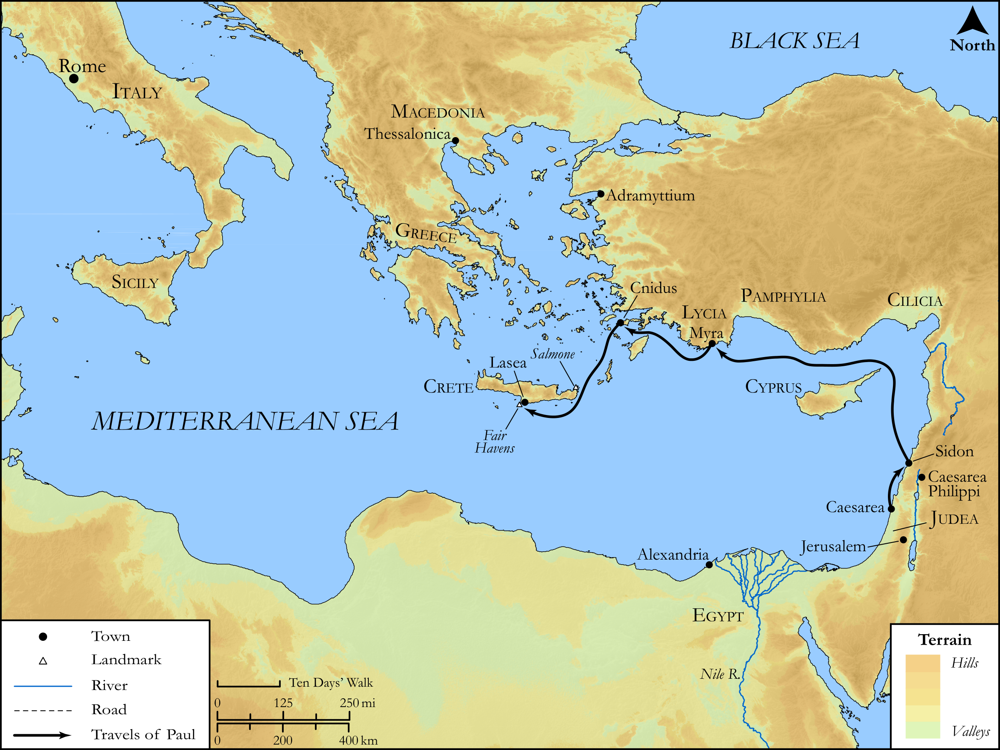

# Biblica Open Bible Maps

## License Information

Biblica Open Bible Maps, © 2023–2025 Biblica, Inc. This work is licensed under Creative Commons Attribution-ShareAlike 4.0 International (<a href="https://creativecommons.org/licenses/by-sa/4.0/">https://creativecommons.org/licenses/by-sa/4.0/</a>). More Information: <a href="https://docs.google.com/document/d/1Pp44yZ0Zdnd59vJHTrt2rPYq0SppfX5rZbPBt6mz37U/edit?tab=t.0#heading=h.oev9aj1ksvk2">https://docs.google.com/document/d/1Pp44yZ0Zdnd59vJHTrt2rPYq0SppfX5rZbPBt6mz37U/edit?tab=t.0#heading=h.oev9aj1ksvk2</a>

--------------------------------

## SRV Acts: Acts 27:1–7 (id: NT361)

### Image Content

[link](images/NT361.png)

Original: [SRV Acts: Acts 27:1\-7](https://drive.google.com/open?id=1zzO6o3hqHpQ2yZ594HUEMWu7Hp6H3aqA&usp=drive_copy)

* **Associated Passages:** Acts 27:1-44

* **Associated ACAI Concepts:** Ship (ID: `realia:Ship`); Paul (ID: `person:Paul`); Salvation (ID: `keyterm:Salvation`); Crete (ID: `place:Crete`); LORD (ID: `deity:Lord`); Fear (ID: `keyterm:Fear`); Anchor (ID: `realia:Anchor`); Julius (ID: `person:Julius`); Italy (ID: `place:Italy`); Ask for (ID: `keyterm:AskFor`); Life (ID: `keyterm:Life`); Fair Havens (ID: `place:FairHavens`); Asia (ID: `place:Asia`); Augustus (ID: `person:Augustus`); Lasea (ID: `place:Lasea`); Aristarchus (ID: `person:Aristarchus`); Sidon (ID: `place:Sidon`); Myra (ID: `place:Myra`); Cilicia (ID: `place:Cilicia`); Salmone (ID: `place:Salmone`); Adriatic Sea (ID: `place:AdriaticSea`); the Syrtis (ID: `place:Syrtis`); Phoenix (ID: `place:Phoenix`); Cnidus (ID: `place:Cnidus`); Alexandria (ID: `place:Alexandria`); Pamphylia (ID: `place:Pamphylia`); Lycia (ID: `place:Lycia`); Adramyttium (ID: `place:Adramyttium`); Cauda (ID: `place:Cauda`); Rope (ID: `realia:Rope`); Decided (ID: `keyterm:Decided`); Serve (ID: `keyterm:Serve`); Thessalonians (ID: `group:Thessalonica`); Macedonia (ID: `place:Macedonia`); An Angel (ID: `deity:Angel`); Name (ID: `keyterm:Name`); Cyprus (ID: `place:Cyprus`); Persuade (ID: `keyterm:Persuade`); Pray (ID: `keyterm:Pray`); Hope (ID: `keyterm:Hope`); Believe (ID: `keyterm:Believe`); Priesthood (ID: `keyterm:Priesthood`); Abstain from Food (ID: `keyterm:Fast`); Forgive (ID: `keyterm:Forgive`); Claudius (ID: `person:Claudius`); Thessalonica (ID: `place:Thessalonica`); Fathom (ID: `realia:Fathom`); Rudder (ID: `realia:Rudder`); Sail (ID: `realia:Sail`); Wheat (ID: `flora:Wheat`)
