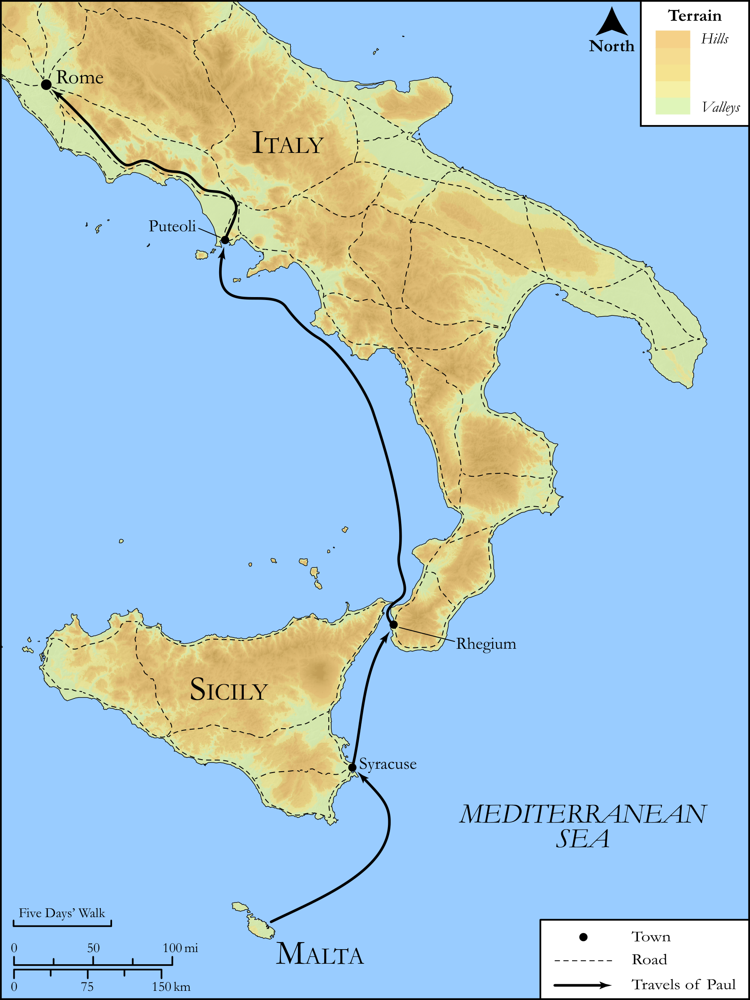

# Biblica Open Bible Maps

## License Information

Biblica Open Bible Maps, © 2023–2025 Biblica, Inc. This work is licensed under Creative Commons Attribution-ShareAlike 4.0 International (<a href="https://creativecommons.org/licenses/by-sa/4.0/">https://creativecommons.org/licenses/by-sa/4.0/</a>). More Information: <a href="https://docs.google.com/document/d/1Pp44yZ0Zdnd59vJHTrt2rPYq0SppfX5rZbPBt6mz37U/edit?tab=t.0#heading=h.oev9aj1ksvk2">https://docs.google.com/document/d/1Pp44yZ0Zdnd59vJHTrt2rPYq0SppfX5rZbPBt6mz37U/edit?tab=t.0#heading=h.oev9aj1ksvk2</a>

--------------------------------

## SRV Acts: Acts 28:1–10, Acts 28:11–15 (id: NT363)

### Image Content

[link](images/NT363.png)

Original: [SRV Acts: Acts 28:1\-10, Acts 28:11\-15](https://drive.google.com/open?id=1eJd3w5xfvVGdYtu6cf9zhCoCfcBlgWS1&usp=drive_copy)

* **Associated Passages:** Acts 28:1-31

* **Associated ACAI Concepts:** Paul (ID: `person:Paul`); LORD (ID: `deity:Lord`); Rome (ID: `place:Rome`); Salvation (ID: `keyterm:Salvation`); Publius (ID: `person:Publius`); Persuade (ID: `keyterm:Persuade`); Jews (ID: `group:Jews`); Kingdom (ID: `keyterm:Kingdom`); Jesus (ID: `person:Jesus.2`); Ask for (ID: `keyterm:AskFor`); Malta (ID: `place:Malta`); Syracuse (ID: `place:Syracuse`); Puteoli (ID: `place:Puteoli`); Three Taverns (ID: `place:ThreeTaverns`); Alexandria (ID: `place:Alexandria`); Rhegium (ID: `place:Rhegium`); Forum of Appius (ID: `place:ForumOfAppius`); Discern (ID: `keyterm:Discern`); Moses (ID: `person:Moses`); Disbelieve (ID: `keyterm:Disbelieve`); Serve (ID: `keyterm:Serve`); Gentiles (ID: `group:Gentile`); Kindness (ID: `keyterm:Kindness`); Be (Or Show Oneself) Just (ID: `keyterm:Just`); Call Upon (ID: `keyterm:CallUpon`); Jerusalem (ID: `place:Jerusalem`); Name (ID: `keyterm:Name`); Proclaim (ID: `keyterm:Proclaim`); Declare (ID: `keyterm:Declare`); Pray (ID: `keyterm:Pray`); Word (ID: `keyterm:Word`); Isaiah (ID: `person:Isaiah`); Think (ID: `keyterm:Think`); Hope (ID: `keyterm:Hope`); Israel (ID: `person:Israel`); Life (ID: `keyterm:Life`); Heart (ID: `keyterm:Heart`); Judea (ID: `place:Judea`); Hospitably (ID: `keyterm:Hospitably`); Law (ID: `keyterm:Law`); Holy Spirit (ID: `deity:HolySpirit`); Claudius (ID: `person:Claudius`); Emblem (ID: `realia:Emblem`); Chain (ID: `realia:Chain`); Snake (ID: `fauna:Snake`); Guest Room (ID: `realia:GuestRoom`); Ship (ID: `realia:Ship`); Inn (ID: `realia:Inn`); Cobra (ID: `fauna:Cobra`)
