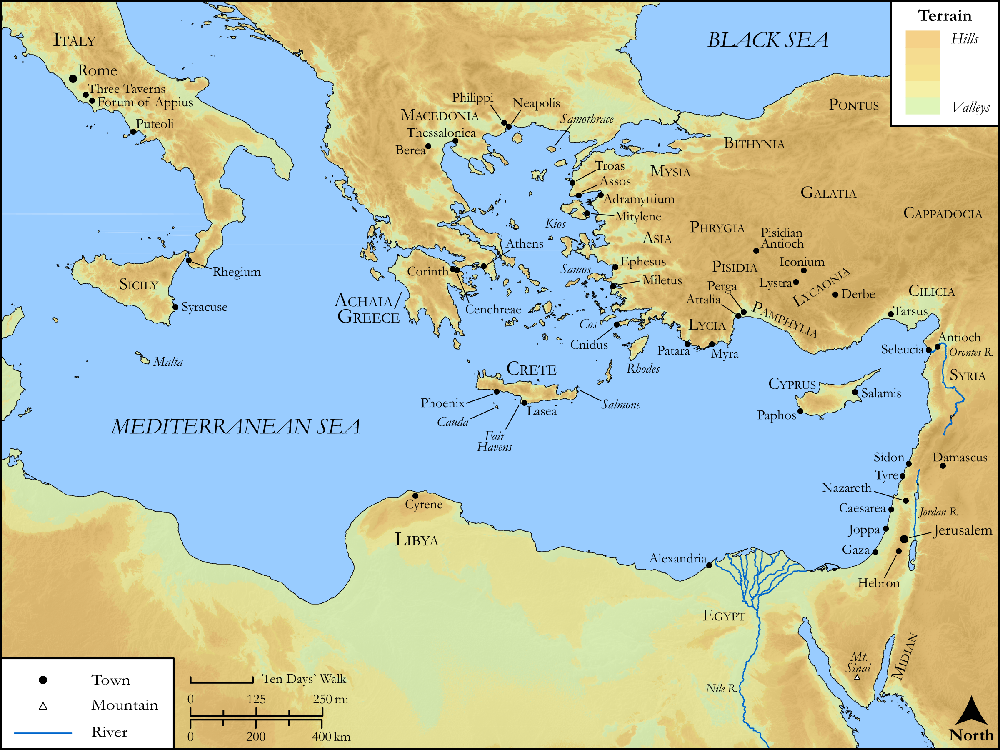

# Biblica Open Bible Maps

## License Information

Biblica Open Bible Maps, © 2023–2025 Biblica, Inc. This work is licensed under Creative Commons Attribution-ShareAlike 4.0 International (https://creativecommons.org/licenses/by-sa/4.0/). More Information: https://docs.google.com/document/d/1Pp44yZ0Zdnd59vJHTrt2rPYq0SppfX5rZbPBt6mz37U/edit?tab=t.0#heading=h.oev9aj1ksvk2

--------------------------------

## SRV Acts: All Acts Sites (Eastern Mediterranean) (id: NT365)

### Image Content

[link](images/NT365.png)

Original: [SRV Acts: All Acts Sites (Eastern Mediterranean)](https://drive.google.com/open?id=1rfsRxL9ygk-KH7l-GL77KJKT5Y-JtH9A&usp=drive_copy)

* **Associated Passages:** Acts 1:1-28:31

* **Associated ACAI Concepts:** LORD (ID: `deity:Lord`); Paul (ID: `person:Paul`); Jesus (ID: `person:Jesus.2`); Jews (ID: `group:Jews`); Name (ID: `keyterm:Name`); Jerusalem (ID: `place:Jerusalem`); Peter (ID: `person:Peter`); Holy Spirit (ID: `deity:HolySpirit`); Believe (ID: `keyterm:Believe`); Ask for (ID: `keyterm:AskFor`); Gentiles (ID: `group:Gentile`); Be a Disciple (ID: `keyterm:Disciple`); Israel (ID: `person:Israel`); Pray (ID: `keyterm:Pray`); Life (ID: `keyterm:Life`); Sky (ID: `keyterm:Heaven`); Salvation (ID: `keyterm:Salvation`); Serve (ID: `keyterm:Serve`); Baptism (ID: `keyterm:Baptism`); Ability (ID: `keyterm:Ability`); Barnabas (ID: `person:Barnabas`); An Angel (ID: `deity:Angel`); Decided (ID: `keyterm:Decided`); Heart (ID: `keyterm:Heart`); Church (ID: `keyterm:Church`); Philip (ID: `person:Philip.4`); Moses (ID: `person:Moses`); Fear (ID: `keyterm:Fear`); Rome (ID: `place:Rome`); Resurrection (ID: `keyterm:Resurrection`)
