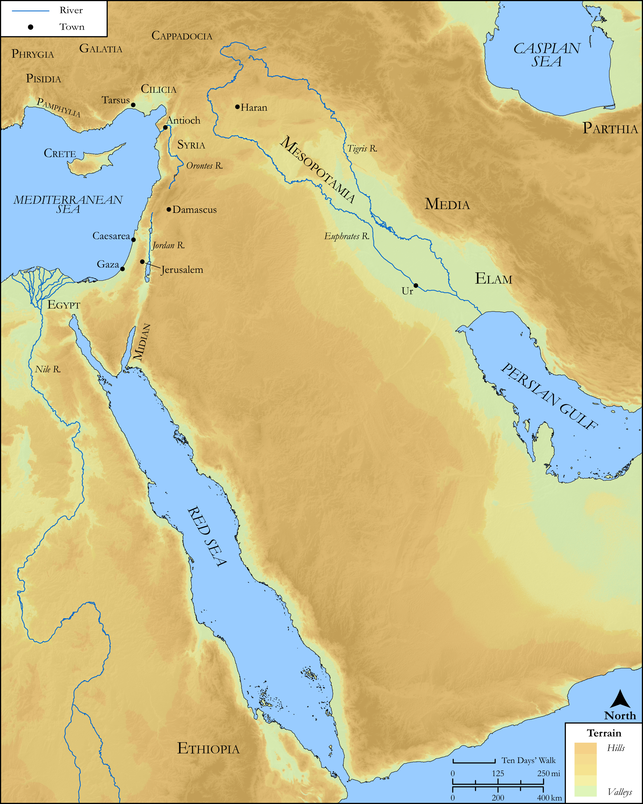

# Biblica Open Bible Maps

## License Information

Biblica Open Bible Maps, © 2023–2025 Biblica, Inc. This work is licensed under Creative Commons Attribution-ShareAlike 4.0 International (https://creativecommons.org/licenses/by-sa/4.0/). More Information: https://docs.google.com/document/d/1Pp44yZ0Zdnd59vJHTrt2rPYq0SppfX5rZbPBt6mz37U/edit?tab=t.0#heading=h.oev9aj1ksvk2

--------------------------------

## SRV Acts: All Acts Sites (Mesopotamia) (id: NT368)

### Image Content

[link](images/NT368.png)

Original: [SRV Acts: All Acts Sites (Mesopotamia)](https://drive.google.com/open?id=1v6J_RVqjPfZ5JNU0EhvmDfnCLWnOtgl8&usp=drive_copy)

* **Associated Passages:** Acts 1:1-26

* **Associated ACAI Concepts:** Jesus (ID: `person:Jesus.2`); Holy Spirit (ID: `deity:HolySpirit`); LORD (ID: `deity:Lord`); Jerusalem (ID: `place:Jerusalem`); Matthias (ID: `person:Matthias`); Pray (ID: `keyterm:Pray`); Sky (ID: `keyterm:Heaven`); Witness (ID: `keyterm:Witness`); Chosen (ID: `keyterm:Chosen`); Baptism (ID: `keyterm:Baptism`); Kingdom (ID: `keyterm:Kingdom`); Judas (ID: `person:Judas.2`); John (ID: `person:John`); Peter (ID: `person:Peter`); Ability (ID: `keyterm:Ability`); Serve (ID: `keyterm:Serve`); Bartholomew (ID: `person:Bartholomew`); Akeldama (ID: `place:Akeldama`); Mary (ID: `person:Mary`); Alphaeus (ID: `person:Alphaeus`); Promise (ID: `keyterm:Promise`); Simon (ID: `person:Simon.2`); Theophilus (ID: `person:Theophilus`); Thomas (ID: `person:Thomas`); Galileans (ID: `group:Galilee`); Judea (ID: `place:Judea`); Joseph (ID: `person:Joseph.9`); Andrew (ID: `person:Andrew`); Mount of Olives (ID: `place:OlivesMount`); James (ID: `person:James.2`); Judas (ID: `person:Judas`); Unjust Deed (ID: `keyterm:UnjustDeed`); Galilee (ID: `place:Galilee`); Ask for (ID: `keyterm:AskFor`); Sabbath Journey (ID: `keyterm:HalfAMile`); John (ID: `person:John.2`); Resurrection (ID: `keyterm:Resurrection`); David (ID: `person:David`); Life (ID: `keyterm:Life`); Philip (ID: `person:Philip`); Matthew (ID: `person:Matthew`); James (ID: `person:James`); Name (ID: `keyterm:Name`); To Cause to Happen (ID: `keyterm:Happen`); Written (ID: `keyterm:Scripture`); To Command (ID: `keyterm:Command`); Samaria (ID: `place:Samaria`); Position of Responsibility (ID: `keyterm:PositionOfResponsibility`); Israel (ID: `person:Israel`); Knower of Hearts (ID: `keyterm:KnowerOfHearts`); Blood (ID: `keyterm:Blood`); Authority (ID: `keyterm:Authority.2`); Half a Mile (ID: `realia:HalfAMile`); Upstairs Room (ID: `realia:UpstairsRoom`); Lot (ID: `realia:Lot`); Clothing (ID: `realia:Clothing`); Olive Tree (ID: `flora:OliveTree`)
