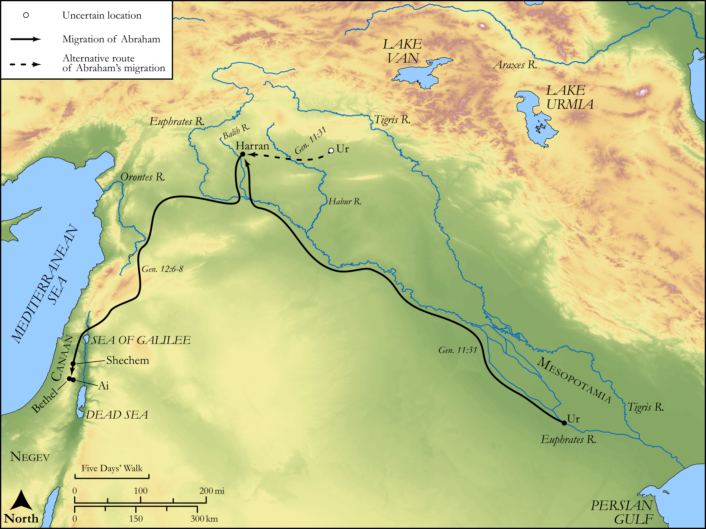

# Biblica Open Bible Maps

## License Information

Biblica Open Bible Maps, © 2023–2025 Biblica, Inc. This work is licensed under Creative Commons Attribution-ShareAlike 4.0 International (https://creativecommons.org/licenses/by-sa/4.0/). More Information: https://docs.google.com/document/d/1Pp44yZ0Zdnd59vJHTrt2rPYq0SppfX5rZbPBt6mz37U/edit?tab=t.0#heading=h.oev9aj1ksvk2

--------------------------------

## Pentateuch: Abraham's Journey to Canaan (id: OT012)

### Image Content

[link](images/OT012.png)

Original: [Pentateuch: Abraham's Journey to Canaan](https://drive.google.com/open?id=1y3aCtABg0ZaM7Jp8yn6wCApcYaFsBHdm&usp=drive_copy)

* **Associated Passages:** Genesis 11:1-12:20

* **Associated ACAI Concepts:** Abraham (ID: `person:Abraham`); LORD (ID: `deity:Lord`); Terah (ID: `person:Terah`); Haran (ID: `person:Haran`); Sarah (ID: `person:Sarah`); Pharaoh (ID: `person:Pharaoh.3`); Haran (ID: `place:Haran`); Reu (ID: `person:Reu`); Egypt (ID: `place:Egypt`); Nahor (ID: `person:Nahor`); Serug (ID: `person:Serug`); Peleg (ID: `person:Peleg`); Lot (ID: `person:Lot`); Shelah (ID: `person:Shelah.2`); Arpachshad (ID: `person:Arpachshad`); Eber (ID: `person:Eber`); Canaan (ID: `place:Canaan`); Nahor (ID: `person:Nahor.2`); Ur (ID: `place:Ur`); Bless (ID: `keyterm:Bless`); Chaldeans (ID: `group:Chaldea`); Chaldea (ID: `place:Chaldea`); Egyptians (ID: `group:Egypt`); Shem (ID: `person:Shem`); Shechem (ID: `place:Shechem`); Shinar (ID: `place:Shinar`); Milcah (ID: `person:Milcah`); Iscah (ID: `person:Iscah`); Ai (ID: `place:Ai`); Canaanites (ID: `group:Canaan`)
