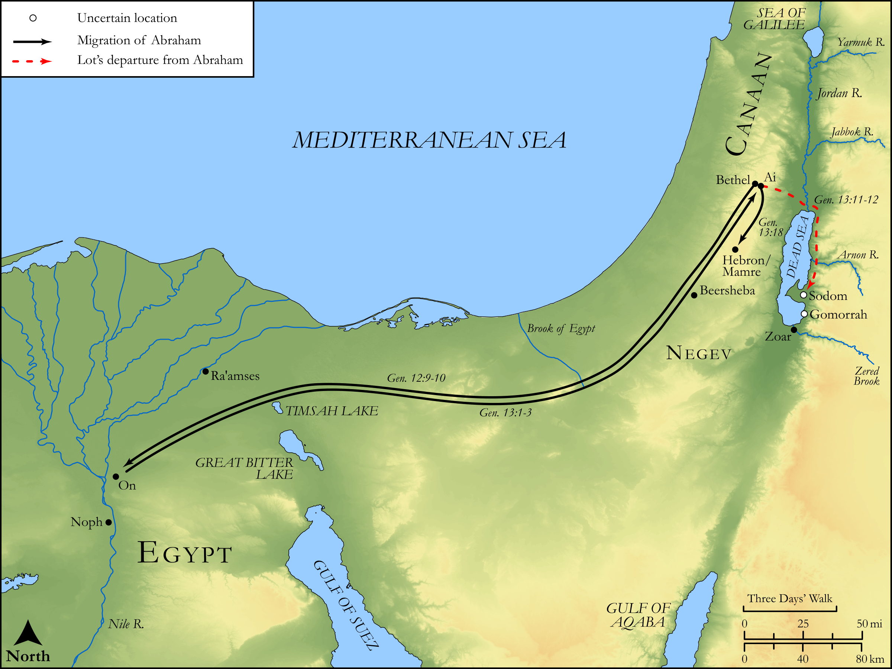

# Biblica Open Bible Maps

## License Information

Biblica Open Bible Maps, © 2023–2025 Biblica, Inc. This work is licensed under Creative Commons Attribution-ShareAlike 4.0 International (<a href="https://creativecommons.org/licenses/by-sa/4.0/">https://creativecommons.org/licenses/by-sa/4.0/</a>). More Information: <a href="https://docs.google.com/document/d/1Pp44yZ0Zdnd59vJHTrt2rPYq0SppfX5rZbPBt6mz37U/edit?tab=t.0#heading=h.oev9aj1ksvk2">https://docs.google.com/document/d/1Pp44yZ0Zdnd59vJHTrt2rPYq0SppfX5rZbPBt6mz37U/edit?tab=t.0#heading=h.oev9aj1ksvk2</a>

--------------------------------

## Pentateuch: Abraham in Egypt and the Separation from Lot (id: OT013)

### Image Content

[link](images/OT013.png)

Original: [Pentateuch: Abraham in Egypt and the Separation from Lot](https://drive.google.com/open?id=1BaJCXqMKhcblztZZhqbFn_pRpbB-j9P-&usp=drive_copy)

* **Associated Passages:** Genesis 12:1-13:18

* **Associated ACAI Concepts:** Abraham (ID: `person:Abraham`); Lot (ID: `person:Lot`); LORD (ID: `deity:Lord`); Egypt (ID: `place:Egypt`); Pharaoh (ID: `person:Pharaoh.3`); Canaan (ID: `place:Canaan`); Sodom (ID: `place:Sodom`); Altar (ID: `realia:Altar`); Flock (ID: `fauna:Flock`); Stone Altar (ID: `realia:StoneAltar`); Temple Altar (ID: `realia:TempleAltar`); Goat (ID: `fauna:Goat`); Tabernacle Altar (ID: `realia:TabernacleAltar`); Sarah (ID: `person:Sarah`); Negev (ID: `place:Negeb`); Ai (ID: `place:Ai`); Bethel (ID: `place:Bethel`); Haran (ID: `place:Haran`); Bless (ID: `keyterm:Bless`); Canaanites (ID: `group:Canaan`); Tent (ID: `realia:Tent`); Jordan River (ID: `place:Jordan`); Egyptians (ID: `group:Egypt`); Oak (ID: `flora:Oak`); Hebron (ID: `place:Hebron`); Shechem (ID: `place:Shechem`); Oak of Moreh (ID: `place:Moreh`); Sheep (ID: `fauna:Lamb`); Cattle (ID: `fauna:Bull`); Zoar (ID: `place:Zoar`); Mamre (ID: `place:Mamre`); Gomorrah (ID: `place:Gomorrah`); Perizzites (ID: `group:Perizzites`); To Sin (ID: `keyterm:Sin`); To Curse (ID: `keyterm:Curse`); Money (ID: `realia:Money`); Camel (ID: `fauna:Camel`); Donkey (ID: `fauna:Donkey`)
