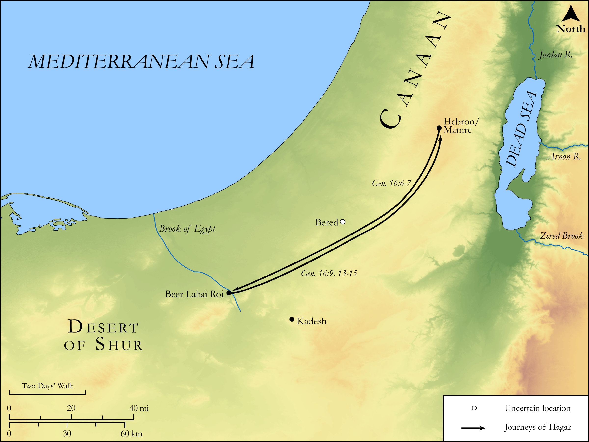

# Biblica Open Bible Maps

## License Information

Biblica Open Bible Maps, © 2023–2025 Biblica, Inc. This work is licensed under Creative Commons Attribution-ShareAlike 4.0 International (https://creativecommons.org/licenses/by-sa/4.0/). More Information: https://docs.google.com/document/d/1Pp44yZ0Zdnd59vJHTrt2rPYq0SppfX5rZbPBt6mz37U/edit?tab=t.0#heading=h.oev9aj1ksvk2

--------------------------------

## Pentateuch: The Flight and Return of Hagar (id: OT016)

### Image Content

[link](images/OT016.png)

Original: [Pentateuch: The Flight and Return of Hagar](https://drive.google.com/open?id=12xgkFYqhhJtslsQUT5pRgtlFEbZE4_Lc&usp=drive_copy)

* **Associated Passages:** Genesis 16:1-16

* **Associated ACAI Concepts:** Abraham (ID: `person:Abraham`); LORD (ID: `deity:Lord`); Hagar (ID: `person:Hagar`); Sarah (ID: `person:Sarah`); An Angel (ID: `deity:Angel`); Ishmael (ID: `person:Ishmael`); Egyptians (ID: `group:Egypt`); Egypt (ID: `place:Egypt`); Bered (ID: `place:Bered`); Beer-lahai-roi (ID: `place:Beer-lahai-roi`); Canaan (ID: `place:Canaan`); Shur (ID: `place:Shur`); Kadesh-barnea (ID: `place:Kadesh-barnea`); Wild Donkey (ID: `fauna:WildDonkey`)
