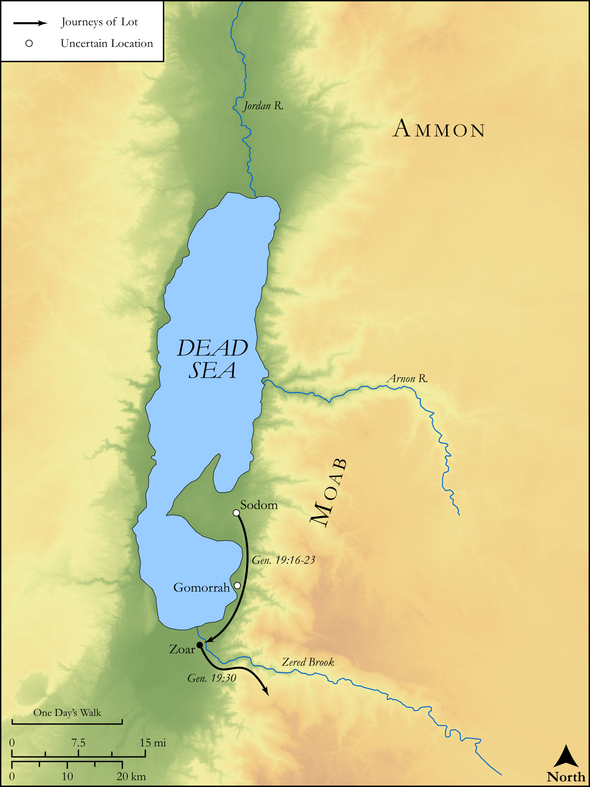

# Biblica Open Bible Maps

## License Information

Biblica Open Bible Maps, © 2023–2025 Biblica, Inc. This work is licensed under Creative Commons Attribution-ShareAlike 4.0 International (https://creativecommons.org/licenses/by-sa/4.0/). More Information: https://docs.google.com/document/d/1Pp44yZ0Zdnd59vJHTrt2rPYq0SppfX5rZbPBt6mz37U/edit?tab=t.0#heading=h.oev9aj1ksvk2

--------------------------------

## Pentateuch: Lot’s Flight from Sodom (id: OT017)

### Image Content

[link](images/OT017.png)

Original: [Pentateuch: Lot’s Flight from Sodom](https://drive.google.com/open?id=1AieVTsJIraiKOskmDGWDQj6Esv6EWjcB&usp=drive_copy)

* **Associated Passages:** Genesis 19:1-38

* **Associated ACAI Concepts:** Lot (ID: `person:Lot`); LORD (ID: `deity:Lord`); Sodom (ID: `place:Sodom`); House (ID: `realia:House`); Zoar (ID: `place:Zoar`); Vine (ID: `flora:Vine`); Wine (ID: `realia:Wine`); Gomorrah (ID: `place:Gomorrah`); Abraham (ID: `person:Abraham`); An Angel (ID: `deity:Angel`); Moab (ID: `person:Moab`); Ben-ammi (ID: `person:Ben-ammi`); Angels (ID: `group:Angels`); Ammonites (ID: `group:Ammon`); Ammon (ID: `place:Ammon`); Favor (ID: `keyterm:Favor`); Kindness (ID: `keyterm:Kindness`); Moab (ID: `place:Moab`); Fear (ID: `keyterm:Fear`); Passion (ID: `keyterm:Ardour`); Kiln (ID: `realia:Kiln`); Unleavened Bread (ID: `realia:UnleavenedBread`); Housetop (ID: `realia:Housetop`)
