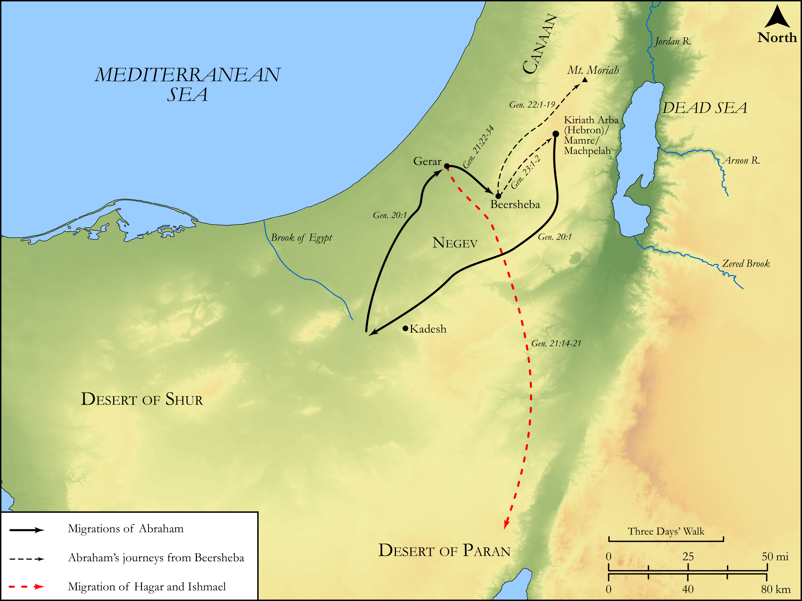

# Biblica Open Bible Maps

## License Information

Biblica Open Bible Maps, © 2023–2025 Biblica, Inc. This work is licensed under Creative Commons Attribution-ShareAlike 4.0 International (<a href="https://creativecommons.org/licenses/by-sa/4.0/">https://creativecommons.org/licenses/by-sa/4.0/</a>). More Information: <a href="https://docs.google.com/document/d/1Pp44yZ0Zdnd59vJHTrt2rPYq0SppfX5rZbPBt6mz37U/edit?tab=t.0#heading=h.oev9aj1ksvk2">https://docs.google.com/document/d/1Pp44yZ0Zdnd59vJHTrt2rPYq0SppfX5rZbPBt6mz37U/edit?tab=t.0#heading=h.oev9aj1ksvk2</a>

--------------------------------

## Pentateuch: The Last Migrations of Abraham (id: OT018)

### Image Content

[link](images/OT018.png)

Original: [Pentateuch: The Last Migrations of Abraham](https://drive.google.com/open?id=1045FITRbcRPyOWyfnId4KGfwAt44TFEs&usp=drive_copy)

* **Associated Passages:** Genesis 20:1-23:20

* **Associated ACAI Concepts:** Abraham (ID: `person:Abraham`); LORD (ID: `deity:Lord`); Abimelech (ID: `person:Abimelech`); Sarah (ID: `person:Sarah`); Isaac (ID: `person:Isaac`); Heth (ID: `person:Heth`); Ephron (ID: `person:Ephron.2`); Offering (ID: `keyterm:Offering`); Beersheba (ID: `place:Beersheba`); Swear (ID: `keyterm:Swear`); Sheep (ID: `fauna:Lamb`); Fear (ID: `keyterm:Fear`); Money (ID: `realia:Money`); Machpelah (ID: `place:Machpelah`); Hagar (ID: `person:Hagar`); An Angel (ID: `deity:Angel`); Phicol (ID: `person:Phicol`); Gerar (ID: `place:Gerar`); Bethuel (ID: `person:Bethuel`); Hebron (ID: `place:Hebron`); Bless (ID: `keyterm:Bless`); Milcah (ID: `person:Milcah`); Mamre (ID: `place:Mamre`); Dispossess (ID: `keyterm:Dispossess`); Kindness (ID: `keyterm:Kindness`); Canaan (ID: `place:Canaan`); Covenant (ID: `keyterm:Covenant`); Egypt (ID: `place:Egypt`); Philistia (ID: `place:Philistine`); Philistines (ID: `group:Philistine`)
