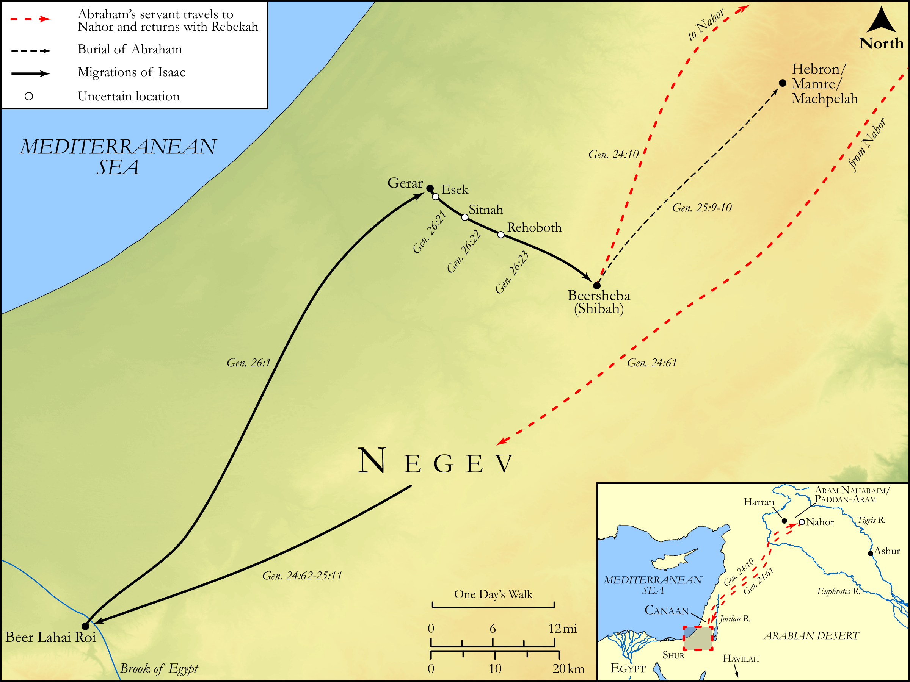

# Biblica Open Bible Maps

## License Information

Biblica Open Bible Maps, © 2023–2025 Biblica, Inc. This work is licensed under Creative Commons Attribution-ShareAlike 4.0 International (<a href="https://creativecommons.org/licenses/by-sa/4.0/">https://creativecommons.org/licenses/by-sa/4.0/</a>). More Information: <a href="https://docs.google.com/document/d/1Pp44yZ0Zdnd59vJHTrt2rPYq0SppfX5rZbPBt6mz37U/edit?tab=t.0#heading=h.oev9aj1ksvk2">https://docs.google.com/document/d/1Pp44yZ0Zdnd59vJHTrt2rPYq0SppfX5rZbPBt6mz37U/edit?tab=t.0#heading=h.oev9aj1ksvk2</a>

--------------------------------

## Pentateuch: Isaac and Rebekah (id: OT019)

### Image Content

[link](images/OT019.png)

Original: [Pentateuch: Isaac and Rebekah](https://drive.google.com/open?id=14kWfsNErASJmE4gshEx16hchqTLpE5nc&usp=drive_copy)

* **Associated Passages:** Genesis 24:1-27:46

* **Associated ACAI Concepts:** Isaac (ID: `person:Isaac`); LORD (ID: `deity:Lord`); Bless (ID: `keyterm:Bless`); Esau (ID: `person:Esau`); Abraham (ID: `person:Abraham`); Rebekah (ID: `person:Rebekah`); Israel (ID: `person:Israel`); Abimelech (ID: `person:Abimelech`); Swear (ID: `keyterm:Swear`); Bethuel (ID: `person:Bethuel`); Ishmael (ID: `person:Ishmael`); Gerar (ID: `place:Gerar`); Love (ID: `keyterm:Love`); Philistines (ID: `group:Philistine`); Philistia (ID: `place:Philistine`); Camel (ID: `fauna:Camel`); Clay Jar (ID: `realia:ClayJar`); Nahor (ID: `person:Nahor.2`); Laban (ID: `person:Laban`); Oath (ID: `keyterm:Oath`); Heth (ID: `person:Heth`); Sarah (ID: `person:Sarah`); Kindness (ID: `keyterm:Kindness`); Goat (ID: `fauna:Goat`); Flock (ID: `fauna:Flock`); House (ID: `realia:House`); Milcah (ID: `person:Milcah`); Egypt (ID: `place:Egypt`); Force to Serve (ID: `keyterm:EnticedToServe`); Truth (ID: `keyterm:Truth`)
