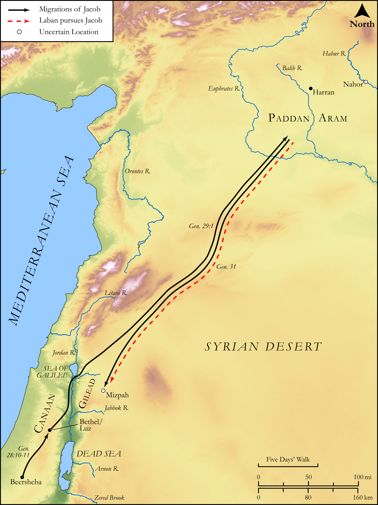

# Biblica Open Bible Maps

## License Information

Biblica Open Bible Maps, © 2023–2025 Biblica, Inc. This work is licensed under Creative Commons Attribution-ShareAlike 4.0 International (https://creativecommons.org/licenses/by-sa/4.0/). More Information: https://docs.google.com/document/d/1Pp44yZ0Zdnd59vJHTrt2rPYq0SppfX5rZbPBt6mz37U/edit?tab=t.0#heading=h.oev9aj1ksvk2

--------------------------------

## Pentateuch: The Migrations of Jacob (Part 1) (id: OT020)

### Image Content

[link](images/OT020.png)

Original: [Pentateuch: The Migrations of Jacob (Part 1\)](https://drive.google.com/open?id=1Q_ZCjLbb1gF8C5SUzNzQCGLKddjcC9-D&usp=drive_copy)

* **Associated Passages:** Genesis 28:1-31:54

* **Associated ACAI Concepts:** Israel (ID: `person:Israel`); LORD (ID: `deity:Lord`); Laban (ID: `person:Laban`); Rachel (ID: `person:Rachel`); Leah (ID: `person:Leah`); Force to Serve (ID: `keyterm:EnticedToServe`); Bilhah (ID: `person:Bilhah`); Isaac (ID: `person:Isaac`); Paddan-aram (ID: `place:Paddan-aram`); Bless (ID: `keyterm:Bless`); Abraham (ID: `person:Abraham`); Flock (ID: `fauna:Flock`); Goat (ID: `fauna:Goat`); Sheep (ID: `fauna:Lamb`); Zilpah (ID: `person:Zilpah`); Canaan (ID: `place:Canaan`); Esau (ID: `person:Esau`); Love (ID: `keyterm:Love`); Jegar-sahadutha (ID: `place:Jegar-sahadutha`); Teraphim (ID: `deity:Teraphim`); Gilead (ID: `place:Gilead`); Arameans (ID: `group:Aramean`); House (ID: `realia:House`); Bethuel (ID: `person:Bethuel`); Bethel (ID: `place:Bethel`); Reuben (ID: `person:Reuben`); Work (ID: `keyterm:Work`); Vow (ID: `keyterm:Vow`); Haran (ID: `place:Haran`); An Angel (ID: `deity:Angel`)
